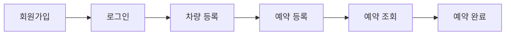
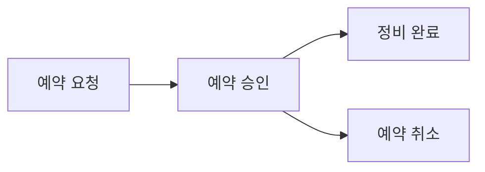
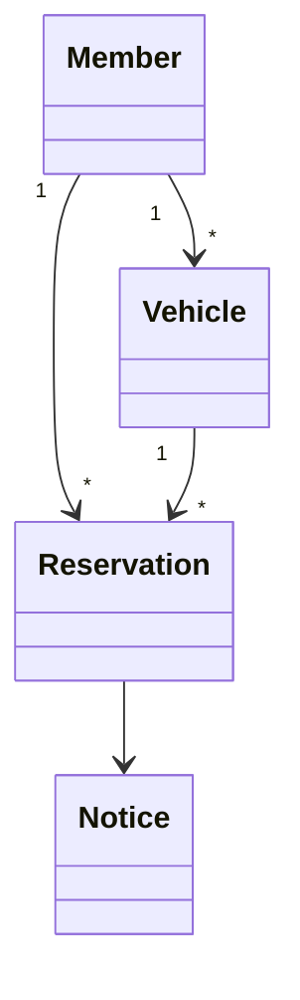

<div align="center">

# 🚗 GarageCare

### **예약은 더 빠르게, 정비는 더 효율적으로.**

소규모 자동차 정비소의 예약과 차량 관리를 디지털화하여  
**관리자가 예약보다 정비에 집중할 수 있도록 돕는 웹서비스**입니다.

<br>


<br>


</div>

---

# 📖 Table of Contents

- [Overview](#-overview)
- [Why GarageCare](#-why-garagecare)
- [Problem](#-problem)
- [Solution](#-solution)
- [Key Features](#-key-features)
- [Architecture](#-architecture)
- [Tech Stack](#-tech-stack)
- [Project Structure](#-project-structure)
- [Documentation](#-documentation)
- [Roadmap](#-roadmap)
- [Development Workflow](#-development-workflow)

---

# 🌟 Project Vision

GarageCare는 예약 시스템을 만드는 프로젝트가 아닙니다.

자동차를 정비하는 사람의 시간을, 예약을 관리하는 시간보다 더 가치 있게 만들기 위한 프로젝트입니다.

소규모 자동차 정비소에서는 예약과 상담이 대부분 전화로 이루어집니다.

정비 작업 중 걸려오는 전화는 작업을 멈추게 만들고, 예약 내용을 메모하거나 기억에 의존하는 과정에서 일정이 누락되거나 중복될 가능성이 생깁니다.

GarageCare는 이러한 반복적인 관리 업무를 줄여 **정비사는 정비에, 고객은 예약에 집중할 수 있는 환경**을 만드는 것을 목표로 합니다.

기술은 목적이 아니라 문제를 해결하기 위한 도구입니다.

GarageCare는 Spring Boot를 학습하기 위한 예제가 아니라, 실제 운영 환경에서 사용할 수 있는 서비스를 만드는 과정을 목표로 개발되고 있습니다.

---

# 🚘 Overview

GarageCare는 소규모 자동차 정비소의 예약 및 차량 관리 업무를 지원하는 웹서비스입니다.

예약, 차량, 고객 정보를 하나의 시스템에서 관리하여 운영 효율을 높이는 것을 목표로 합니다.

---

# ⚠️ Problem

| Customer | Administrator |
|-----------|---------------|
| 원하는 시간에 예약하기 어렵다 | 작업 중에도 예약 전화를 받아야 한다 |
| 예약 내용을 다시 확인하기 어렵다 | 예약 누락 및 일정 중복이 발생할 수 있다 |
| 차량 정보를 반복해서 전달해야 한다 | 고객 및 차량 정보를 효율적으로 관리하기 어렵다 |
| 운영시간과 공지를 확인하기 어렵다 | 공지사항 전달이 어렵다 |

GarageCare는 이러한 문제를 해결하기 위해 **예약 관리 프로세스를 디지털화**하는 것을 목표로 합니다.

---

# 🎯 Project Philosophy

GarageCare는 기능의 개수보다 **문제 해결의 완성도**를 중요하게 생각합니다.

프로젝트를 진행하면서 다음 원칙을 기준으로 모든 기능을 설계합니다.

- 실제 운영 과정에서 발생하는 문제를 해결할 것
- 단순한 CRUD 구현보다 사용자 경험을 우선할 것
- MVP에서는 핵심 기능만 구현할 것
- 모든 설계 과정은 문서로 기록할 것
- 확장보다 안정성을 우선할 것

---

# 💡 Solution

GarageCare는 **예약 중심의 업무를 디지털화**하여 고객과 관리자 모두의 사용 경험을 개선합니다.

서비스는 크게 세 가지 핵심 영역으로 구성됩니다.

| Customer | Administrator | System |
|----------|---------------|--------|
| 온라인 예약 | 예약 관리 | 데이터 관리 |
| 차량 정보 조회 | 예약 상태 변경 | 예약 기록 |
| 예약 조회 및 취소 | 공지사항 관리 | 확장 가능한 구조 |

GarageCare는 예약을 단순히 저장하는 것이 아니라,

예약, 차량, 고객 정보를 하나의 흐름으로 연결하여 **실제 운영에 사용할 수 있는 시스템**을 만드는 것을 목표로 합니다.

---

# ✨ Key Features

## 👤 Member

사용자 인증 및 계정 관리

- 회원가입
- 로그인
- 권한 구분(Customer / Administrator)

---

## 🚗 Vehicle

차량 정보 관리

- 차량 등록
- 차량 조회
- 차량 수정

---

## 📅 Reservation

예약 관리

- 예약 등록
- 예약 조회
- 예약 취소
- 예약 상태 확인

---

## 👨‍🔧 Admin

관리자 기능

- 전체 예약 조회
- 예약 상태 변경
- 고객 및 차량 정보 조회

---

## 📢 Notice

공지사항

- 공지사항 조회
- 공지사항 등록
- 공지사항 수정
- 공지사항 삭제

---

# 🔄 User Flow

### Customer



### Administrator


### Reservation Lifecycle



---

# 🧩 Domain Model



---

# 🏗 Architecture

```text
flowchart TD
        │
        ▼
Client (Browser)
        │
        ▼
Spring MVC Controller
        │
        ▼
Service
(Business Logic)
        │
        ▼
Repository
(JPA)
        │
        ▼
Database
(H2 → MySQL)
```

GarageCare는 **Controller → Service → Repository** 계층 구조를 기반으로 설계합니다.

각 계층은 하나의 책임만 가지며,

비즈니스 로직은 Service 계층에서 관리합니다.

이 구조를 통해 유지보수성과 테스트 용이성을 높이는 것을 목표로 합니다.

---

# 🛠 Tech Stack

| Category | Technology | Purpose |
|-----------|------------|---------|
| Language | Java 17 | LTS 버전 기반 안정성 |
| Framework | Spring Boot | 웹 애플리케이션 개발 |
| Template Engine | Thymeleaf | Server Side Rendering |
| Database | H2 | 개발 환경 데이터베이스 |
| ORM | Spring Data JPA | 객체 중심 데이터 관리 |
| Build Tool | Gradle | 의존성 및 빌드 관리 |
| Version Control | Git & GitHub | 형상관리 |
| IDE | IntelliJ IDEA | 개발 환경 |

---

### Why Java 17?

- Spring Boot LTS 지원
- 안정적인 장기 지원 버전
- 실무 사용 비율이 높음

---

### Why Spring Boot?

- 빠른 웹서비스 개발
- Spring 생태계 활용
- 유지보수가 쉬운 구조

---

### Why JPA?

- 객체 중심 개발
- 생산성 향상
- 유지보수 비용 감소

---

# 📂 Project Structure

```text
garagecare
│
├── docs
│   ├── planning.md
│   ├── feature-list.md
│   ├── user-flow.md
│   ├── domain-model.md
│   ├── erd.md
│   ├── wireframe.md
│   ├── api-spec.md
│   └── architecture.md
│
├── .github
│
├── src
│   ├── main
│   └── test
│
├── README.md
└── build.gradle
```

프로젝트는 **문서(Docs)와 코드(Source)를 분리**하여 관리합니다.

설계 변경은 문서를 먼저 수정한 뒤 코드에 반영하는 것을 원칙으로 합니다.

---

# 📚 Documentation

GarageCare는 **문서 중심(Document-Driven Development)** 으로 개발됩니다.

설계와 구현이 일치하도록 모든 주요 의사결정을 문서로 관리합니다.

| Document | Description |
|-----------|-------------|
| 📐 `planning.md` | 프로젝트 비전, 목표 및 요구사항 정의 |
| 📋 `feature-list.md` | MVP 기능 목록 및 우선순위 |
| 🔄 `user-flow.md` | 고객과 관리자의 서비스 이용 흐름 |
| 🧩 `domain-model.md` | 핵심 도메인 및 비즈니스 규칙 |
| 🗄 `erd.md` | 데이터베이스 구조 및 관계 |
| 🎨 `wireframe.md` | 화면 설계 및 UI 흐름 |
| 🌐 `api-spec.md` | API 요청 및 응답 명세 |
| 🏗 `architecture.md` | 시스템 아키텍처 및 프로젝트 구조 |

> 설계가 변경되면 **문서를 먼저 수정한 후 코드를 변경하는 것**을 원칙으로 합니다.

---

# 🗺 Roadmap

## ✅ Version 1.0 (MVP)

- [x] 프로젝트 기획
- [ ] 회원 기능
- [ ] 차량 관리
- [ ] 예약 기능
- [ ] 관리자 기능
- [ ] 공지사항

---

## 🚀 Version 1.1

- [ ] 예약 알림
- [ ] 차량 관리 개선
- [ ] 사용자 경험 개선

---

## 🚀 Version 2.0

- [ ] 정비 이력 관리
- [ ] 엔진오일 교체주기 알림
- [ ] AI 정비 상담
- [ ] AI 증상 기반 정비 추천

---

## 🌎 Version 3.0

- [ ] Dashboard
- [ ] 예약 통계
- [ ] 고객 분석

---

# 🔄 Development Workflow

모든 기능은 아래 과정을 따라 개발합니다.

```text
Planning
    │
    ▼
GitHub Issue
    │
    ▼
Branch
    │
    ▼
Development
    │
    ▼
Commit
    │
    ▼
Pull Request
    │
    ▼
Review
    │
    ▼
Merge
```

GarageCare는 **Issue 기반 개발(Issue-Driven Development)** 을 원칙으로 합니다.

모든 구현은 요구사항과 설계를 먼저 정의한 뒤 진행합니다.

---

# 📈 Future Plans

GarageCare는 단순한 예약 서비스를 넘어

소규모 자동차 정비소 운영을 지원하는 플랫폼으로 발전하는 것을 목표로 합니다.

향후 다음 기능을 계획하고 있습니다.

- AI 기반 정비 상담
- 정비 이력 관리
- 소모품 교체주기 알림
- 예약 데이터 분석
- 관리자 Dashboard
- Cloud 환경 배포

---

# 🔄 Development Workflow

모든 기능은 아래 과정을 따라 개발합니다.

```text
Planning
    │
    ▼
GitHub Issue
    │
    ▼
Branch
    │
    ▼
Development
    │
    ▼
Commit
    │
    ▼
Pull Request
    │
    ▼
Review
    │
    ▼
Merge
```

GarageCare는 **Issue 기반 개발(Issue-Driven Development)** 을 원칙으로 합니다.

모든 구현은 요구사항과 설계를 먼저 정의한 뒤 진행합니다.

---

# 🎯 Project Philosophy

GarageCare는 기능의 개수보다 **문제 해결의 완성도**를 중요하게 생각합니다.

프로젝트를 진행하면서 다음 원칙을 기준으로 모든 기능을 설계합니다.

- 실제 운영 과정에서 발생하는 문제를 해결할 것
- 단순한 CRUD 구현보다 사용자 경험을 우선할 것
- MVP에서는 핵심 기능만 구현할 것
- 모든 설계 과정은 문서로 기록할 것
- 확장보다 안정성을 우선할 것

---

# 🛠 Engineering Principles

GarageCare는 **기능을 많이 만드는 프로젝트가 아니라, 실제 문제를 해결하는 프로젝트**를 지향합니다.

모든 설계와 구현은 다음 원칙을 기준으로 진행합니다.

| Principle | Description |
|-----------|-------------|
| 👤 User First | 사용자 경험을 가장 우선으로 고려합니다. |
| 🔧 Solve Real Problems | 실제 정비소 운영 과정에서 발생하는 문제를 해결하는 기능만 개발합니다. |
| 📝 Documentation First | 구현보다 설계를 먼저 작성하고, 중요한 의사결정은 문서로 기록합니다. |
| 🧩 Maintainable Code | 새로운 기능보다 유지보수하기 쉬운 구조를 우선합니다. |
| 📈 Incremental Improvement | 작은 기능이라도 완성도를 높이며 점진적으로 서비스를 발전시킵니다. |
| 📝 Documentation First | 설계를 먼저 작성하고, 구현은 문서를 기준으로 진행합니다. |

---

# 📜 License

This project is licensed under the MIT License.

See the `LICENSE` file for details.
