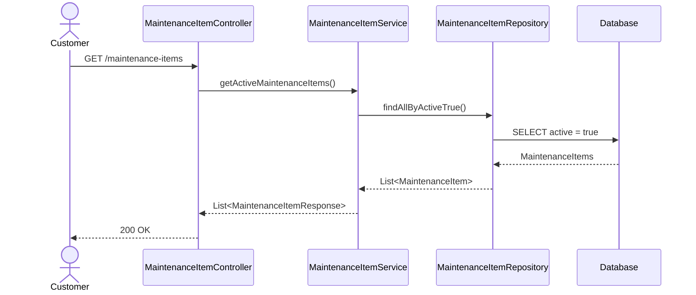
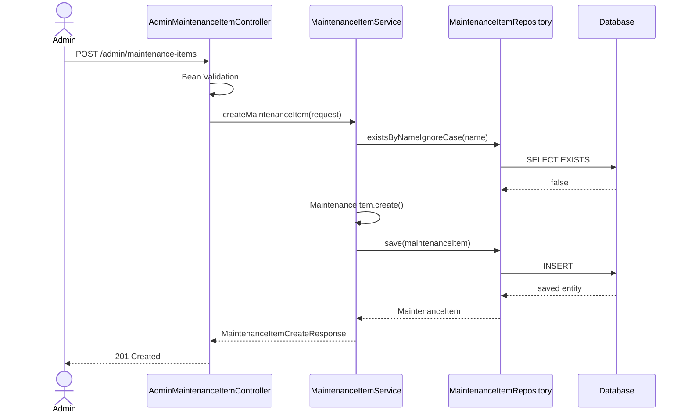
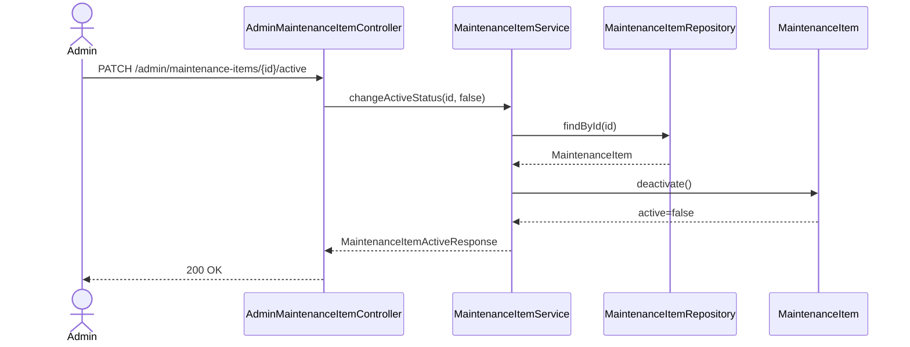

# GarageCare API Specification

> Version: 1.0.0  
> Status: Draft  
> Last Updated: 2026-07-24

---

# 1. Overview

본 문서는 GarageCare MVP에서 사용하는 API를 정의한다.

API는 클라이언트와 서버 간의 데이터 교환 규칙을 명확하게 정의하며,
Controller 구현, DTO 설계, Validation, 권한 처리 및 통합 테스트의 기준 문서로 사용한다.

본 프로젝트는 Spring Boot와 Thymeleaf 기반의 MVC 애플리케이션으로 구현되지만,
향후 REST API 또는 SPA(Vue, React)로 확장될 수 있도록 API 중심으로 설계한다.

---

# 2. Scope

현재 API 명세는 GarageCare MVP 범위를 대상으로 한다.

## Included

### Authentication

- 로그인
- 로그아웃
- 현재 로그인 사용자 조회

### Member

- 회원가입

### Vehicle

- 차량 목록
- 차량 등록
- 차량 상세
- 차량 수정

### Reservation

- 예약 생성
- 예약 목록
- 예약 상세
- 예약 취소
- 관리자 예약 조회
- 예약 상태 변경

### MaintenanceItem

- 정비 항목 조회
- 정비 항목 등록
- 수정
- 활성·비활성 변경

### Notice

- 공지사항 조회
- 등록
- 수정
- 삭제

---

## Out of Scope

다음 기능은 MVP 이후 별도의 API를 설계한다.

- 비밀번호 변경
- 회원 탈퇴
- 결제
- 정비 이력
- 알림
- AI 상담
- 다중 정비소
- 파일 업로드
- 이미지 관리

---

# 3. API Design Principles

GarageCare의 API는 다음 원칙을 따른다.

---

## 3.1 Resource-Oriented

API는 화면이 아닌 리소스를 기준으로 설계한다.

예를 들어

Good

```
GET /vehicles
```

Bad

```
GET /vehicleList
```

---

## 3.2 HTTP Method

| Method | Purpose |
|---------|---------|
| GET | 조회 |
| POST | 생성 |
| PUT | 전체 수정 |
| PATCH | 일부 수정 |
| DELETE | 삭제 |

GarageCare에서는 삭제 대신 상태 변경을 사용하는 경우가 많으므로 DELETE 사용은 최소화한다.

예)

```
PATCH /reservations/{id}/cancel
```

---

## 3.3 URL Naming

모든 URL은

- 소문자
- 복수형
- kebab-case

를 사용한다.

Good

```
/maintenance-items
```

Bad

```
/MaintenanceItem
/maintenanceItem
```

---

## 3.4 Stateless

HTTP 요청은 각각 독립적으로 처리된다.

인증은 Spring Security Session 기반으로 구현하지만,
API 설계 자체는 Stateless한 요청 구조를 유지한다.

---

## 3.5 Consistency

모든 API는 동일한 규칙을 따른다.

- 동일한 Response 구조
- 동일한 Error 구조
- 동일한 Status Code
- 동일한 Validation 방식

---

## 3.6 Predictability

URL만 보아도 동작을 예측할 수 있어야 한다.

예)

```
GET /vehicles

차량 목록 조회
```

```
POST /vehicles

차량 등록
```

```
GET /vehicles/{vehicleId}

차량 상세 조회
```

---

# 4. Naming Convention

---

## Controller

```
MemberController
VehicleController
ReservationController
NoticeController
```

---

## Request DTO

```
MemberCreateRequest
VehicleCreateRequest
ReservationCreateRequest
```

---

## Response DTO

```
VehicleResponse
ReservationResponse
NoticeResponse
```

---

## Path Variable

항상 Resource 이름을 사용한다.

Good

```
vehicleId
reservationId
noticeId
```

Bad

```
id
```

---

## Query Parameter

camelCase 사용

```
status
page
size
sort
reservationDate
```

---

# 5. Common Request Rule

---

## Content-Type

```
application/json
```

Form 기반 MVC에서도 Controller 내부 DTO 구조를 기준으로 작성한다.

---

## Character Encoding

```
UTF-8
```

---

## Date Format

```
yyyy-MM-dd
```

예)

```
2026-07-25
```

---

## Time Format

```
HH:mm
```

예)

```
10:30
```

---

## DateTime Format

```
yyyy-MM-dd'T'HH:mm:ss
```

예)

```
2026-07-25T10:30:00
```

---

## Pagination

```
?page=0
&size=10
```

MVP에서는 일부 화면만 Pagination을 적용한다.

---

# 6. Authentication

GarageCare는 Session 기반 인증을 사용한다.

로그인 후 Session에 사용자 정보를 저장하며,
인증이 필요한 요청은 로그인 여부를 확인한다.

---

## Authorization

| Role | Description |
|------|-------------|
| GUEST | 비회원 |
| CUSTOMER | 일반 회원 |
| ADMIN | 관리자 |

---

# 7. Authentication API

---

# 7.1 Login

## Purpose

회원 로그인

---

## URL

```
POST /login
```

---

## Authorization

```
Permit All
```

---

## Request

```json
{
  "loginId": "parkhyunwoo",
  "password": "1234"
}
```

---

## Validation

| Field | Rule |
|---------|---------|
| loginId | Required |
| password | Required |

---

## Business Rules

- 아이디 존재 여부 확인
- 비밀번호 검증
- Session 생성
- 로그인 사용자 저장

---

## Success Response

HTTP

```
302 Found
```

Redirect

```
/
```

또는

```
/admin
```

관리자 로그인 시 관리자 페이지로 이동한다.

---

## Error Response

```
401 Unauthorized
```

```json
{
  "code": "AUTH_001",
  "message": "아이디 또는 비밀번호를 확인해 주세요."
}
```

---

# 7.2 Logout

## Purpose

로그아웃

---

## URL

```
POST /logout
```

---

## Authorization

```
Authenticated
```

---

## Business Rules

- Session 제거
- 인증 정보 제거

---

## Success

```
302 Found
```

Redirect

```
/
```

---

# 7.3 Current User

## Purpose

현재 로그인한 사용자 조회

---

## URL

```
GET /api/me
```

---

## Authorization

```
Authenticated
```

---

## Success

```json
{
  "id": 1,
  "name": "박현우",
  "role": "CUSTOMER"
}
```

---

## Error

```
401 Unauthorized
```

---

# 8. Member API

---

# 8.1 Create Member

## Purpose

회원가입

---

## URL

```
POST /members
```

---

## Authorization

```
Permit All
```

---

## Request

```json
{
  "loginId":"parkhyunwoo",
  "password":"1234",
  "confirmPassword":"1234",
  "name":"박현우",
  "phone":"01012345678"
}
```

---

## Validation

| Field | Rule |
|---------|---------|
| loginId | Required |
| loginId | Duplicate Check |
| password | Required |
| confirmPassword | Must Match |
| name | Required |
| phone | Phone Format |

---

## Business Rules

- 로그인 아이디 중복 불가
- 비밀번호 암호화 저장
- 기본 권한 CUSTOMER
- 회원 생성 후 로그인하지 않음

---

## Success

HTTP

```
201 Created
```

Response

```json
{
  "id":1,
  "message":"회원가입이 완료되었습니다."
}
```

---

## Error

Duplicate LoginId

```json
{
  "code":"MEMBER_001",
  "message":"이미 사용 중인 로그인 아이디입니다."
}
```

Password

```json
{
  "code":"MEMBER_002",
  "message":"비밀번호가 일치하지 않습니다."
}
```

Validation

```json
{
  "code":"COMMON_001",
  "message":"입력값을 확인해 주세요."
}
```

---

# 9. Common Response Format

GarageCare는 모든 API에서 동일한 Response 구조를 사용한다.

---

## Success

```json
{
  "success": true,
  "data": {
  },
  "message": "성공"
}
```

---

## Fail

```json
{
  "success": false,
  "code": "MEMBER_001",
  "message": "이미 사용 중인 로그인 아이디입니다."
}
```

---

# 10. HTTP Status Policy

| Status | Meaning |
|---------|---------|
| 200 | 조회 성공 |
| 201 | 생성 성공 |
| 204 | 성공 (응답 없음) |
| 400 | Validation 실패 |
| 401 | 로그인 필요 |
| 403 | 권한 없음 |
| 404 | 데이터 없음 |
| 409 | 중복 데이터 |
| 500 | 서버 오류 |

---

# 11. Error Code Convention

모든 Error Code는

```
도메인_번호
```

형태를 사용한다.

예)

```
AUTH_001
MEMBER_001
VEHICLE_001
RESERVATION_001
NOTICE_001
COMMON_001
```

---

## Common

| Code | Description |
|------|-------------|
| COMMON_001 | Validation 실패 |
| COMMON_002 | 요청 형식 오류 |
| COMMON_003 | 서버 오류 |

---

## Authentication

| Code | Description |
|------|-------------|
| AUTH_001 | 로그인 실패 |
| AUTH_002 | 인증 필요 |
| AUTH_003 | 권한 없음 |

---

## Member

| Code | Description |
|------|-------------|
| MEMBER_001 | 로그인 아이디 중복 |
| MEMBER_002 | 비밀번호 불일치 |

---

# 12. Related Documents

| Document | Description |
|----------|-------------|
| planning.md | 프로젝트 목표 |
| feature-list.md | 기능 목록 |
| domain-model.md | 도메인 모델 |
| erd.md | 데이터베이스 설계 |
| wireframe.md | 화면 설계 |

---

# 13. Summary

GarageCare의 API는 RESTful 설계 원칙을 기반으로 하며, 일관된 URL 구조, Response 형식, Error Code 정책을 따른다.

본 문서는 Authentication과 Member API를 정의하며, 이후 Vehicle, Reservation, MaintenanceItem, Notice API의 상세 명세를 이어서 작성한다.

---

# 14. Vehicle API

Vehicle API는 고객이 자신의 차량을 등록하고 관리하기 위한 기능을 제공한다.

예약은 반드시 차량을 기반으로 생성되므로, Vehicle은 Reservation의 선행 조건이 되는 핵심 도메인이다.

관련 화면

- 내 차량 목록
- 차량 등록
- 차량 상세
- 차량 수정
- 예약 신청

관련 Domain

- Member
- Vehicle
- Reservation

---

# 15. Vehicle API Design Principles

Vehicle API는 다음 원칙을 따른다.

## Ownership

모든 차량은 반드시 하나의 Member에게 소속된다.

다른 회원의 차량은 조회하거나 수정할 수 없다.

---

## Soft Ownership

차량 삭제 기능은 MVP에서 제공하지 않는다.

예약 이력과 연결되기 때문이다.

필요 시 향후

```
active = false
```

방식으로 비활성화한다.

---

## Reservation Dependency

예약 생성 시

```
등록 차량 존재
```

가 선행 조건이다.

등록 차량이 없다면 예약을 생성할 수 없다.

---

## Security

Vehicle ID만 알고 있다고 접근할 수 없어야 한다.

반드시

```
vehicle.owner == loginMember
```

검증을 수행한다.

---

# 16. Vehicle API Summary

| Method | URL | Description |
|---------|-----|-------------|
| GET | /vehicles | 내 차량 목록 |
| POST | /vehicles | 차량 등록 |
| GET | /vehicles/{vehicleId} | 차량 상세 |
| PUT | /vehicles/{vehicleId} | 차량 수정 |

---

# 17. GET /vehicles

## Purpose

현재 로그인한 회원이 등록한 차량 목록을 조회한다.

---

## Authorization

```
CUSTOMER
```

---

## URL

```
GET /vehicles
```

---

## Request

Path Variable 없음

Body 없음

---

## Business Rules

조회 대상은

```
로그인한 회원
```

의 차량만 포함한다.

관리자는 별도 관리자 기능에서 조회한다.

차량은

```
등록 순
```

또는

```
최근 수정 순
```

으로 정렬할 수 있다.

MVP에서는 등록 순으로 조회한다.

---

## Success

HTTP

```
200 OK
```

---

## Response

```json
{
  "success": true,
  "data": [
    {
      "vehicleId": 1,
      "manufacturer": "현대",
      "model": "그랜저",
      "vehicleNumber": "12가3456",
      "modelYear": 2023,
      "mileage": 35000
    },
    {
      "vehicleId": 2,
      "manufacturer": "기아",
      "model": "쏘렌토",
      "vehicleNumber": "34나5678",
      "modelYear": 2022,
      "mileage": 42000
    }
  ],
  "message": "조회 성공"
}
```

---

## Empty Response

등록 차량이 없는 경우

```json
{
  "success": true,
  "data": [],
  "message": "등록된 차량이 없습니다."
}
```

---

## Error

```
401 Unauthorized
```

로그인하지 않은 사용자

```
403 Forbidden
```

권한 없음

---

## Related Screen

```
내 차량 목록
예약 신청
```

---

# 18. POST /vehicles

## Purpose

새로운 차량을 등록한다.

---

## Authorization

```
CUSTOMER
```

---

## URL

```
POST /vehicles
```

---

## Request

```json
{
  "manufacturer": "현대",
  "model": "그랜저",
  "vehicleNumber": "12가3456",
  "modelYear": 2023,
  "mileage": 35000
}
```

---

## Request Fields

| Field | Type | Required | Description |
|---------|------|----------|-------------|
| manufacturer | String | ✅ | 제조사 |
| model | String | ✅ | 모델명 |
| vehicleNumber | String | ✅ | 차량 번호 |
| modelYear | Integer | ❌ | 연식 |
| mileage | Integer | ❌ | 주행거리 |

---

# 19. Validation Rule

## manufacturer

- Required
- Blank 불가
- 최대 30자

---

## model

- Required
- Blank 불가
- 최대 50자

---

## vehicleNumber

- Required
- 차량 번호 형식
- 동일 회원 중복 불가

예)

```
12가3456
```

---

## modelYear

Optional

허용 범위

```
1980
~

현재년도 +1
```

---

## mileage

Optional

```
0 이상
```

---

# 20. Business Rules

차량 등록 시 다음 순서로 처리한다.

① 로그인 사용자 확인

↓

② 입력값 Validation

↓

③ 차량번호 중복 검사

↓

④ Vehicle 생성

↓

⑤ Member와 연결

↓

⑥ 저장

---

동일 회원이

```
12가3456
```

을 두 번 등록할 수 없다.

다른 회원은 동일 번호 등록 가능 여부는 운영 정책에 따라 결정한다.

MVP에서는

```
전체 시스템에서 차량번호 중복 불가
```

를 적용한다.

---

## Success

HTTP

```
201 Created
```

---

## Response

```json
{
  "success": true,
  "data": {
    "vehicleId": 3
  },
  "message": "차량이 등록되었습니다."
}
```

---

## Error Example

차량번호 중복

```json
{
  "success": false,
  "code": "VEHICLE_001",
  "message": "이미 등록된 차량번호입니다."
}
```

---

Validation 실패

```json
{
  "success": false,
  "code": "COMMON_001",
  "message": "입력값을 확인해 주세요."
}
```

---

## HTTP Status

| Status | Description |
|---------|-------------|
| 201 | 등록 성공 |
| 400 | Validation 실패 |
| 401 | 로그인 필요 |
| 409 | 차량번호 중복 |

---

## Related Screen

```
차량 등록
예약 신청
```

---

## Related Domain

```
Member
Vehicle
```

---

# 21. GET /vehicles/{vehicleId}

## Purpose

회원이 등록한 특정 차량의 상세 정보를 조회한다.

차량 상세 화면 및 차량 수정 화면에서 사용한다.

---

## Authorization

```
CUSTOMER
```

---

## URL

```
GET /vehicles/{vehicleId}
```

---

## Path Variable

| Name | Type | Description |
|------|------|-------------|
| vehicleId | Long | 차량 ID |

---

## Request

Body 없음

---

## Business Rules

조회 대상 차량은 반드시

```
현재 로그인한 회원의 차량
```

이어야 한다.

다른 회원의 차량을 조회할 수 없다.

관리자는 별도 관리자 API를 사용한다.

---

## Success

HTTP

```
200 OK
```

---

## Response

```json
{
  "success": true,
  "data": {
    "vehicleId": 1,
    "manufacturer": "현대",
    "model": "그랜저",
    "vehicleNumber": "12가3456",
    "modelYear": 2023,
    "mileage": 35200,
    "createdAt": "2026-07-20T13:40:20",
    "updatedAt": "2026-07-22T18:15:30"
  },
  "message": "조회 성공"
}
```

---

## Error

차량이 존재하지 않는 경우

```json
{
  "success": false,
  "code": "VEHICLE_002",
  "message": "차량을 찾을 수 없습니다."
}
```

---

본인 차량이 아닌 경우

```json
{
  "success": false,
  "code": "AUTH_003",
  "message": "접근 권한이 없습니다."
}
```

---

## HTTP Status

| Status | Description |
|---------|-------------|
| 200 | 조회 성공 |
| 401 | 로그인 필요 |
| 403 | 접근 권한 없음 |
| 404 | 차량 없음 |

---

## Related Screen

- 차량 상세
- 차량 수정

---

# 22. PUT /vehicles/{vehicleId}

## Purpose

등록된 차량 정보를 수정한다.

MVP에서는 다음 정보만 수정 가능하다.

- 제조사
- 모델명
- 연식
- 주행거리

차량번호는 수정하지 않는다.

---

## Authorization

```
CUSTOMER
```

---

## URL

```
PUT /vehicles/{vehicleId}
```

---

## Request

```json
{
    "manufacturer":"현대",
    "model":"그랜저",
    "modelYear":2024,
    "mileage":42000
}
```

---

## Request Fields

| Field | Required | Description |
|---------|----------|-------------|
| manufacturer | ✅ | 제조사 |
| model | ✅ | 모델 |
| modelYear | ❌ | 연식 |
| mileage | ❌ | 주행거리 |

---

## Validation

manufacturer

- Required
- 최대 30자

model

- Required
- 최대 50자

modelYear

```
1980 ~ 현재년도 +1
```

mileage

```
0 이상
```

---

## Business Rules

① 로그인 확인

↓

② 차량 존재 확인

↓

③ 소유자 확인

↓

④ Validation

↓

⑤ 수정

↓

⑥ 저장

---

예약 이력은 영향을 받지 않는다.

차량번호는 변경하지 않는다.

---

## Success

HTTP

```
200 OK
```

Response

```json
{
    "success":true,
    "data":{
        "vehicleId":1
    },
    "message":"차량 정보가 수정되었습니다."
}
```

---

## Error

```json
{
    "success":false,
    "code":"VEHICLE_002",
    "message":"차량을 찾을 수 없습니다."
}
```

```json
{
    "success":false,
    "code":"AUTH_003",
    "message":"접근 권한이 없습니다."
}
```

---

## HTTP Status

| Status | Meaning |
|---------|----------|
|200|수정 성공|
|400|Validation 실패|
|401|로그인 필요|
|403|권한 없음|
|404|차량 없음|

---

## Related Screen

- 차량 수정

---

# 23. Vehicle Authorization Policy

| Action | CUSTOMER | ADMIN |
|----------|:--------:|:-----:|
| 차량 등록 | ✅ | ❌ |
| 내 차량 조회 | ✅ | ❌ |
| 차량 상세 | ✅ | ❌ |
| 차량 수정 | ✅ | ❌ |
| 전체 차량 조회 | ❌ | 추후 지원 |

---

# 24. Vehicle Error Code

| Code | Description |
|------|-------------|
| VEHICLE_001 | 차량번호 중복 |
| VEHICLE_002 | 차량 없음 |
| VEHICLE_003 | 차량 소유자가 아님 |
| VEHICLE_004 | 잘못된 차량번호 형식 |
| VEHICLE_005 | 허용되지 않는 연식 |

---

# 25. Vehicle Sequence

## 차량 등록

```text
Member

↓

VehicleController

↓

VehicleService

↓

Member 확인

↓

Validation

↓

중복 검사

↓

Vehicle 생성

↓

Repository 저장

↓

Response
```

---

## 차량 조회

```text
Member

↓

VehicleController

↓

VehicleService

↓

회원 확인

↓

Vehicle 조회

↓

소유자 확인

↓

Response
```

---

## 차량 수정

```text
Member

↓

VehicleController

↓

VehicleService

↓

회원 확인

↓

Vehicle 조회

↓

소유자 확인

↓

Validation

↓

수정

↓

저장
```

---

# 26. Design Decisions

## 차량번호 수정 금지

차량번호는 차량을 식별하는 핵심 정보이다.

예약 이력 및 향후 정비 이력과 연결되므로 MVP에서는 수정 기능을 제공하지 않는다.

필요한 경우 차량을 새로 등록하는 방식으로 처리한다.

---

## 차량 삭제 미지원

예약 데이터 보존을 위해 삭제 기능을 제공하지 않는다.

향후

```
active = false
```

전략으로 변경 가능하다.

---

## 차량번호 중복 정책

현재는

```
전체 시스템에서 중복 불가
```

를 적용한다.

향후 다중 정비소를 지원할 경우

```
정비소별 중복 허용
```

으로 변경할 수 있다.

---

# 27. Open Decisions

향후 검토가 필요한 사항

- 대표 차량(Default Vehicle) 지원 여부
- 차량 이미지 업로드
- VIN(차대번호) 관리
- 제조사 자동 선택
- 모델 자동완성
- 차량 삭제 정책
- 차량번호 변경 정책

---

# 28. Summary

Vehicle API는 회원이 자신의 차량을 등록하고 관리하기 위한 기능을 제공한다.

모든 차량은 하나의 회원에게 소속되며, 예약 생성의 선행 조건으로 사용된다.

차량 삭제와 차량번호 변경은 데이터 무결성과 예약 이력 보존을 위해 MVP 범위에서 제외하며, 향후 서비스 확장 시 Soft Delete 및 관리 기능을 통해 지원할 수 있다.

---

# 29. Reservation API

Reservation API는 고객이 차량 정비 예약을 생성하고 관리하기 위한 기능을 제공한다.

GarageCare MVP의 핵심 기능이며, 예약 생성부터 완료까지의 전체 생명주기를 관리한다.

예약은 하나 이상의 정비 항목(ReservationItem)을 포함하며, 차량과 회원을 기준으로 생성된다.

관련 Domain

- Member
- Vehicle
- Reservation
- ReservationItem
- MaintenanceItem

관련 화면

- 예약 신청
- 예약 완료
- 예약 목록
- 예약 상세
- 관리자 예약 관리

---

# 30. Reservation API Design Principles

Reservation API는 다음 원칙을 따른다.

---

## Reservation Aggregate

Reservation은 Aggregate Root이며 ReservationItem을 포함한다.

```
Reservation
 ├── Vehicle
 ├── Member
 └── ReservationItem
        └── MaintenanceItem
```

ReservationItem은 Reservation 외부에서 직접 생성하거나 수정하지 않는다.

---

## Reservation Status

예약은 반드시 아래 상태 흐름을 따른다.

```
REQUESTED

↓

CONFIRMED

↓

COMPLETED
```

또는

```
REQUESTED

↓

CANCELED
```

완료된 예약은 다시 REQUESTED 상태로 변경하지 않는다.

---

## Ownership

예약은 생성한 회원만 조회 및 취소할 수 있다.

관리자는 모든 예약을 조회할 수 있다.

---

## ReservationItem Rule

예약에는 최소 하나 이상의 정비 항목이 포함되어야 한다.

```
ReservationItem.size() >= 1
```

동일한 정비 항목을 두 번 선택할 수 없다.

---

## Vehicle Ownership

예약하려는 차량은 반드시 로그인한 회원의 차량이어야 한다.

타인의 차량으로 예약할 수 없다.

---

# 31. Reservation API Summary

| Method | URL | Description |
|---------|-----|-------------|
| POST | /reservations | 예약 생성 |
| GET | /reservations | 내 예약 목록 |
| GET | /reservations/{reservationId} | 예약 상세 |
| PATCH | /reservations/{reservationId}/cancel | 예약 취소 |
| GET | /admin/reservations | 관리자 예약 조회 |
| PATCH | /admin/reservations/{reservationId}/status | 예약 상태 변경 |

---

# 32. POST /reservations

## Purpose

새로운 정비 예약을 생성한다.

예약 생성 시 차량과 정비 항목을 함께 선택한다.

---

## Authorization

```
CUSTOMER
```

---

## URL

```
POST /reservations
```

---

## Request

```json
{
  "vehicleId": 3,
  "reservationDate": "2026-08-15",
  "reservationTime": "10:30",
  "memo": "브레이크 소음 확인 부탁드립니다.",
  "maintenanceItems": [
    1,
    3,
    5
  ]
}
```

---

## Request Fields

| Field | Type | Required | Description |
|------|------|:--------:|-------------|
| vehicleId | Long | ✅ | 예약 차량 |
| reservationDate | Date | ✅ | 예약 날짜 |
| reservationTime | Time | ✅ | 예약 시간 |
| memo | String | ❌ | 요청사항 |
| maintenanceItems | List<Long> | ✅ | 정비 항목 ID 목록 |

---

# 33. Validation Rule

## vehicleId

- Required
- 존재하는 차량이어야 한다.
- 로그인 회원의 차량이어야 한다.

---

## reservationDate

- Required
- 오늘 이전 날짜 불가

예)

```
2026-08-15
```

가능

```
2026-07-10
```

불가

---

## reservationTime

- Required

예약 가능 시간만 선택 가능

예)

```
09:00

09:30

10:00

...

17:30
```

운영 정책 변경 시 Service에서 관리한다.

---

## memo

최대

```
300자
```

---

## maintenanceItems

필수

최소

```
1개 이상
```

동일한 항목 중복 선택 불가

비활성 항목 선택 불가

---

# 34. Business Rules

예약 생성은 다음 순서로 수행한다.

① 로그인 확인

↓

② 차량 존재 확인

↓

③ 차량 소유자 확인

↓

④ 입력값 Validation

↓

⑤ 예약 가능 날짜 확인

↓

⑥ 정비 항목 존재 확인

↓

⑦ 중복 정비 항목 제거 확인

↓

⑧ Reservation 생성

↓

⑨ ReservationItem 생성

↓

⑩ 저장

↓

⑪ 예약 완료

---

예약 생성 후

Status는

```
REQUESTED
```

로 저장된다.

---

예약 생성 시

ReservationItem은 MaintenanceItem 개수만큼 자동 생성된다.

예)

```
엔진오일

타이어

브레이크
```

선택

↓

```
Reservation

↓

ReservationItem

ReservationItem

ReservationItem
```

---

## Success

HTTP

```
201 Created
```

---

## Response

```json
{
  "success": true,
  "data": {
    "reservationId": 21,
    "status": "REQUESTED"
  },
  "message": "예약이 완료되었습니다."
}
```

---

## Error Example

차량 없음

```json
{
  "success": false,
  "code": "RESERVATION_001",
  "message": "차량을 찾을 수 없습니다."
}
```

---

정비 항목 없음

```json
{
  "success": false,
  "code": "RESERVATION_002",
  "message": "정비 항목을 선택해 주세요."
}
```

---

예약 가능 시간이 아님

```json
{
  "success": false,
  "code": "RESERVATION_003",
  "message": "예약 가능한 시간이 아닙니다."
}
```

---

타인의 차량

```json
{
  "success": false,
  "code": "RESERVATION_004",
  "message": "예약 가능한 차량이 아닙니다."
}
```

---

Validation

```json
{
  "success": false,
  "code": "COMMON_001",
  "message": "입력값을 확인해 주세요."
}
```

---

## HTTP Status

| Status | Description |
|---------|-------------|
|201|예약 생성|
|400|Validation 실패|
|401|로그인 필요|
|403|권한 없음|
|404|차량 또는 정비항목 없음|
|409|예약 불가|

---

## Related Screen

- 예약 신청
- 예약 완료

---

## Related Domain

- Reservation
- ReservationItem
- MaintenanceItem
- Vehicle
- Member

---

# 35. GET /reservations

## Purpose

현재 로그인한 회원의 예약 목록을 조회한다.

예약 내역 화면에서 사용하며, 예약 상태와 예약 일정을 확인할 수 있다.

---

## Authorization

```
CUSTOMER
```

---

## URL

```
GET /reservations
```

---

## Query Parameter

| Name | Type | Required | Description |
|------|------|----------|-------------|
| page | Integer | ❌ | 페이지 번호 (기본 0) |
| size | Integer | ❌ | 페이지 크기 (기본 10) |
| status | String | ❌ | 예약 상태 |
| sort | String | ❌ | 정렬 기준 |

---

## Example Request

```
GET /reservations?page=0&size=10
```

```
GET /reservations?status=REQUESTED
```

---

## Business Rules

조회 대상은

```
현재 로그인한 회원의 예약
```

만 포함한다.

관리자 예약은 조회되지 않는다.

예약은 기본적으로

```
예약일 내림차순
```

으로 조회한다.

가장 최근 예약이 가장 먼저 나타난다.

---

## Reservation Status

조회 가능한 상태

```
REQUESTED
```

```
CONFIRMED
```

```
COMPLETED
```

```
CANCELED
```

---

## Success

HTTP

```
200 OK
```

---

## Response

```json
{
  "success": true,
  "data": {
    "content": [
      {
        "reservationId": 31,
        "vehicleModel": "그랜저",
        "reservationDate": "2026-08-15",
        "reservationTime": "10:30",
        "status": "REQUESTED"
      },
      {
        "reservationId": 29,
        "vehicleModel": "그랜저",
        "reservationDate": "2026-08-05",
        "reservationTime": "14:00",
        "status": "COMPLETED"
      }
    ],
    "page": 0,
    "size": 10,
    "totalElements": 2,
    "totalPages": 1
  },
  "message": "조회 성공"
}
```

---

## Empty Response

예약이 없는 경우

```json
{
  "success": true,
  "data": {
    "content": [],
    "page": 0,
    "size": 10,
    "totalElements": 0,
    "totalPages": 0
  },
  "message": "예약 내역이 없습니다."
}
```

---

## HTTP Status

| Status | Description |
|---------|-------------|
|200|조회 성공|
|401|로그인 필요|

---

## Related Screen

- 예약 목록

---

# 36. GET /reservations/{reservationId}

## Purpose

예약 상세 정보를 조회한다.

예약 화면에서 신청한 정비 항목과 요청사항을 확인하기 위해 사용한다.

---

## Authorization

```
CUSTOMER
```

---

## URL

```
GET /reservations/{reservationId}
```

---

## Path Variable

| Name | Type |
|------|------|
| reservationId | Long |

---

## Business Rules

예약은

```
예약한 회원
```

만 조회할 수 있다.

관리자는 관리자 API를 사용한다.

---

## Success

HTTP

```
200 OK
```

---

## Response

```json
{
  "success": true,
  "data": {
    "reservationId": 31,
    "vehicle": {
      "vehicleId": 3,
      "manufacturer": "현대",
      "model": "그랜저",
      "vehicleNumber": "12가3456"
    },
    "reservationDate": "2026-08-15",
    "reservationTime": "10:30",
    "status": "REQUESTED",
    "memo": "브레이크 소음 확인 부탁드립니다.",
    "maintenanceItems": [
      {
        "id": 1,
        "name": "엔진오일 교환"
      },
      {
        "id": 5,
        "name": "브레이크 점검"
      }
    ],
    "createdAt": "2026-07-25T12:10:22",
    "updatedAt": "2026-07-25T12:10:22"
  },
  "message": "조회 성공"
}
```

---

## Error

예약 없음

```json
{
  "success": false,
  "code": "RESERVATION_005",
  "message": "예약을 찾을 수 없습니다."
}
```

---

타인의 예약

```json
{
  "success": false,
  "code": "AUTH_003",
  "message": "접근 권한이 없습니다."
}
```

---

## HTTP Status

| Status | Description |
|---------|-------------|
|200|조회 성공|
|401|로그인 필요|
|403|권한 없음|
|404|예약 없음|

---

## Related Screen

- 예약 상세

---

# 37. Reservation Response Policy

예약 조회 시 응답은 항상 다음 원칙을 따른다.

---

## Vehicle

예약 당시 차량 정보를 반환한다.

```
vehicle
```

객체 안에 포함한다.

---

## Maintenance Item

정비 항목은

```
ReservationItem
```

을 기준으로 조회한다.

응답에서는 사용자가 이해하기 쉽도록

```
MaintenanceItem 목록
```

형태로 반환한다.

---

## Status

예약 상태는 Enum 문자열을 그대로 반환한다.

예)

```
REQUESTED
```

```
CONFIRMED
```

```
COMPLETED
```

```
CANCELED
```

클라이언트에서 상태에 따라 UI를 표시한다.

---

## Date Format

```
yyyy-MM-dd
```

---

## Time Format

```
HH:mm
```

---

## DateTime

```
yyyy-MM-dd'T'HH:mm:ss
```

---

# 38. Pagination Policy

예약 목록은 Spring Data Page를 사용한다.

---

## Default

```
page = 0

size = 10
```

---

## Maximum Size

```
50
```

이상을 요청하면

```
50
```

으로 제한한다.

---

## Sort

기본

```
reservationDate DESC
reservationTime DESC
```

---

향후 지원 예정

```
status

createdAt

updatedAt
```

---

# 39. Reservation Search Policy

현재 MVP에서는

```
status
```

검색만 지원한다.

예)

```
GET /reservations?status=COMPLETED
```

향후 추가 예정

- 날짜 범위 검색
- 차량 검색
- 정비 항목 검색
- 키워드 검색

---

# 40. Reservation Authorization Policy

| Action | CUSTOMER | ADMIN |
|---------|:--------:|:-----:|
| 예약 생성 | ✅ | ❌ |
| 내 예약 조회 | ✅ | ❌ |
| 예약 상세 | ✅ | ❌ |
| 예약 취소 | ✅ | ❌ |
| 전체 예약 조회 | ❌ | ✅ |
| 예약 상태 변경 | ❌ | ✅ |

---

# 41. Summary

Reservation 조회 API는 회원이 자신의 예약 정보를 안전하게 조회하기 위한 기능을 제공한다.

모든 조회는 로그인한 회원의 예약만 반환하며, 차량 정보와 정비 항목을 함께 제공하여 예약 상세 화면에서 필요한 모든 데이터를 한 번의 요청으로 확인할 수 있도록 설계하였다.

---

# 42. PATCH /reservations/{reservationId}/cancel

## Purpose

회원이 자신의 예약을 취소한다.

예약 취소는 데이터를 삭제하지 않고 상태(Status)를 `CANCELED`로 변경한다.

---

## Authorization

```
CUSTOMER
```

---

## URL

```
PATCH /reservations/{reservationId}/cancel
```

---

## Path Variable

| Name | Type | Description |
|------|------|-------------|
| reservationId | Long | 예약 ID |

---

## Request

Body 없음

---

## Business Rules

예약은 다음 조건을 만족할 경우에만 취소할 수 있다.

- 본인의 예약
- REQUESTED 상태
- CONFIRMED 상태

다음 상태에서는 취소할 수 없다.

```
COMPLETED
```

```
CANCELED
```

---

## Success

HTTP

```
200 OK
```

```json
{
  "success": true,
  "data": {
    "reservationId": 31,
    "status": "CANCELED"
  },
  "message": "예약이 취소되었습니다."
}
```

---

## Error

```json
{
  "success": false,
  "code": "RESERVATION_006",
  "message": "취소할 수 없는 예약입니다."
}
```

---

## HTTP Status

| Status | Description |
|---------|-------------|
|200|취소 성공|
|401|로그인 필요|
|403|권한 없음|
|404|예약 없음|
|409|취소 불가|

---

# 43. GET /admin/reservations

## Purpose

관리자가 전체 예약을 조회한다.

예약 관리 화면에서 사용한다.

---

## Authorization

```
ADMIN
```

---

## URL

```
GET /admin/reservations
```

---

## Query Parameter

| Name | Description |
|------|-------------|
| page | 페이지 |
| size | 페이지 크기 |
| status | 예약 상태 |
| reservationDate | 예약 날짜 |

---

## Business Rules

관리자는 모든 회원의 예약을 조회할 수 있다.

기본 정렬

```
reservationDate ASC
reservationTime ASC
```

오늘 예약이 먼저 표시된다.

---

## Success

```json
{
  "success": true,
  "data": {
    "content": [
      {
        "reservationId": 31,
        "customerName": "박현우",
        "vehicleNumber": "12가3456",
        "reservationDate": "2026-08-15",
        "reservationTime": "10:30",
        "status": "REQUESTED"
      }
    ]
  }
}
```

---

# 44. PATCH /admin/reservations/{reservationId}/status

## Purpose

관리자가 예약 상태를 변경한다.

---

## Authorization

```
ADMIN
```

---

## URL

```
PATCH /admin/reservations/{reservationId}/status
```

---

## Request

```json
{
    "status":"CONFIRMED"
}
```

---

## Allowed Status

```
CONFIRMED
```

```
COMPLETED
```

```
CANCELED
```

---

## Business Rules

관리자는 다음 상태 전이만 수행할 수 있다.

```
REQUESTED

↓

CONFIRMED
```

```
CONFIRMED

↓

COMPLETED
```

```
REQUESTED

↓

CANCELED
```

```
CONFIRMED

↓

CANCELED
```

---

다음 변경은 허용하지 않는다.

```
COMPLETED

↓

REQUESTED
```

```
COMPLETED

↓

CONFIRMED
```

```
CANCELED

↓

REQUESTED
```

---

## Success

```json
{
  "success": true,
  "data": {
    "reservationId": 31,
    "status": "CONFIRMED"
  },
  "message": "예약 상태가 변경되었습니다."
}
```

---

# 45. Reservation Status Transition

예약 상태는 다음 생명주기를 따른다.

```text
REQUESTED
     │
     ▼
CONFIRMED
     │
     ▼
COMPLETED

REQUESTED
     │
     ▼
CANCELED

CONFIRMED
     │
     ▼
CANCELED
```

---

## State Policy

| Current | Next |
|----------|------|
| REQUESTED | CONFIRMED |
| REQUESTED | CANCELED |
| CONFIRMED | COMPLETED |
| CONFIRMED | CANCELED |

허용되지 않는 상태 변경은 모두 예외를 발생시킨다.

---

# 46. Reservation Error Code

| Code | Description |
|------|-------------|
| RESERVATION_001 | 차량을 찾을 수 없음 |
| RESERVATION_002 | 정비 항목 없음 |
| RESERVATION_003 | 예약 가능한 시간이 아님 |
| RESERVATION_004 | 차량 소유자가 아님 |
| RESERVATION_005 | 예약을 찾을 수 없음 |
| RESERVATION_006 | 취소할 수 없는 예약 |
| RESERVATION_007 | 잘못된 예약 상태 변경 |
| RESERVATION_008 | 예약 시간 중복 |
| RESERVATION_009 | 비활성 정비 항목 |

---

# 47. Reservation Sequence

## 예약 생성

```text
Member

↓

ReservationController

↓

ReservationService

↓

Vehicle 조회

↓

소유자 확인

↓

Validation

↓

MaintenanceItem 조회

↓

Reservation 생성

↓

ReservationItem 생성

↓

Repository 저장

↓

Response
```

---

## 예약 취소

```text
Member

↓

ReservationController

↓

ReservationService

↓

Reservation 조회

↓

소유자 확인

↓

취소 가능 여부 확인

↓

Status 변경

↓

저장

↓

Response
```

---

## 관리자 상태 변경

```text
Admin

↓

ReservationController

↓

ReservationService

↓

Reservation 조회

↓

상태 전이 검증

↓

Status 변경

↓

저장

↓

Response
```

---

# 48. Design Decisions

## ReservationItem 직접 수정 금지

ReservationItem은 Reservation Aggregate 내부 객체이다.

Controller에서 ReservationItem을 직접 수정하지 않는다.

---

## 예약 삭제 미지원

예약은 서비스 이력으로 활용된다.

삭제 대신

```
CANCELED
```

상태를 사용한다.

---

## 상태 변경은 Service에서만 수행

Controller에서 상태를 직접 변경하지 않는다.

모든 상태 변경은

```
Reservation.changeStatus()
```

또는

```
ReservationService
```

를 통해 수행한다.

---

## 예약 시간 중복 정책

동일 차량이 동일 날짜 및 시간에 중복 예약되는 것은 허용하지 않는다.

예약 생성 시 중복 여부를 검사하며, 중복일 경우 `409 Conflict`와 `RESERVATION_008` 오류를 반환한다.

---

# 49. Open Decisions

향후 검토 항목

- 예약 수정 기능
- 예약 재신청
- 예약 승인 알림
- 예약 대기열
- 정비 예상 소요시간
- 정비사 배정
- 캘린더 기반 예약 UI
- 공휴일 예약 정책

---

# 50. Summary

Reservation API는 GarageCare의 핵심 기능으로, 예약 생성부터 조회, 취소, 관리자 상태 관리까지 전체 예약 생명주기를 정의한다.

모든 예약은 `Reservation` Aggregate를 중심으로 관리되며, `ReservationItem`을 통해 하나 이상의 정비 항목을 포함한다.

예약 데이터는 삭제하지 않고 상태를 변경하여 이력을 보존하며, 상태 전이 규칙과 권한 정책을 통해 데이터의 무결성과 비즈니스 규칙을 유지한다.

---

# 51. MaintenanceItem API Overview

MaintenanceItem API는 예약 시 선택할 수 있는 정비 항목을 조회하고, 관리자가 정비 항목을 등록·수정·활성화하는 기능을 제공한다.

정비 항목은 `ReservationItem`을 통해 예약과 연결된다.

```text
Reservation
    │
    ▼
ReservationItem
    │
    ▼
MaintenanceItem
```

고객은 활성화된 정비 항목만 조회할 수 있다.

관리자는 활성 상태와 관계없이 전체 정비 항목을 조회하고 관리할 수 있다.

---

# 52. MaintenanceItem Design Principles

## 52.1 직접 삭제하지 않는다

정비 항목은 기존 예약 이력에서 참조될 수 있다.

따라서 정비 항목을 물리적으로 삭제하지 않고 `active` 상태를 변경한다.

```text
active = true
```

예약 시 선택 가능

```text
active = false
```

신규 예약에서 선택 불가

기존 예약 내역에서는 계속 조회 가능

---

## 52.2 활성 정비 항목만 고객에게 노출한다

고객용 API는 `active=true`인 정비 항목만 반환한다.

비활성화된 정비 항목은 관리자 API에서만 조회할 수 있다.

---

## 52.3 정비 항목 이름은 중복할 수 없다

동일한 이름의 정비 항목이 여러 개 생성되면 예약 화면과 관리자 화면에서 혼란이 발생할 수 있다.

따라서 정비 항목 이름은 전체 시스템에서 중복되지 않도록 관리한다.

MVP 기준으로 이름 비교 시 앞뒤 공백을 제거하고, 대소문자를 구분하지 않는 정책을 적용한다.

예시:

```text
엔진오일 교환
엔진오일 교환 
ENGINE OIL
engine oil
```

정규화 후 동일한 이름이면 중복으로 판단한다.

---

## 52.4 가격은 확정 금액이 아닌 예상 금액이다

`estimatedPrice`는 고객에게 안내하기 위한 예상 가격이다.

실제 정비 비용은 차량 상태와 부품 가격 등에 따라 달라질 수 있다.

따라서 화면에는 다음과 같이 안내한다.

```text
표시된 금액은 예상 가격이며 실제 정비 비용과 다를 수 있습니다.
```

MVP에서 가격 기능을 제외하는 경우 `estimatedPrice`는 nullable로 둘 수 있다.

---

## 52.5 정비 항목 수정은 기존 예약 이력에 영향을 주지 않아야 한다

현재 구조에서는 기존 예약이 `MaintenanceItem`을 참조한다.

따라서 정비 항목 이름이나 가격이 변경되면 과거 예약 화면에도 변경된 값이 표시될 수 있다.

MVP에서는 이를 허용한다.

향후에는 `ReservationItem`에 다음 스냅샷 필드를 추가할 수 있다.

```text
maintenanceItemNameSnapshot
estimatedPriceSnapshot
```

---

# 53. MaintenanceItem API Summary

## Customer API

| Method | URL | Description | Authorization |
|--------|-----|-------------|---------------|
| GET | `/maintenance-items` | 활성 정비 항목 목록 조회 | CUSTOMER |

## Admin API

| Method | URL | Description | Authorization |
|--------|-----|-------------|---------------|
| GET | `/admin/maintenance-items` | 전체 정비 항목 조회 | ADMIN |
| POST | `/admin/maintenance-items` | 정비 항목 등록 | ADMIN |
| PUT | `/admin/maintenance-items/{maintenanceItemId}` | 정비 항목 수정 | ADMIN |
| PATCH | `/admin/maintenance-items/{maintenanceItemId}/active` | 활성 상태 변경 | ADMIN |

---

# 54. GET /maintenance-items

## Purpose

고객이 예약 신청 화면에서 선택 가능한 정비 항목을 조회한다.

활성화된 정비 항목만 반환한다.

---

## Authorization

```text
CUSTOMER
```

---

## URL

```http
GET /maintenance-items
```

---

## Query Parameters

없음

향후 카테고리 기능을 추가할 경우 다음 파라미터를 지원할 수 있다.

| Name | Type | Required | Description |
|------|------|----------|-------------|
| category | String | No | 정비 항목 카테고리 |
| keyword | String | No | 정비 항목 이름 검색 |

---

## Processing Rules

1. 로그인 상태를 확인한다.
2. `active=true`인 정비 항목을 조회한다.
3. 표시 순서에 따라 정렬한다.
4. 고객용 응답 DTO로 변환한다.

기본 정렬 기준:

```text
displayOrder ASC
maintenanceItemId ASC
```

`displayOrder`를 MVP에서 사용하지 않는 경우 다음 기준을 적용한다.

```text
name ASC
```

---

## Success Response

### HTTP Status

```http
200 OK
```

### Response Body

```json
{
  "success": true,
  "data": [
    {
      "maintenanceItemId": 1,
      "name": "엔진오일 교환",
      "description": "엔진오일과 오일 필터를 점검하고 교환합니다.",
      "estimatedPrice": 80000
    },
    {
      "maintenanceItemId": 2,
      "name": "브레이크 점검",
      "description": "브레이크 패드와 디스크 상태를 점검합니다.",
      "estimatedPrice": null
    }
  ],
  "message": null
}
```

---

## Empty Response

활성화된 정비 항목이 없는 경우 빈 배열을 반환한다.

```json
{
  "success": true,
  "data": [],
  "message": null
}
```

빈 목록은 오류로 처리하지 않는다.

---

## Response Fields

| Field | Type | Nullable | Description |
|-------|------|----------|-------------|
| maintenanceItemId | Long | No | 정비 항목 ID |
| name | String | No | 정비 항목 이름 |
| description | String | Yes | 정비 항목 설명 |
| estimatedPrice | Long | Yes | 예상 가격 |

---

## Error Responses

### 로그인하지 않은 경우

```http
401 Unauthorized
```

```json
{
  "success": false,
  "code": "AUTH_001",
  "message": "로그인이 필요합니다."
}
```

---

## Related Screen

- 예약 신청 화면
- 정비 항목 선택 영역

---

## Related Domain

- MaintenanceItem
- Reservation
- ReservationItem

---

## Related DTO

```text
MaintenanceItemResponse
```

예상 필드:

```java
Long maintenanceItemId;
String name;
String description;
Long estimatedPrice;
```

---

## Related Service

```text
MaintenanceItemService#getActiveMaintenanceItems()
```

---

## Related Repository

```text
MaintenanceItemRepository
```

예상 Repository 메서드:

```java
List<MaintenanceItem> findAllByActiveTrueOrderByNameAsc();
```

`displayOrder`를 사용하는 경우:

```java
List<MaintenanceItem> findAllByActiveTrueOrderByDisplayOrderAscIdAsc();
```

---

## Related Test

- `MaintenanceItemServiceTest#getActiveMaintenanceItems`
- `MaintenanceItemControllerTest#getMaintenanceItems`
- 비활성 정비 항목 제외 테스트
- 활성 항목이 없는 경우 빈 배열 반환 테스트

---

# 55. GET /admin/maintenance-items

## Purpose

관리자가 활성화 여부와 관계없이 전체 정비 항목을 조회한다.

정비 항목 관리 화면에서 사용한다.

---

## Authorization

```text
ADMIN
```

---

## URL

```http
GET /admin/maintenance-items
```

---

## Query Parameters

| Name | Type | Required | Default | Description |
|------|------|----------|---------|-------------|
| page | Integer | No | 0 | 페이지 번호 |
| size | Integer | No | 20 | 페이지 크기 |
| active | Boolean | No | 전체 | 활성 상태 필터 |
| keyword | String | No | 없음 | 정비 항목 이름 검색 |
| sort | String | No | name,asc | 정렬 기준 |

---

## Query Examples

전체 조회:

```http
GET /admin/maintenance-items
```

활성 항목 조회:

```http
GET /admin/maintenance-items?active=true
```

비활성 항목 조회:

```http
GET /admin/maintenance-items?active=false
```

이름 검색:

```http
GET /admin/maintenance-items?keyword=엔진오일
```

---

## Processing Rules

1. 관리자 권한을 확인한다.
2. 검색 조건을 적용한다.
3. 페이지네이션을 적용한다.
4. 관리자용 응답 DTO로 변환한다.

검색어 앞뒤 공백은 제거한다.

빈 검색어는 검색 조건이 없는 것으로 처리한다.

---

## Success Response

```http
200 OK
```

```json
{
  "success": true,
  "data": {
    "content": [
      {
        "maintenanceItemId": 1,
        "name": "엔진오일 교환",
        "description": "엔진오일과 오일 필터를 점검하고 교환합니다.",
        "estimatedPrice": 80000,
        "active": true,
        "createdAt": "2026-08-01T10:00:00",
        "updatedAt": "2026-08-03T15:30:00"
      },
      {
        "maintenanceItemId": 5,
        "name": "에어컨 필터 교환",
        "description": "실내 공기 필터를 점검하고 교환합니다.",
        "estimatedPrice": 30000,
        "active": false,
        "createdAt": "2026-07-15T09:00:00",
        "updatedAt": "2026-08-02T11:20:00"
      }
    ],
    "page": 0,
    "size": 20,
    "totalElements": 2,
    "totalPages": 1
  },
  "message": null
}
```

---

## Response Fields

| Field | Type | Nullable | Description |
|-------|------|----------|-------------|
| maintenanceItemId | Long | No | 정비 항목 ID |
| name | String | No | 정비 항목 이름 |
| description | String | Yes | 정비 항목 설명 |
| estimatedPrice | Long | Yes | 예상 가격 |
| active | Boolean | No | 활성 상태 |
| createdAt | LocalDateTime | No | 생성 일시 |
| updatedAt | LocalDateTime | No | 수정 일시 |

---

## Error Responses

### 로그인하지 않은 경우

```http
401 Unauthorized
```

### 관리자 권한이 없는 경우

```http
403 Forbidden
```

```json
{
  "success": false,
  "code": "AUTH_003",
  "message": "접근 권한이 없습니다."
}
```

---

## Related Screen

- 관리자 정비 항목 목록
- 관리자 정비 항목 검색
- 관리자 정비 항목 활성 상태 필터

---

## Related DTO

```text
AdminMaintenanceItemResponse
MaintenanceItemSearchCondition
```

---

## Related Service

```text
MaintenanceItemService#getMaintenanceItemsForAdmin()
```

---

## Related Repository

```text
MaintenanceItemRepository
MaintenanceItemQueryRepository
```

검색 조건이 단순한 MVP에서는 Spring Data JPA 메서드 또는 Specification을 사용할 수 있다.

---

## Related Test

- 관리자 전체 목록 조회
- 활성 상태 필터 테스트
- 이름 검색 테스트
- 페이지네이션 테스트
- CUSTOMER 접근 차단 테스트

---

# 56. POST /admin/maintenance-items

## Purpose

관리자가 새로운 정비 항목을 등록한다.

---

## Authorization

```text
ADMIN
```

---

## URL

```http
POST /admin/maintenance-items
```

---

## Request Body

```json
{
  "name": "타이어 공기압 점검",
  "description": "타이어 공기압과 마모 상태를 점검합니다.",
  "estimatedPrice": 10000
}
```

---

## Request Fields

| Field | Type | Required | Validation | Description |
|-------|------|----------|------------|-------------|
| name | String | Yes | 2~50자 | 정비 항목 이름 |
| description | String | No | 최대 500자 | 정비 항목 설명 |
| estimatedPrice | Long | No | 0 이상 | 예상 가격 |

---

## Validation Rules

### name

- 필수
- 앞뒤 공백 제거
- 최소 2자
- 최대 50자
- 공백만으로 구성할 수 없음
- 중복 이름 금지

### description

- 선택
- 최대 500자
- 빈 문자열은 `null`로 정규화 가능

### estimatedPrice

- 선택
- 0 이상
- 소수점 미지원
- 원 단위 정수 사용

---

## Business Rules

1. 관리자 권한을 확인한다.
2. 이름을 정규화한다.
3. 동일 이름의 정비 항목이 존재하는지 확인한다.
4. MaintenanceItem을 생성한다.
5. 최초 상태는 `active=true`로 설정한다.
6. 저장 후 생성 결과를 반환한다.

---

## Domain Creation Example

```java
MaintenanceItem.create(
    name,
    description,
    estimatedPrice
);
```

생성 시 내부 기본값:

```text
active = true
```

---

## Success Response

### HTTP Status

```http
201 Created
```

### Response Body

```json
{
  "success": true,
  "data": {
    "maintenanceItemId": 7,
    "name": "타이어 공기압 점검",
    "description": "타이어 공기압과 마모 상태를 점검합니다.",
    "estimatedPrice": 10000,
    "active": true,
    "createdAt": "2026-08-10T14:00:00"
  },
  "message": "정비 항목이 등록되었습니다."
}
```

---

## Error Responses

### 이름이 누락된 경우

```http
400 Bad Request
```

```json
{
  "success": false,
  "code": "COMMON_001",
  "message": "정비 항목 이름은 필수입니다."
}
```

### 이름이 중복된 경우

```http
409 Conflict
```

```json
{
  "success": false,
  "code": "MAINTENANCE_001",
  "message": "이미 등록된 정비 항목입니다."
}
```

### 가격이 음수인 경우

```http
400 Bad Request
```

```json
{
  "success": false,
  "code": "MAINTENANCE_003",
  "message": "예상 가격은 0원 이상이어야 합니다."
}
```

---

## HTTP Status

| Status | Description |
|--------|-------------|
| 201 | 등록 성공 |
| 400 | 입력값 검증 실패 |
| 401 | 로그인 필요 |
| 403 | 관리자 권한 없음 |
| 409 | 정비 항목 이름 중복 |
| 500 | 서버 오류 |

---

## Related Screen

- 관리자 정비 항목 등록 화면
- 관리자 정비 항목 관리 화면

---

## Related Entity

- MaintenanceItem

---

## Related DTO

```text
MaintenanceItemCreateRequest
MaintenanceItemCreateResponse
```

예시:

```java
public record MaintenanceItemCreateRequest(
    @NotBlank
    @Size(min = 2, max = 50)
    String name,

    @Size(max = 500)
    String description,

    @PositiveOrZero
    Long estimatedPrice
) {
}
```

---

## Related Service

```text
MaintenanceItemService#createMaintenanceItem()
```

---

## Related Repository

```text
MaintenanceItemRepository
```

예상 메서드:

```java
boolean existsByNameIgnoreCase(String name);
```

---

## Related Exception

- `DuplicateMaintenanceItemException`
- `InvalidMaintenanceItemPriceException`

---

## Related Test

- 정상 등록 테스트
- 이름 중복 등록 실패 테스트
- 빈 이름 등록 실패 테스트
- 이름 길이 초과 테스트
- 음수 가격 입력 실패 테스트
- CUSTOMER 등록 차단 테스트

---

# 57. PUT /admin/maintenance-items/{maintenanceItemId}

## Purpose

관리자가 기존 정비 항목의 정보를 수정한다.

활성 상태는 이 API에서 변경하지 않는다.

활성 상태 변경은 별도의 API를 사용한다.

```http
PATCH /admin/maintenance-items/{maintenanceItemId}/active
```

---

## Authorization

```text
ADMIN
```

---

## URL

```http
PUT /admin/maintenance-items/{maintenanceItemId}
```

---

## Path Variable

| Name | Type | Description |
|------|------|-------------|
| maintenanceItemId | Long | 수정할 정비 항목 ID |

---

## Request Body

```json
{
  "name": "타이어 공기압 및 마모 점검",
  "description": "공기압, 트레드 마모도 및 편마모 여부를 점검합니다.",
  "estimatedPrice": 15000
}
```

---

## Request Fields

| Field | Type | Required | Validation |
|-------|------|----------|------------|
| name | String | Yes | 2~50자 |
| description | String | No | 최대 500자 |
| estimatedPrice | Long | No | 0 이상 |

`PUT` 방식이므로 수정 가능한 필드는 모두 전달하는 것을 원칙으로 한다.

부분 수정이 필요해질 경우 향후 `PATCH` API를 별도로 제공할 수 있다.

---

## Business Rules

1. 관리자 권한을 확인한다.
2. 정비 항목을 조회한다.
3. 이름을 정규화한다.
4. 다른 정비 항목과 이름이 중복되는지 확인한다.
5. 도메인 메서드를 통해 정보를 수정한다.
6. 수정된 정보를 반환한다.

자기 자신의 기존 이름은 중복으로 판단하지 않는다.

예시:

```text
현재 이름: 엔진오일 교환
변경 이름: 엔진오일 교환
```

허용

```text
다른 항목 이름: 엔진오일 교환
변경 이름: 엔진오일 교환
```

불허

---

## Domain Method Example

```java
maintenanceItem.update(
    request.name(),
    request.description(),
    request.estimatedPrice()
);
```

Entity 필드를 Controller나 Service에서 직접 수정하지 않는다.

---

## Success Response

```http
200 OK
```

```json
{
  "success": true,
  "data": {
    "maintenanceItemId": 7,
    "name": "타이어 공기압 및 마모 점검",
    "description": "공기압, 트레드 마모도 및 편마모 여부를 점검합니다.",
    "estimatedPrice": 15000,
    "active": true,
    "updatedAt": "2026-08-11T10:20:00"
  },
  "message": "정비 항목이 수정되었습니다."
}
```

---

## Error Responses

### 정비 항목이 존재하지 않는 경우

```http
404 Not Found
```

```json
{
  "success": false,
  "code": "MAINTENANCE_002",
  "message": "정비 항목을 찾을 수 없습니다."
}
```

### 다른 정비 항목과 이름이 중복되는 경우

```http
409 Conflict
```

```json
{
  "success": false,
  "code": "MAINTENANCE_001",
  "message": "이미 등록된 정비 항목입니다."
}
```

---

## Related Screen

- 관리자 정비 항목 수정 화면
- 관리자 정비 항목 상세 또는 목록

---

## Related DTO

```text
MaintenanceItemUpdateRequest
MaintenanceItemResponse
```

---

## Related Service

```text
MaintenanceItemService#updateMaintenanceItem()
```

---

## Related Repository

```text
MaintenanceItemRepository
```

예상 메서드:

```java
boolean existsByNameIgnoreCaseAndIdNot(
    String name,
    Long maintenanceItemId
);
```

---

## Related Exception

- `MaintenanceItemNotFoundException`
- `DuplicateMaintenanceItemException`
- `InvalidMaintenanceItemPriceException`

---

## Related Test

- 정상 수정 테스트
- 존재하지 않는 항목 수정 실패 테스트
- 자기 자신의 동일 이름 유지 테스트
- 다른 항목과 이름 중복 실패 테스트
- 음수 가격 수정 실패 테스트
- CUSTOMER 수정 차단 테스트

---

# 58. PATCH /admin/maintenance-items/{maintenanceItemId}/active

## Purpose

관리자가 정비 항목의 활성 상태를 변경한다.

정비 항목을 삭제하지 않고 고객 예약 화면에서 노출 여부만 제어한다.

---

## Authorization

```text
ADMIN
```

---

## URL

```http
PATCH /admin/maintenance-items/{maintenanceItemId}/active
```

---

## Path Variable

| Name | Type | Description |
|------|------|-------------|
| maintenanceItemId | Long | 정비 항목 ID |

---

## Request Body

```json
{
  "active": false
}
```

---

## Request Fields

| Field | Type | Required | Description |
|-------|------|----------|-------------|
| active | Boolean | Yes | 변경할 활성 상태 |

---

## Business Rules

### 활성화

```text
active=false
    ↓
active=true
```

활성화된 정비 항목은 고객 예약 화면에 노출된다.

### 비활성화

```text
active=true
    ↓
active=false
```

비활성화된 정비 항목은 신규 예약에서 선택할 수 없다.

기존 예약 데이터에서는 계속 표시된다.

---

## Idempotency

현재 상태와 동일한 값을 요청해도 오류를 발생시키지 않는다.

예시:

```text
현재 active=true
요청 active=true
```

결과:

```text
active=true
```

정상 응답을 반환한다.

이 정책은 관리자 화면에서 중복 요청이 발생해도 안정적으로 처리하기 위함이다.

---

## Success Response

```http
200 OK
```

```json
{
  "success": true,
  "data": {
    "maintenanceItemId": 7,
    "name": "타이어 공기압 및 마모 점검",
    "active": false,
    "updatedAt": "2026-08-11T11:00:00"
  },
  "message": "정비 항목의 활성 상태가 변경되었습니다."
}
```

---

## Error Responses

### 정비 항목이 존재하지 않는 경우

```http
404 Not Found
```

```json
{
  "success": false,
  "code": "MAINTENANCE_002",
  "message": "정비 항목을 찾을 수 없습니다."
}
```

### active 값이 누락된 경우

```http
400 Bad Request
```

```json
{
  "success": false,
  "code": "COMMON_001",
  "message": "활성 상태 값은 필수입니다."
}
```

---

## Reservation Relationship

정비 항목을 비활성화해도 기존 `ReservationItem`은 삭제하지 않는다.

```text
MaintenanceItem active=false

기존 ReservationItem 유지

기존 예약 상세 조회 가능

신규 예약 선택만 차단
```

---

## Related Screen

- 관리자 정비 항목 목록
- 활성화 토글
- 비활성화 버튼

---

## Related DTO

```text
MaintenanceItemActiveUpdateRequest
MaintenanceItemActiveResponse
```

---

## Related Service

```text
MaintenanceItemService#changeActiveStatus()
```

---

## Related Domain Method

다음과 같이 상태별 메서드를 분리할 수 있다.

```java
maintenanceItem.activate();
maintenanceItem.deactivate();
```

또는 명시적 변경 메서드를 사용할 수 있다.

```java
maintenanceItem.changeActiveStatus(active);
```

도메인 의미가 더 명확한 `activate()`와 `deactivate()` 방식을 우선 고려한다.

---

## Related Exception

- `MaintenanceItemNotFoundException`

---

## Related Test

- 활성 항목 비활성화 테스트
- 비활성 항목 활성화 테스트
- 동일 상태 요청 테스트
- 존재하지 않는 항목 상태 변경 실패 테스트
- CUSTOMER 접근 차단 테스트
- 비활성 항목이 고객 목록에서 제외되는지 테스트

---

# 59. MaintenanceItem Validation Policy

## Controller Validation

요청 형식과 단순 입력값 검증을 담당한다.

```text
@NotBlank
@Size
@PositiveOrZero
@NotNull
```

예시:

```java
@NotBlank
@Size(min = 2, max = 50)
private String name;
```

---

## Service Validation

다른 데이터와의 관계 또는 조회가 필요한 검증을 담당한다.

예시:

- 정비 항목 이름 중복 확인
- 정비 항목 존재 여부 확인
- 관리자 권한 확인

---

## Domain Validation

객체 자체가 항상 유효한 상태를 유지하도록 보장한다.

예시:

- 이름이 공백만으로 구성되지 않음
- 예상 가격이 음수가 아님
- 필수 상태값이 null이 아님

---

## Validation Responsibility

```text
Controller
    │
    ├── 요청 형식
    ├── 필수값
    └── 길이 및 숫자 범위
    │
    ▼
Service
    │
    ├── 중복 검사
    ├── 존재 여부
    └── 권한 및 관계 검증
    │
    ▼
Domain
    │
    └── 객체 불변 조건 보장
```

---

# 60. MaintenanceItem Authorization Policy

| Action | GUEST | CUSTOMER | ADMIN |
|--------|-------|----------|-------|
| 활성 항목 조회 | 불가 | 가능 | 가능 |
| 전체 항목 조회 | 불가 | 불가 | 가능 |
| 정비 항목 등록 | 불가 | 불가 | 가능 |
| 정비 항목 수정 | 불가 | 불가 | 가능 |
| 활성 상태 변경 | 불가 | 불가 | 가능 |

관리자가 고객용 API를 호출하는 것은 허용할 수 있다.

ADMIN은 CUSTOMER보다 상위 권한으로 간주한다.

---

# 61. MaintenanceItem Error Codes

| Code | HTTP Status | Description |
|------|-------------|-------------|
| MAINTENANCE_001 | 409 | 정비 항목 이름 중복 |
| MAINTENANCE_002 | 404 | 정비 항목을 찾을 수 없음 |
| MAINTENANCE_003 | 400 | 예상 가격이 유효하지 않음 |
| MAINTENANCE_004 | 400 | 정비 항목 이름이 유효하지 않음 |
| MAINTENANCE_005 | 409 | 비활성 정비 항목을 예약에 사용 |
| MAINTENANCE_006 | 400 | 활성 상태 값이 유효하지 않음 |

---

## Error Code Usage

### MAINTENANCE_001

다음 API에서 발생할 수 있다.

```text
POST /admin/maintenance-items
PUT /admin/maintenance-items/{maintenanceItemId}
```

### MAINTENANCE_002

다음 API에서 발생할 수 있다.

```text
PUT /admin/maintenance-items/{maintenanceItemId}
PATCH /admin/maintenance-items/{maintenanceItemId}/active
POST /reservations
```

### MAINTENANCE_005

예약 생성 시 비활성 정비 항목이 포함된 경우 발생한다.

```json
{
  "success": false,
  "code": "MAINTENANCE_005",
  "message": "현재 선택할 수 없는 정비 항목이 포함되어 있습니다."
}
```

---

# 62. MaintenanceItem Sequence Diagrams

## 62.1 고객 정비 항목 조회



---

## 62.2 관리자 정비 항목 등록



---

## 62.3 정비 항목 비활성화



---

# 63. MaintenanceItem Transaction Policy

## Read Operations

다음 API는 읽기 전용 트랜잭션을 사용한다.

```java
@Transactional(readOnly = true)
```

적용 대상:

- 고객 정비 항목 목록 조회
- 관리자 정비 항목 목록 조회

---

## Write Operations

다음 API는 일반 트랜잭션을 사용한다.

```java
@Transactional
```

적용 대상:

- 정비 항목 등록
- 정비 항목 수정
- 활성 상태 변경

---

## Transaction Boundary

트랜잭션은 Controller가 아닌 Service 계층에서 시작한다.

```text
Controller
    │
    │ 트랜잭션 없음
    ▼
Service
    │
    │ @Transactional
    ▼
Repository
```

---

# 64. MaintenanceItem DTO Convention

## Request DTO

```text
MaintenanceItemCreateRequest
MaintenanceItemUpdateRequest
MaintenanceItemActiveUpdateRequest
```

## Response DTO

```text
MaintenanceItemResponse
AdminMaintenanceItemResponse
MaintenanceItemCreateResponse
MaintenanceItemActiveResponse
```

---

## DTO Mapping Policy

Entity를 Controller 응답으로 직접 반환하지 않는다.

```text
Entity
    ↓
Response DTO
    ↓
ApiResponse<T>
```

예시:

```java
return ApiResponse.success (
    MaintenanceItemResponse.from(maintenanceItem)
);
```

---

# 65. MaintenanceItem Repository Policy

기본 Repository:

```java
public interface MaintenanceItemRepository
        extends JpaRepository<MaintenanceItem, Long> {
}
```

예상 메서드:

```java
boolean existsByNameIgnoreCase(String name);

boolean existsByNameIgnoreCaseAndIdNot(
    String name,
    Long maintenanceItemId
);

List<MaintenanceItem> findAllByActiveTrueOrderByNameAsc();
```

복잡한 관리자 검색 조건이 추가될 경우 QueryDSL 도입을 검토한다.

MVP 단계에서는 단순한 Spring Data JPA 조회 메서드를 우선 사용한다.

---

# 66. MaintenanceItem Design Decisions

## 66.1 DELETE API를 제공하지 않는다

정비 항목은 기존 예약 데이터에서 참조될 수 있다.

물리 삭제 시 다음 문제가 발생할 수 있다.

- 예약 이력 손실
- 외래 키 오류
- 과거 정비 내역 표시 불가
- 통계 데이터 왜곡

따라서 활성 상태 변경 방식으로 관리한다.

---

## 66.2 고객 API와 관리자 API를 분리한다

고객은 활성 항목만 조회해야 하고, 관리자는 모든 항목을 조회해야 한다.

하나의 API에서 권한에 따라 응답을 다르게 반환하면 동작을 예측하기 어려워질 수 있다.

따라서 URL을 분리한다.

```text
/maintenance-items

/admin/maintenance-items
```

---

## 66.3 활성 상태 변경은 별도 API를 사용한다

정비 항목 정보 수정과 상태 변경은 목적이 다르다.

정보 수정:

```http
PUT /admin/maintenance-items/{id}
```

상태 변경:

```http
PATCH /admin/maintenance-items/{id}/active
```

이를 분리함으로써 요청 의도와 감사 로그를 명확하게 유지할 수 있다.

---

## 66.4 가격은 Long 타입을 사용한다

MVP에서는 대한민국 원화만 사용한다.

소수점이 필요하지 않으므로 `Long` 타입을 사용한다.

```text
80000
```

통화 단위를 여러 개 지원하게 될 경우 다음 구조를 검토한다.

```text
Money
├── amount
└── currency
```

---

## 66.5 과거 예약 스냅샷은 MVP 이후로 연기한다

현재는 ReservationItem이 MaintenanceItem을 참조한다.

정비 항목 이름이나 가격 변경 시 과거 예약 표시값도 변경될 수 있다.

MVP에서는 구현 복잡도를 줄이기 위해 현재 구조를 유지한다.

서비스 운영 데이터가 쌓이기 시작하면 스냅샷 필드를 추가한다.

---

# 67. MaintenanceItem Open Decisions

향후 검토할 항목:

- 정비 항목 카테고리
- 정비 예상 소요시간
- 차량 종류별 가격
- 부품비와 공임 분리
- 정비 항목 대표 이미지
- 정비 항목 표시 순서
- 관리자 드래그 정렬
- 예약 시점 이름·가격 스냅샷
- 다국어 정비 항목 이름
- 정비 항목별 사전 안내 사항
- 정비 항목별 예약 가능 시간 설정

---

# 68. MaintenanceItem Summary

MaintenanceItem API는 고객이 예약 시 선택할 정비 항목을 제공하고, 관리자가 정비 항목을 관리할 수 있도록 설계한다.

고객은 활성화된 정비 항목만 조회할 수 있으며, 관리자는 전체 항목 조회, 등록, 수정, 활성 상태 변경을 수행할 수 있다.

정비 항목은 기존 예약 이력을 보호하기 위해 물리적으로 삭제하지 않는다.

```text
등록
  ↓
활성 상태
  ↓
예약에서 사용
  ↓
비활성화
  ↓
신규 예약 선택 차단
  ↓
기존 예약 이력 유지
```

MaintenanceItem은 Reservation Aggregate 외부의 독립적인 기준 정보이며, ReservationItem을 통해 예약과 연결된다.

---

# 69. Notice API Overview

Notice API는 고객에게 공지사항을 제공하고, 관리자가 공지사항을 등록·수정·삭제할 수 있는 기능을 제공한다.

공지사항은 회원가입 여부와 관계없이 조회할 수 있는 공개 정보이다.

```text
ADMIN
    │
    ▼
 Notice 작성
    │
    ▼
 Notice 수정
    │
    ▼
 고객 조회
```

공지사항은 서비스 운영, 휴무 안내, 이벤트, 시스템 점검 등의 정보를 전달하기 위해 사용한다.

---

# 70. Notice Design Principles

## 70.1 공지사항은 공개 데이터이다

공지사항은 로그인하지 않은 사용자도 조회할 수 있다.

```text
Guest
Customer
Admin
```

모두 조회 가능

---

## 70.2 작성 권한은 관리자만 가진다

공지 등록, 수정, 삭제는 관리자만 수행한다.

```text
POST

PUT

DELETE
```

모두 ADMIN 전용이다.

---

## 70.3 삭제는 MVP에서 물리 삭제를 사용한다

예약 데이터와 달리 공지사항은 과거 이력을 반드시 보존할 필요가 없다.

따라서 MVP에서는 Physical Delete를 사용한다.

향후 운영 이력이 필요할 경우 Soft Delete를 검토한다.

---

## 70.4 최신 공지가 먼저 노출된다

기본 정렬

```text
createdAt DESC
```

최신 공지가 항상 상단에 표시된다.

---

## 70.5 제목은 필수이다

내용이 짧더라도 제목은 반드시 입력한다.

---

# 71. Notice API Summary

## Public API

| Method | URL | Description |
|--------|-----|-------------|
| GET | `/notices` | 공지 목록 조회 |
| GET | `/notices/{noticeId}` | 공지 상세 조회 |

---

## Admin API

| Method | URL | Description |
|--------|-----|-------------|
| POST | `/admin/notices` | 공지 등록 |
| PUT | `/admin/notices/{noticeId}` | 공지 수정 |
| DELETE | `/admin/notices/{noticeId}` | 공지 삭제 |

---

# 72. GET /notices

## Purpose

공지사항 목록을 조회한다.

---

## Authorization

```text
PUBLIC
```

로그인 여부와 관계없이 접근 가능하다.

---

## URL

```http
GET /notices
```

---

## Query Parameters

| Name | Type | Required | Default |
|------|------|----------|---------|
| page | Integer | No | 0 |
| size | Integer | No | 10 |

---

## Business Rules

최신 공지부터 조회한다.

기본 정렬

```text
createdAt DESC
```

---

## Success Response

```json
{
  "success": true,
  "data": {
    "content": [
      {
        "noticeId": 15,
        "title": "추석 연휴 휴무 안내",
        "createdAt": "2026-09-12"
      }
    ],
    "page":0,
    "size":10,
    "totalPages":1
  }
}
```

---

## Related DTO

```
NoticeListResponse
```

---

## Related Service

```
NoticeService#getNoticeList()
```

---

## Related Test

- 목록 조회
- 페이지 조회
- 최신순 정렬

---

# 73. GET /notices/{noticeId}

## Purpose

공지사항 상세 조회

---

## Authorization

PUBLIC

---

## URL

```http
GET /notices/{noticeId}
```

---

## Success Response

```json
{
  "success": true,
  "data": {
    "noticeId":15,
    "title":"추석 연휴 휴무 안내",
    "content":"9월 29일부터 10월 1일까지 휴무입니다.",
    "createdAt":"2026-09-12",
    "updatedAt":"2026-09-13"
  }
}
```

---

## Error

```json
{
  "success":false,
  "code":"NOTICE_001",
  "message":"공지사항을 찾을 수 없습니다."
}
```

---

# 74. POST /admin/notices

## Purpose

공지 등록

---

## Authorization

ADMIN

---

## URL

```http
POST /admin/notices
```

---

## Request

```json
{
    "title":"추석 휴무 안내",
    "content":"9월 29일부터 휴무입니다."
}
```

---

## Validation

title

- 필수
- 2~100자

content

- 필수
- 최대 5000자

---

## Business Rules

관리자 권한 확인

↓

Notice 생성

↓

저장

↓

응답 반환

---

## Success

```http
201 Created
```

```json
{
    "success":true,
    "data":{
        "noticeId":31
    },
    "message":"공지사항이 등록되었습니다."
}
```

---

## Related DTO

```
NoticeCreateRequest

NoticeResponse
```

---

## Related Service

```
NoticeService#createNotice()
```

---

## Related Test

- 정상 등록
- 제목 누락
- 내용 누락
- CUSTOMER 접근 차단

---

# 75. PUT /admin/notices/{noticeId}

## Purpose

공지 수정

---

## Authorization

ADMIN

---

## URL

```http
PUT /admin/notices/{noticeId}
```

---

## Request

```json
{
    "title":"추석 휴무 안내(수정)",
    "content":"9월 29일부터 10월 2일까지 휴무입니다."
}
```

---

## Business Rules

공지 조회

↓

제목 수정

↓

내용 수정

↓

updatedAt 갱신

↓

저장

---

## Success

```http
200 OK
```

---

## Error

404

NOTICE_001

---

## Related Service

```
NoticeService#updateNotice()
```

---

## Related Test

- 정상 수정
- 존재하지 않는 공지
- CUSTOMER 접근 차단

---

# 76. DELETE /admin/notices/{noticeId}

## Purpose

공지 삭제

---

## Authorization

ADMIN

---

## URL

```http
DELETE /admin/notices/{noticeId}
```

---

## Business Rules

공지 조회

↓

삭제

↓

204 반환

---

## Success

```http
204 No Content
```

---

## Error

```json
{
  "success":false,
  "code":"NOTICE_001",
  "message":"공지사항을 찾을 수 없습니다."
}
```

---

## Related Test

- 삭제 성공
- 존재하지 않는 공지
- CUSTOMER 삭제 차단

---

# 77. Notice Validation Policy

Controller

↓

Bean Validation

↓

Service Validation

↓

Domain Validation

제목

- 필수
- 최대 100자

내용

- 필수
- 최대 5000자

---

# 78. Notice Authorization Policy

| Action | Guest | Customer | Admin |
|---------|-------|----------|-------|
|목록조회|O|O|O|
|상세조회|O|O|O|
|등록|X|X|O|
|수정|X|X|O|
|삭제|X|X|O|

---

# 79. Notice Error Codes

| Code | HTTP | Description |
|------|------|-------------|
| NOTICE_001 |404|공지를 찾을 수 없음|
| NOTICE_002 |400|제목이 유효하지 않음|
| NOTICE_003 |400|내용이 유효하지 않음|

---

# 80. Notice Sequence

## 공지 등록

```mermaid
sequenceDiagram
actor Admin
participant Controller
participant Service
participant Repository

Admin->>Controller: POST
Controller->>Service:createNotice()
Service->>Repository:save()
Repository-->>Service
Service-->>Controller
Controller-->>Admin
```

---

## 공지 조회

```mermaid
sequenceDiagram
actor Customer
participant Controller
participant Service
participant Repository

Customer->>Controller:GET
Controller->>Service
Service->>Repository
Repository-->>Service
Service-->>Controller
Controller-->>Customer
```

---

# 81. Notice Design Decisions

- 공지는 공개 데이터이다.
- 최신순으로 조회한다.
- 작성자는 ADMIN만 가능하다.
- MVP에서는 Physical Delete를 사용한다.
- Entity는 Response로 직접 반환하지 않는다.

---

# 82. Notice Open Decisions

향후 추가 예정

- 중요 공지 고정(Pinned Notice)
- 팝업 공지
- 예약 완료 시 공지 노출
- 첨부파일
- 이미지
- Markdown 지원
- 조회수
- 검색
- 카테고리
- 예약 관련 공지 자동 생성

---

# 83. Notice Summary

Notice API는 서비스 운영 정보를 고객에게 전달하기 위한 API이다.

Guest와 Customer는 조회만 가능하며, 공지 등록·수정·삭제는 관리자만 수행한다.

MVP에서는 단순한 공지 시스템으로 시작하지만, 향후 팝업 공지, 중요 공지 고정, 첨부파일, 검색 기능 등을 추가할 수 있도록 확장성을 고려하여 설계하였다.

---

# 84. Common API Policy

GarageCare의 모든 API는 일관된 설계 원칙을 따른다.

이를 통해 유지보수성을 높이고, 새로운 기능이 추가되더라도 동일한 규칙을 적용할 수 있도록 한다.

---

## 84.1 RESTful API

다음 원칙을 따른다.

### Resource 중심 URL

```http
GET /members
GET /vehicles
GET /reservations
GET /notices
```

동사를 URL에 포함하지 않는다.

❌

```http
/getReservation
/createVehicle
/updateNotice
```

⭕

```http
GET /reservations
POST /vehicles
PUT /notices/{noticeId}
```

---

## 84.2 HTTP Method

| Method | Purpose |
|---------|---------|
| GET | 조회 |
| POST | 생성 |
| PUT | 전체 수정 |
| PATCH | 부분 수정 |
| DELETE | 삭제 |

---

## 84.3 URL Convention

모든 URL은

- 소문자
- 복수형
- kebab-case

를 사용한다.

예시

```http
/api/v1/maintenance-items
```

---

## 84.4 JSON

모든 Request / Response는 JSON을 사용한다.

```http
Content-Type

application/json
```

---

## 84.5 Time Format

ISO-8601

```text
2026-08-15T14:30:00
```

날짜만 필요한 경우

```text
2026-08-15
```

시간만 필요한 경우

```text
14:30
```

---

# 85. Response Convention

GarageCare의 모든 응답은 동일한 구조를 가진다.

```json
{
    "success": true,
    "data": {},
    "message": null
}
```

---

## Success

```json
{
    "success": true,
    "data": {
        "memberId": 1
    },
    "message": null
}
```

---

## Error

```json
{
    "success": false,
    "code": "MEMBER_001",
    "message": "회원을 찾을 수 없습니다."
}
```

---

## ApiResponse

예상 클래스

```java
public class ApiResponse<T> {

    private boolean success;

    private T data;

    private String message;

}
```

---

## ErrorResponse

```java
public class ErrorResponse {

    private boolean success;

    private String code;

    private String message;

}
```

---

## Design Rule

Entity는 Response로 직접 반환하지 않는다.

```
Entity

↓

Response DTO

↓

ApiResponse
```

---

# 86. Exception Policy

모든 비즈니스 예외는 BusinessException을 상속받는다.

```text
RuntimeException

↓

BusinessException

↓

MemberException

VehicleException

ReservationException

MaintenanceItemException

NoticeException
```

---

## Exception Example

```java
throw new ReservationNotFoundException();
```

Controller에서는 예외를 처리하지 않는다.

모든 예외는

```
@ControllerAdvice
```

에서 처리한다.

---

## GlobalExceptionHandler

```text
Controller

↓

Service

↓

Exception 발생

↓

ControllerAdvice

↓

ErrorResponse
```

---

## Error Code Convention

```
MEMBER_001

VEHICLE_001

RESERVATION_001

NOTICE_001
```

---

# 87. Authorization Policy

GarageCare는 Role 기반 접근 제어를 사용한다.

```
Guest

↓

Customer

↓

Admin
```

---

## Permission Matrix

| API | Guest | Customer | Admin |
|------|:----:|:--------:|:-----:|
| Login | O | O | O |
| Member | O | O | O |
| Vehicle | X | O | O |
| Reservation | X | O | O |
| MaintenanceItem | O(조회) | O | O |
| Notice | O | O | O |
| Admin API | X | X | O |

---

## Authorization Rule

모든 관리자 API는

```http
/admin/**
```

경로를 사용한다.

예시

```http
/admin/notices

/admin/maintenance-items
```

---

# 88. Validation Policy

검증은 계층별 역할을 가진다.

```text
Controller

↓

Service

↓

Domain
```

---

## Controller

Bean Validation

```
@NotBlank

@NotNull

@Size

@Positive
```

---

## Service

비즈니스 검증

- 중복 확인
- 존재 여부
- 권한 확인
- 예약 가능 여부

---

## Domain

객체의 불변 조건 유지

예시

```text
Reservation

↓

status 변경 가능 여부
```

---

# 89. Transaction Policy

트랜잭션은 Service 계층에서 시작한다.

```
Controller

↓

Service (@Transactional)

↓

Repository
```

---

## Read

```java
@Transactional(readOnly = true)
```

조회 API

---

## Write

```java
@Transactional
```

등록

수정

삭제

---

# 90. DTO Convention

## Request

```
CreateRequest

UpdateRequest

SearchCondition
```

---

예시

```
MemberCreateRequest

VehicleUpdateRequest

ReservationSearchCondition
```

---

## Response

```
MemberResponse

VehicleResponse

ReservationResponse
```

---

DTO는 immutable을 위해

```
record
```

사용을 권장한다.

---

# 91. Package Convention

```
garagecare

├── global
│
├── member
│
├── vehicle
│
├── reservation
│
├── maintenance
│
└── notice
```

---

각 도메인은 동일한 구조를 가진다.

```
controller

service

repository

entity

dto

exception
```

---

# 92. API Version Strategy

현재 버전

```
v1
```

모든 API

```
/api/v1/
```

사용

예시

```http
/api/v1/members

/api/v1/vehicles

/api/v1/reservations
```

---

향후

```
v2
```

에서는

기존 API를 삭제하지 않고

새로운 버전을 추가한다.

```
/api/v2/
```

---

# 93. Future APIs

향후 추가 예정

## AI

```
POST

/ai/diagnosis
```

증상 기반 정비 추천

---

## Notification

```
/notifications
```

예약 알림

점검 알림

---

## Maintenance History

```
/maintenance-history
```

차량별 정비 이력

---

## Dashboard

```
/dashboard
```

예약 통계

매출 통계

---

## File Upload

```
/files
```

차량 사진

정비 사진

---

## Payment

```
/payments
```

온라인 결제

---

# 94. Related Documents

API는 다음 문서와 함께 사용된다.

| Document | Description |
|-----------|-------------|
| planning.md | 프로젝트 목표 |
| feature-list.md | 기능 목록 |
| architecture.md | 시스템 구조 |
| domain-model.md | 도메인 설계 |
| erd.md | 데이터베이스 설계 |
| wireframe.md | 화면 설계 |

---

# 95. API Summary

GarageCare API는 회원, 차량, 예약, 정비 항목, 공지사항을 중심으로 구성된다.

모든 API는 동일한 응답 구조와 예외 처리 정책을 사용하며, 계층별 책임을 분리하여 유지보수성과 확장성을 고려하였다.

도메인 모델, ERD, 화면 설계와 일관된 구조를 유지하도록 설계되었으며, 향후 AI 상담, 정비 이력 관리, 알림, 결제 기능 등을 추가할 수 있도록 확장성을 확보하였다.

```text
Planning
    │
    ▼
Feature
    │
    ▼
Domain
    │
    ▼
ERD
    │
    ▼
Wireframe
    │
    ▼
API
    │
    ▼
Implementation
```

API는 구현의 기준이 되는 설계 문서이며, 이후 Spring Boot 애플리케이션 개발 시 Controller, Service, Repository, DTO, Test 코드의 기준으로 활용한다.