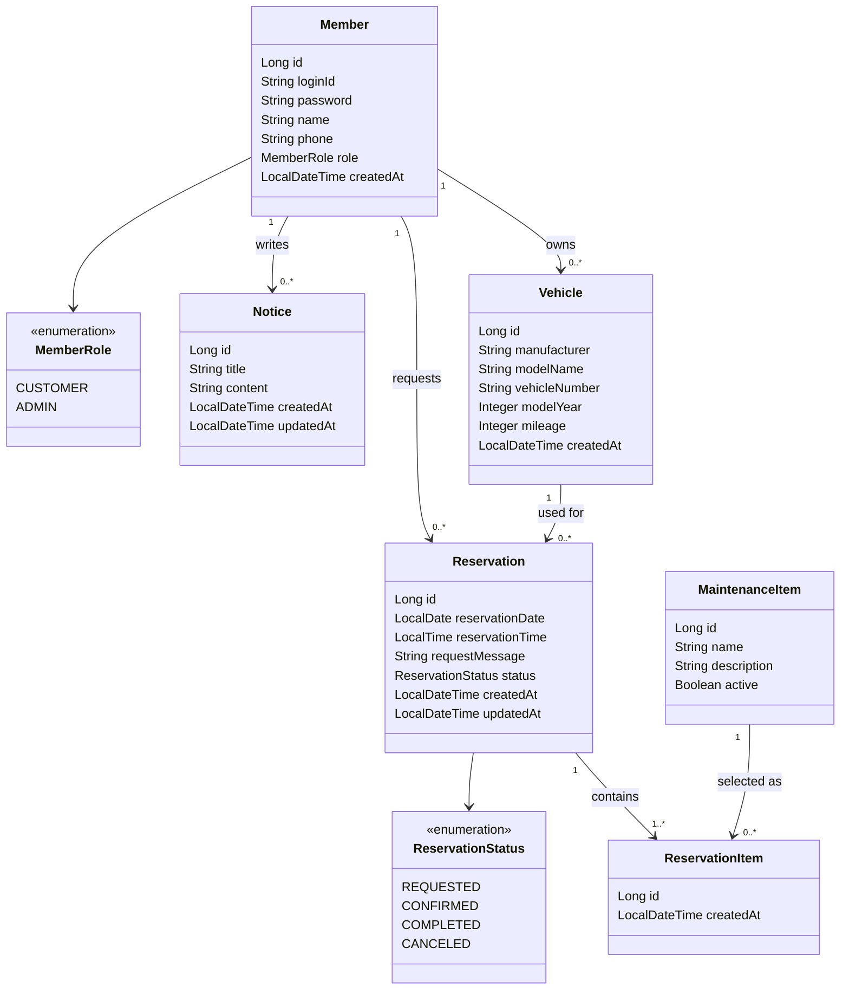
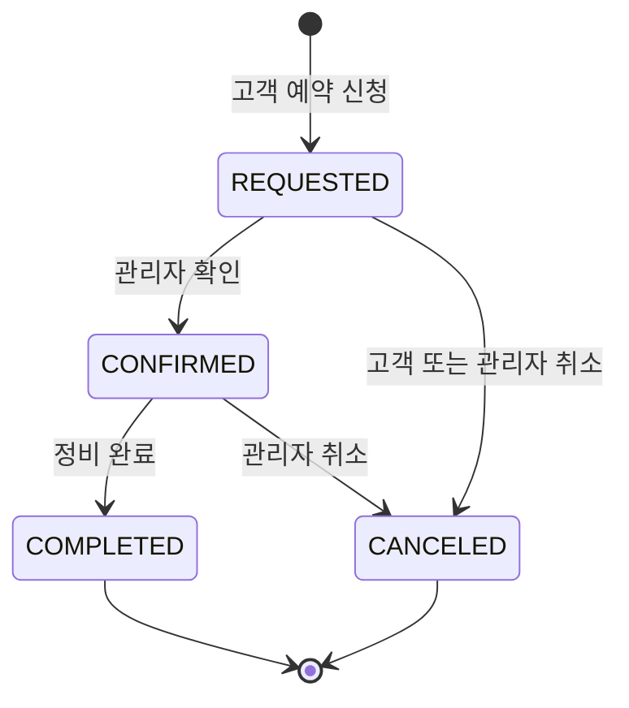

# GarageCare Domain Model

> Version: 1.0.0  
> Status: Draft  
> Last Updated: 2026-07-16

---

## 1. Overview

이 문서는 GarageCare의 핵심 도메인과 각 도메인의 책임, 관계 및 비즈니스 규칙을 정의한다.

도메인 모델은 데이터베이스 테이블을 먼저 설계하기 위한 문서가 아니라, GarageCare가 다루는 실제 업무 개념을 명확하게 표현하기 위한 문서다.

이 문서에서 정의한 도메인과 규칙은 이후 다음 작업의 기준으로 사용한다.

- ERD 설계
- JPA Entity 설계
- Service 계층의 비즈니스 로직 구현
- API 및 화면 입력값 설계
- 테스트 케이스 작성

상세한 데이터 타입, 컬럼 길이, PK·FK와 같은 데이터베이스 구현 사항은 `erd.md`에서 별도로 정의한다.

---

## 2. Design Principles

GarageCare의 도메인 모델은 다음 원칙을 기준으로 설계한다.

### 2.1 Business First

데이터베이스 구조보다 실제 정비소의 예약 업무와 사용자 행동을 먼저 고려한다.

테이블을 만들기 편한 구조보다 비즈니스 개념과 규칙을 코드에서 명확하게 표현할 수 있는 구조를 우선한다.

### 2.2 Clear Responsibility

각 도메인은 하나의 명확한 책임을 가진다.

- `Member`는 사용자 계정과 권한을 관리한다.
- `Vehicle`은 고객이 소유한 차량 정보를 관리한다.
- `Reservation`은 정비 예약과 진행 상태를 관리한다.
- `MaintenanceItem`은 정비소에서 제공하는 정비 항목을 관리한다.
- `Notice`는 정비소 공지사항을 관리한다.

### 2.3 Explicit Business Rules

중요한 규칙을 Controller나 화면에 분산시키지 않고 도메인 또는 Service 계층에서 명시적으로 관리한다.

예를 들어 예약 취소 가능 여부와 예약 상태 변경 조건은 단순한 문자열 비교가 아니라 정의된 규칙에 따라 판단한다.

### 2.4 Minimal MVP

현재 모델은 하나의 소규모 정비소에서 사용하는 MVP를 기준으로 한다.

다중 정비소, 결제, 재고 관리, 정비기사 배정 등은 초기 도메인에서 제외한다.

### 2.5 Extension without Premature Complexity

정비 이력, 소모품 교체주기 알림, AI 상담 등 향후 기능을 고려하되, 아직 필요하지 않은 구조를 미리 구현하지 않는다.

현재 요구사항을 명확하게 해결하면서 이후 확장 가능한 수준으로만 설계한다.

### 2.6 Terminology

GarageCare에서는 다음 용어를 기준으로 사용한다.

| Term | Meaning |
|---|---|
| `Member` | GarageCare에 가입한 전체 회원 |
| `Customer` | `CUSTOMER` 권한을 가진 회원 |
| `Administrator` | `ADMIN` 권한을 가진 회원 |
| `Vehicle` | 회원이 등록한 차량 |
| `Reservation` | 고객이 신청한 정비 예약 |
| `MaintenanceItem` | 정형화된 정비 항목 |
| `Notice` | 관리자가 작성한 공지사항 |

문서에서는 일반 설명에는 한국어 표현을 사용하고,
클래스명과 도메인명은 영문 표기를 사용한다.

---

## 3. Domain Overview

GarageCare MVP의 핵심 도메인은 다음과 같다.

| Domain | Responsibility | MVP |
|---|---|:---:|
| `Member` | 사용자 계정, 인증 정보 및 권한 관리 | ✅ |
| `Vehicle` | 고객이 등록한 차량 정보 관리 | ✅ |
| `Reservation` | 정비 예약 정보와 진행 상태 관리 | ✅ |
| `ReservationItem` | 예약과 정비 항목의 연결 정보 관리 | ✅ |
| `MaintenanceItem` | 정비소에서 제공하는 정비 항목 관리 | ✅ |
| `Notice` | 정비소 공지사항 관리 | ✅ |

`ReservationItem`은 사용자에게 독립적으로 노출되는 기능 도메인이 아니라,
`Reservation`과 `MaintenanceItem`의 다대다 관계를 해소하기 위한 연결 도메인이다.

### Supporting Types

독립적인 핵심 도메인은 아니지만, 도메인의 상태와 권한을 명확히 표현하기 위해 다음 타입을 사용한다.

| Type | Responsibility |
|---|---|
| `MemberRole` | 고객과 관리자의 권한 구분 |
| `ReservationStatus` | 예약의 진행 상태 표현 |

---

## 4. Domain Relationship

GarageCare의 핵심 관계는 다음과 같다.

- 한 명의 회원은 여러 대의 차량을 등록할 수 있다.
- 하나의 차량은 여러 예약에서 사용될 수 있다.
- 한 명의 회원은 여러 예약을 신청할 수 있다.
- 하나의 예약은 반드시 한 명의 회원과 한 대의 차량에 연결된다.
- 하나의 예약은 하나 이상의 `ReservationItem`을 가진다.
- 하나의 `ReservationItem`은 하나의 정비 항목을 참조한다.
- 하나의 정비 항목은 여러 `ReservationItem`에서 사용될 수 있다.
- 공지사항은 관리자 권한을 가진 회원이 작성하고 관리한다.

### Relationship Summary

| Source | Relation | Target | Description |
|---|---|---|---|
| `Member` | 1:N | `Vehicle` | 한 회원이 여러 차량을 소유 |
| `Member` | 1:N | `Reservation` | 한 회원이 여러 예약을 신청 |
| `Vehicle` | 1:N | `Reservation` | 한 차량이 여러 예약에 사용 |
| `Reservation` | 1:N | `ReservationItem` | 하나의 예약에 여러 정비 항목 연결 정보 포함 |
| `MaintenanceItem` | 1:N | `ReservationItem` | 하나의 정비 항목이 여러 예약에서 선택됨 |
| `Member` | 1:N | `Notice` | 관리자가 여러 공지사항 작성 |

---

## 5. Domain Diagram



> 위 다이어그램은 비즈니스 관계를 표현한 도메인 모델이다.  
> 실제 데이터베이스의 연결 테이블과 FK 구조는 `erd.md`에서 구체화한다.

---

# 6. Domain Details

## 6.1 Member

### Responsibility

`Member`는 GarageCare를 사용하는 고객과 관리자의 계정 정보를 관리한다.

회원가입과 로그인에 필요한 인증 정보를 보유하며, 사용자의 권한을 통해 접근 가능한 기능을 구분한다.

관리자를 별도의 도메인으로 분리하지 않고 `MemberRole`을 통해 고객과 관리자를 구분한다.

### Core Attributes

| Attribute | Description | Required |
|---|---|:---:|
| `id` | 회원 식별자 | ✅ |
| `loginId` | 로그인에 사용하는 고유 아이디 | ✅ |
| `password` | 암호화된 비밀번호 | ✅ |
| `name` | 사용자 이름 | ✅ |
| `phone` | 연락 가능한 전화번호 | ✅ |
| `role` | 고객 또는 관리자 권한 | ✅ |
| `createdAt` | 계정 생성 시각 | ✅ |

### MemberRole

```text
CUSTOMER
ADMIN
```

- `CUSTOMER`: 차량을 등록하고 본인의 예약을 관리한다.
- `ADMIN`: 전체 예약과 공지사항을 관리한다.

### Relationships

- 하나의 회원은 여러 차량을 등록할 수 있다.
- 하나의 회원은 여러 예약을 신청할 수 있다.
- 관리자 권한을 가진 회원은 여러 공지사항을 작성할 수 있다.

### Business Rules

- 로그인 아이디는 중복될 수 없다.
- 비밀번호는 평문으로 저장하지 않는다.
- 회원은 하나의 권한을 가진다.
- 고객은 자신의 차량과 예약만 조회할 수 있다.
- 관리자만 전체 예약과 공지사항 관리 기능에 접근할 수 있다.
- 예약에 연결된 회원 정보는 예약의 소유권을 판단하는 기준이 된다.

### Withdrawal Policy

- 진행 중인 예약이 존재하는 회원은 즉시 탈퇴할 수 없다.
- 회원 탈퇴 시 차량과 예약 이력을 함께 삭제하지 않는다.
- 개인정보 처리 방식은 인증 기능 구현 전에 별도로 확정한다.
- 초기 MVP에서는 회원 탈퇴 기능을 제외할 수 있다.

### Main Behaviors

향후 도메인 또는 Service 계층에서 다음 행동을 제공할 수 있다.

```text
registerVehicle()
changeProfile()
verifyReservationOwnership()
hasAdminRole()
```

---

## 6.2 Vehicle

### Responsibility

`Vehicle`은 고객이 정비 예약에 사용하는 차량 정보를 관리한다.

차량 정보를 회원과 분리함으로써 한 명의 고객이 여러 대의 차량을 등록하고, 동일한 차량으로 반복 예약할 수 있도록 한다.

### Core Attributes

| Attribute | Description | Required |
|---|---|:---:|
| `id` | 차량 식별자 | ✅ |
| `member` | 차량을 소유한 회원 | ✅ |
| `manufacturer` | 제조사 | ✅ |
| `modelName` | 차량 모델명 | ✅ |
| `vehicleNumber` | 차량 번호 | ✅ |
| `modelYear` | 연식 | 선택 |
| `mileage` | 현재 누적 주행거리 | 선택 |
| `createdAt` | 차량 등록 시각 | ✅ |

### Relationships

- 하나의 차량은 반드시 한 명의 회원에게 속한다.
- 하나의 차량은 여러 예약에 사용될 수 있다.

### Business Rules

- 차량은 소유 회원 없이 생성될 수 없다.
- 고객은 자신이 소유한 차량만 조회하거나 수정할 수 있다.
- 예약에 사용되는 차량은 예약을 신청한 회원이 소유한 차량이어야 한다.
- 차량 번호는 동일 정비소 내에서 중복 등록되지 않도록 검토한다.
- 주행거리는 음수일 수 없다.
- 새로운 주행거리를 입력할 때 기존 주행거리보다 작은 값이 입력되는 경우 검증이 필요하다.

### Deletion Policy

- 진행 중인 예약이 있는 차량은 삭제할 수 없다.
- 예약 이력이 존재하는 차량은 물리 삭제보다 비활성화를 우선 검토한다.
- 차량 삭제 여부는 예약 이력 보존 정책과 함께 결정한다.

### Main Behaviors

```text
updateVehicleInfo()
updateMileage()
isOwnedBy(member)
```

### Design Decision

차량 정보를 `Member`의 단순 문자열 속성으로 저장하지 않고 별도 도메인으로 분리한다.

이 구조는 다음 확장을 가능하게 한다.

- 한 회원의 다중 차량 등록
- 차량별 예약 이력 조회
- 차량별 정비 이력 관리
- 차량별 소모품 교체주기 알림

---

## 6.3 Reservation

### Responsibility

`Reservation`은 고객이 신청한 정비 예약의 날짜, 시간, 대상 차량, 정비 항목, 요청사항 및 진행 상태를 관리한다.

GarageCare의 핵심 도메인이며, 고객의 예약 신청부터 관리자의 확인과 정비 완료까지 전체 흐름을 표현한다.

### Core Attributes

| Attribute | Description | Required |
|---|---|:---:|
| `id` | 예약 식별자 | ✅ |
| `member` | 예약을 신청한 회원 | ✅ |
| `vehicle` | 정비 대상 차량 | ✅ |
| `reservationItems` | 예약에 포함된 하나 이상의 정비 항목 | ✅ |
| `reservationDate` | 예약 희망 날짜 | ✅ |
| `reservationTime` | 예약 희망 시간 | ✅ |
| `requestMessage` | 고객 요청사항 | 선택 |
| `status` | 예약 진행 상태 | ✅ |
| `createdAt` | 예약 생성 시각 | ✅ |
| `updatedAt` | 예약 수정 시각 | ✅ |

### Date and Time Decision

GarageCare는 관리자 화면에서 날짜별 예약 현황을 조회하는 흐름이 중요하므로
예약 날짜와 시간을 각각 `reservationDate`, `reservationTime`으로 분리한다.

중복 예약 검사와 정렬 시에는 두 값을 함께 사용한다.

향후 시간대 기반 검색이나 외부 캘린더 연동이 필요해질 경우
`LocalDateTime` 기반 구조로의 변경을 검토한다.

### ReservationStatus

```text
REQUESTED
CONFIRMED
COMPLETED
CANCELED
```

| Status | Meaning |
|---|---|
| `REQUESTED` | 고객이 예약을 신청한 상태 |
| `CONFIRMED` | 관리자가 예약을 확인하고 확정한 상태 |
| `COMPLETED` | 정비가 완료된 상태 |
| `CANCELED` | 고객 또는 관리자가 예약을 취소한 상태 |

### Status Flow



### Status Transition Rules

| Current Status | Next Status | Actor | Allowed |
|---|---|---|:---:|
| `REQUESTED` | `CONFIRMED` | Administrator | ✅ |
| `REQUESTED` | `CANCELED` | Customer / Administrator | ✅ |
| `CONFIRMED` | `COMPLETED` | Administrator | ✅ |
| `CONFIRMED` | `CANCELED` | Administrator | ✅ |
| `COMPLETED` | `CANCELED` | Customer / Administrator | ❌ |
| `CANCELED` | `REQUESTED` | Customer / Administrator | ❌ |

정의되지 않은 상태 전이는 허용하지 않는다.

### Relationships

- 하나의 예약은 반드시 한 명의 회원과 연결된다.
- 하나의 예약은 반드시 한 대의 차량과 연결된다.
- 하나의 예약은 하나 이상의 `ReservationItem`을 가진다.
- 정비 항목은 `ReservationItem`을 통해 예약에 연결된다.
- 한 회원과 차량은 여러 예약을 가질 수 있다.

### Business Rules

#### Reservation Creation

- 로그인한 고객만 예약을 신청할 수 있다.
- 예약은 반드시 고객이 소유한 차량으로 신청해야 한다.
- 예약 날짜는 현재 날짜보다 이전일 수 없다.
- 예약 시간은 정비소가 운영하는 예약 가능 시간 안에서 선택해야 한다.
- 하나의 예약에는 최소 한 개 이상의 `ReservationItem`이 필요하다.
- 동일한 정비 항목을 하나의 예약에 중복 추가할 수 없다.
- 비활성화된 정비 항목은 새로운 예약에 추가할 수 없다.
- 새 예약의 초기 상태는 `REQUESTED`이다.

#### Reservation Ownership

- 고객은 자신의 예약만 조회할 수 있다.
- 관리자는 모든 예약을 조회할 수 있다.
- 예약 신청 회원과 차량 소유 회원은 동일해야 한다.

#### Reservation Cancellation

- `REQUESTED` 상태의 예약은 고객 또는 관리자가 취소할 수 있다.
- `CONFIRMED` 상태의 고객 취소 허용 여부는 운영 정책에 따라 확정한다.
- `COMPLETED` 상태의 예약은 취소할 수 없다.
- 이미 `CANCELED` 상태인 예약은 다시 취소할 수 없다.

#### Reservation Status Change

- 관리자만 예약을 `CONFIRMED` 또는 `COMPLETED` 상태로 변경할 수 있다.
- 정의되지 않은 상태 전이는 허용하지 않는다.
- `CANCELED` 또는 `COMPLETED` 상태는 종료 상태로 취급한다.

#### Duplicate Reservation

초기 MVP에서는 다음 기준으로 중복 여부를 검토한다.

- 동일한 차량
- 동일한 예약 날짜
- 동일한 예약 시간
- 종료 상태가 아닌 예약

정비소가 같은 시간대에 여러 차량을 처리할 수 있는지는 실제 운영자 의견을 확인한 뒤 예약 수용량 정책으로 확정한다.

#### Reservation Availability

- 예약은 정비소 영업시간 내에서만 생성할 수 있다.
- 초기 MVP의 예약 시간 단위는 1시간으로 설정한다.
- 동일 시간대 예약 가능 수량은 초기에는 1건으로 제한한다.
- 휴무일과 특정 날짜 예약 차단 기능은 MVP 이후 확장한다.
- 실제 운영 환경에서 동시간대 여러 차량을 받을 수 있는 경우 수용량 정책을 조정한다.

### Main Behaviors

```text
confirm()
complete()
cancel()
isCancelableBy(member)
validateVehicleOwner()
changeSchedule()
addMaintenanceItem()
removeMaintenanceItem()
containsMaintenanceItem()
```

### Design Decision

예약은 `Member`와 `Vehicle`을 모두 참조한다.

차량을 통해 회원을 간접적으로 확인할 수도 있지만 예약 신청자를 명확하게 기록하면 다음 장점이 있다.

- 예약 소유권 검증이 명확해진다.
- 예약 신청 당시의 사용자를 직접 조회할 수 있다.
- 관리자 검색과 고객별 예약 조회가 단순해진다.

다만 두 관계가 불일치하지 않도록 예약 생성 시 회원과 차량 소유자가 동일한지 반드시 검증해야 한다.

---

## 6.4 ReservationItem

### Responsibility

`ReservationItem`은 예약과 정비 항목의 연결 정보를 관리한다.

초기 MVP에서는 예약과 정비 항목의 관계를 표현하는 역할만 담당하지만,
향후 항목별 예상 금액, 작업 여부 및 정비 결과를 확장할 수 있다.

### Core Attributes

| Attribute | Description | Required |
|---|---|:---:|
| `id` | 연결 정보 식별자 | ✅ |
| `reservation` | 연결된 예약 | ✅ |
| `maintenanceItem` | 선택된 정비 항목 | ✅ |
| `createdAt` | 생성 시각 | ✅ |

### Relationships

- 하나의 예약은 여러 `ReservationItem`을 가질 수 있다.
- 하나의 정비 항목은 여러 `ReservationItem`에서 사용될 수 있다.

### Business Rules

- 하나의 예약에는 최소 한 개 이상의 `ReservationItem`이 필요하다.
- 동일한 예약에 같은 정비 항목을 중복 추가할 수 없다.
- 비활성화된 정비 항목은 새로운 예약에 추가할 수 없다.

### Future Extension

향후 다음 속성을 추가할 수 있다.

- 예상 금액
- 실제 작업 여부
- 작업 결과
- 항목별 고객 요청사항

---

## 6.5 MaintenanceItem

### Responsibility

`MaintenanceItem`은 고객이 선택하는 정형화된 정비 항목을 나타낸다.

고객의 증상, 특이사항 또는 추가 요청은
`Reservation.requestMessage`에 자유롭게 입력한다.

### Core Attributes

| Attribute | Description | Required |
|---|---|:---:|
| `id` | 정비 항목 식별자 | ✅ |
| `name` | 정비 항목명 | ✅ |
| `description` | 정비 항목 설명 | 선택 |
| `active` | 예약 화면 노출 여부 | ✅ |

### Initial Items

초기 MVP에서는 다음과 같은 항목을 고려한다.

- 엔진오일 교환
- 타이어 점검 및 교체
- 브레이크 점검
- 배터리 점검 및 교체
- 일반 점검
- 기타 상담

실제 제공 항목은 정비소 운영자의 의견을 반영해 확정한다.

### Relationships

- 하나의 정비 항목은 여러 `ReservationItem`에서 참조될 수 있다.
- 정비 항목은 `ReservationItem`을 통해 예약과 연결된다.

### Business Rules

- 정비 항목명은 중복되지 않아야 한다.
- 비활성화된 정비 항목은 새로운 예약에서 선택할 수 없다.
- 기존 예약에서 사용된 항목은 삭제보다 비활성화를 우선한다.
- 하나의 예약에는 최소 한 개의 정비 항목이 포함되어야 한다.

### Main Behaviors

```text
activate()
deactivate()
updateDescription()
isAvailable()
```

### Design Decision

`Reservation`과 `MaintenanceItem`의 다대다 관계를 직접 매핑하지 않고,
`ReservationItem` 연결 엔티티를 통해 표현한다.

이를 통해 관계를 명시적으로 관리하고,
향후 항목별 예상 금액, 작업 상태 및 정비 결과를 확장할 수 있다.

---

## 6.6 Notice

### Responsibility

`Notice`는 정비소 운영시간, 휴무일, 예약 안내 등의 공지사항을 관리한다.

고객은 공지사항을 조회할 수 있으며, 관리자만 생성·수정·삭제할 수 있다.

### Core Attributes

| Attribute | Description | Required |
|---|---|:---:|
| `id` | 공지사항 식별자 | ✅ |
| `author` | 공지사항 작성 관리자 | ✅ |
| `title` | 공지사항 제목 | ✅ |
| `content` | 공지사항 내용 | ✅ |
| `createdAt` | 작성 시각 | ✅ |
| `updatedAt` | 수정 시각 | ✅ |

### Relationships

- 하나의 관리자는 여러 공지사항을 작성할 수 있다.
- 공지사항 작성자는 `ADMIN` 권한을 가진 회원이어야 한다.

### Business Rules

- 공지사항은 관리자만 작성할 수 있다.
- 제목과 본문은 비어 있을 수 없다.
- 고객은 공지사항을 조회할 수 있지만 수정하거나 삭제할 수 없다.
- 수정 시 최초 작성일은 유지하고 수정 시각만 변경한다.
- 공지사항 삭제 정책은 초기에는 물리 삭제를 사용하되, 운영 필요에 따라 논리 삭제를 검토한다.

### Main Behaviors

```text
update()
validateAuthor()
```

### Design Decision

`Admin`을 별도 엔티티로 만들지 않고 `MemberRole.ADMIN` 권한을 가진 회원이 공지사항을 작성하도록 한다.

이를 통해 별도의 관리자 계정 테이블을 만들지 않고도 인증 및 권한 구조를 일관되게 유지할 수 있다.

---

# 7. Aggregate Considerations

도메인 주도 설계의 엄격한 Aggregate 구현을 바로 적용하지는 않지만, 데이터 변경의 경계를 다음과 같이 고려한다.

## Member Aggregate

```text
Member
└── Vehicle
```

- 차량은 회원 소유권 아래에서 생성된다.
- 차량 조회와 수정 시 회원 소유권을 검증한다.
- 다만 JPA 구현에서는 Vehicle을 독립 Entity로 관리한다.

## Reservation Aggregate

```text
Reservtion
├── Member reference
├── Vehicle reference
└── ReservationItem
    └── MaintenanceItem reference
```

- 예약 상태 변경은 Reservation을 중심으로 수행한다.
- 상태를 Controller에서 직접 변경하지 않는다.
- 예약 가능 여부와 취소 가능 여부는 Reservation 또는 ReservationService가 판단한다.

## Notice Aggregate

```text
Notice
└── Member author reference
```

- 공지사항 생성 시 작성자의 관리자 권한을 검증한다.

> 초기 MVP에서는 지나치게 복잡한 Aggregate 구조를 적용하지 않는다.  
> 대신 비즈니스 규칙의 책임이 어느 객체 또는 Service에 속하는지 명확하게 구분한다.

---

# 8. Cross-Domain Business Rules

개별 도메인을 넘어 여러 도메인에 적용되는 규칙은 다음과 같다.

## 8.1 Ownership Validation

- 차량을 조회하거나 수정할 때 요청한 회원과 차량 소유자를 비교한다.
- 예약을 생성할 때 신청 회원과 차량 소유자가 동일해야 한다.
- 고객이 예약을 조회하거나 취소할 때 예약 신청자와 현재 회원이 동일해야 한다.

## 8.2 Authorization

- 고객은 본인의 차량과 예약만 관리할 수 있다.
- 관리자는 모든 예약을 조회하고 상태를 변경할 수 있다.
- 관리자만 공지사항을 생성·수정·삭제할 수 있다.

## 8.3 Data Integrity

- 예약은 최소 한 개 이상의 `ReservationItem`을 가져야 한다.
- `ReservationItem`은 예약과 정비 항목 없이 생성될 수 없다.
- 동일 예약에 같은 정비 항목을 중복 연결할 수 없다.
- 비활성화된 정비 항목은 새로운 `ReservationItem`에 연결할 수 없다.

## 8.4 Audit Information

주요 도메인에는 생성 및 수정 시각을 기록한다.

```text
createdAt
updatedAt
```

향후 필요하면 다음 정보를 추가할 수 있다.

```text
createdBy
updatedBy
deletedAt
```

---

# 9. Application Service Responsibilities

모든 규칙을 Entity 내부에 넣는 것은 적절하지 않다.

여러 도메인을 조회하거나 외부 저장소 접근이 필요한 규칙은 Service 계층에서 처리한다.

| Service | Main Responsibility |
|---|---|
| `MemberService` | 회원가입, 중복 검사, 계정 조회 |
| `VehicleService` | 차량 등록, 소유권 검증, 차량 정보 수정 |
| `ReservationService` | 예약 생성, 정비 항목 연결, 중복 예약 검증, 상태 변경 및 취소 |
| `MaintenanceItemService` | 정비 항목 관리 및 활성 상태 검증 |
| `NoticeService` | 공지사항 등록·수정·삭제와 관리자 권한 검증 |

### Entity Responsibility

Entity 내부에서 처리하기 적절한 행동:

- 예약 내 정비 항목 중복 여부 판단
- 예약 정비 항목 추가 및 제거
- 예약 상태 전이
- 예약 취소 가능 여부 판단
- 차량 주행거리 갱신
- 정비 항목 활성화 및 비활성화
- 공지사항 내용 수정

### Service Responsibility

Service에서 처리하기 적절한 행동:

- 로그인 아이디 중복 조회
- 차량 소유권 확인을 위한 Repository 조회
- 동일 시간 예약 중복 검사
- 관리자 권한 확인
- 여러 도메인을 조합한 예약 생성
- 선택한 `MaintenanceItem` 조회 및 활성 상태 확인
- `ReservationItem` 생성과 예약 연결

---

# 10. Domain Invariants

도메인이 항상 유지해야 하는 핵심 조건이다.

## Member

```text
loginId must not be blank
password must be encoded
name must not be blank
phone must not be blank
role must not be null
```

## Vehicle

```text
member must not be null
manufacturer must not be blank
modelName must not be blank
vehicleNumber must not be blank
mileage must be zero or positive
```

## Reservation

```text
member must not be null
vehicle must not be null
member must own vehicle
reservation date must not be in the past
reservation time must be available
at least one maintenance item is required
status must not be null
```

## ReservationItem

```text
reservation must not be null
maintenanceItem must not be null
maintenanceItem must be active
the same maintenance item must not be duplicated within one reservation
```

## MaintenanceItem

```text
name must not be blank
name must be unique
active must not be null
```

## Notice

```text
author must have ADMIN role
title must not be blank
content must not be blank
```

---

# 11. Future Extension

현재 도메인 모델을 기반으로 다음 도메인을 확장할 수 있다.

## MaintenanceHistory

정비 완료 결과와 실제 수행 항목을 차량별로 기록한다.

예상 관계:

```text
Vehicle 1:N MaintenanceHistory
Reservation 1:0..1 MaintenanceHistory
```

## MaintenanceCycle

차량별 소모품 교체주기와 다음 교체 예상 시점을 관리한다.

예상 항목:

- 엔진오일
- 브레이크 패드
- 타이어
- 배터리

## Notification

예약 접수, 확정, 취소 및 교체주기 알림을 관리한다.

예상 채널:

- 이메일
- 문자
- 서비스 내부 알림

## Consultation

고객의 증상을 입력받아 상담 내역과 추천 정비 항목을 관리한다.

향후 AI 추천 기능과 연결할 수 있다.

## Workshop

여러 정비소를 지원할 경우 정비소 자체를 독립 도메인으로 분리한다.

현재 MVP는 단일 정비소를 가정하므로 포함하지 않는다.

---

# 12. Open Decisions

아직 확정되지 않았으며 실제 운영자 의견이나 후속 설계에서 결정할 사항이다.

| Decision | Current Direction |
|---|---|
| 동일 시간대 예약 가능 수 | 실제 정비소 처리 가능 수량 확인 후 결정 |
| `CONFIRMED` 상태의 고객 취소 | 운영 정책 확인 필요 |
| 차량 번호 중복 범위 | 단일 정비소 기준 고유값 권장 |
| 예약 시간 단위 | 30분 또는 1시간 단위 검토 |
| 정비 항목 가격 관리 | MVP 제외, 추후 검토 |
| 공지사항 논리 삭제 | 초기 물리 삭제, 운영 단계에서 재검토 |
| 회원 탈퇴 시 예약·차량 처리 | 구현 전 정책 확정 필요 |
| `ReservationItem`의 가격 정보 | MVP 제외, 가격 기능 도입 시 추가 |
| 예약 당시 정비 항목명 보존 | 항목명 변경 가능성을 고려해 추후 검토 |
| 항목별 작업 결과 기록 | 정비 이력 기능 도입 시 추가 |

확정된 내용은 이 문서와 관련 Issue에 결정 근거를 함께 기록한다.

---

# 13. Related Documents

| Document | Description |
|---|---|
| [`planning.md`](./planning.md) | 프로젝트 비전과 사용자 요구사항 |
| [`feature-list.md`](./feature-list.md) | MVP 기능 목록과 우선순위 |
| `erd.md` | 테이블, 컬럼 및 데이터베이스 관계 |
| `api-spec.md` | 도메인 기능을 제공하는 요청·응답 명세 |
| `architecture.md` | 애플리케이션 계층과 패키지 구조 |

---

# 14. Summary

GarageCare의 핵심 도메인은 다음과 같이 정의한다.

```text
Member
├── owns Vehicle
├── requests Reservation
└── writes Notice as ADMIN

Vehicle
└── is used in Reservation

Reservation
└── contains ReservationItem
    └── references MaintenanceItem
```

가장 중요한 비즈니스 흐름은 다음과 같다.

```text
회원 가입
→ 차량 등록
→ 정비 항목 선택
→ 예약 신청
→ 관리자 예약 확정
→ 정비 완료
```

이 도메인 모델을 기준으로 ERD, JPA Entity, Service 및 API 구조를 설계한다.