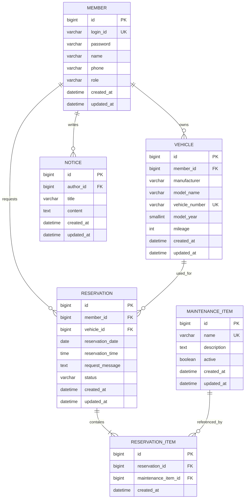

# GarageCare ERD

> Version: 1.1.0  
> Status: Draft  
> Last Updated: 2026-07-18

---

## 1. Overview

이 문서는 GarageCare MVP의 관계형 데이터베이스 구조를 정의한다.

`domain-model.md`에서 정의한 비즈니스 개념을 테이블, 컬럼, 관계 및 제약조건으로 구체화하며 이후 다음 작업의 기준으로 사용한다.

- JPA Entity 설계
- Repository 구현
- 데이터베이스 스키마 작성
- Service 계층의 비즈니스 검증
- API 요청·응답 모델 설계
- 통합 테스트 작성

본 문서는 데이터 저장 구조를 정의한다. 예약 상태 전이, 소유권 검증, 예약 가능 시간 등 상세 비즈니스 규칙은 `domain-model.md`를 기준으로 한다.

---

## 2. Scope

현재 ERD는 하나의 소규모 정비소에서 사용하는 MVP를 기준으로 한다.

### Included

- 회원 및 권한
- 차량 등록
- 정비 예약
- 예약별 정비 항목
- 정비 항목 관리
- 공지사항

### Out of Scope

- 결제
- 정비기사 배정
- 부품 및 재고 관리
- 다중 정비소
- 정비 이력
- 알림 발송 내역
- AI 상담 및 추천

범위 밖의 기능은 현재 테이블에 미리 포함하지 않고 실제 기능 확장 시 별도 Entity로 설계한다.

---

## 3. Design Principles

### 3.1 Business-Oriented Design

테이블은 화면 구성보다 실제 정비소 업무 개념을 기준으로 설계한다.

예를 들어 관리자는 별도 사용자 유형이 아니라 회원이 가진 권한이므로 별도의 `admin` 테이블을 만들지 않고 `member.role`로 구분한다.

### 3.2 Referential Integrity

모든 연관관계는 FK를 통해 명확하게 표현한다.

다만 FK만으로 검증할 수 없는 다음 규칙은 애플리케이션 계층에서 검증한다.

- 예약 회원과 차량 소유자의 일치
- 관리자 권한 여부
- 예약 상태 전이 가능 여부
- 예약 가능 시간
- 동일 시간대 예약 수용량

### 3.3 History Preservation

회원, 차량 또는 정비 항목의 변경으로 과거 예약 기록이 함께 삭제되지 않도록 한다.

운영 이력에 해당하는 데이터는 물리 삭제보다 상태 변경 또는 비활성화를 우선한다.

### 3.4 Explicit Relationship Entity

`reservation`과 `maintenance_item`의 다대다 관계를 직접 매핑하지 않는다.

연결 Entity인 `reservation_item`을 사용해 관계를 명시적으로 관리하고, 향후 다음 정보를 확장할 수 있도록 한다.

- 예약 당시 항목명
- 예상 금액
- 실제 정비 금액
- 작업 상태
- 작업 결과

### 3.5 Portable Enum Storage

회원 권한과 예약 상태는 DB 전용 `ENUM` 타입 대신 `VARCHAR`로 저장한다.

이를 통해 H2와 운영 DB 간 호환성을 높이고 JPA에서는 다음 방식으로 매핑한다.

```java
@Enumerated(EnumType.STRING)
```

---

## 4. Naming Convention

### 4.1 Table and Column

테이블명과 컬럼명은 소문자 `snake_case`를 사용한다.

```text
member
vehicle
reservation
reservation_item
maintenance_item
notice
```

> `member`와 `reservation`은 일부 DBMS 또는 SQL 환경에서 충돌 가능성이 있으므로 실제 운영 DB 선택 시 예약어 여부를 확인한다. 충돌이 발생하면 `members`, `reservations`처럼 복수형 테이블명으로 변경한다.

### 4.2 Primary Key

모든 테이블의 PK는 다음 이름을 사용한다.

```text
id
```

### 4.3 Foreign Key

참조 대상 Entity 이름 뒤에 `_id`를 붙인다.

```text
member_id
vehicle_id
reservation_id
maintenance_item_id
author_id
```

### 4.4 Time Columns

```text
created_at
updated_at
```

시간 정보는 애플리케이션과 DB에서 동일한 시간대 기준을 사용한다.

---

## 5. Entity Overview

| Entity | Table | Responsibility |
|---|---|---|
| `Member` | `member` | 회원 계정, 인증 정보 및 권한 관리 |
| `Vehicle` | `vehicle` | 회원이 등록한 차량 정보 관리 |
| `Reservation` | `reservation` | 정비 예약 일정과 상태 관리 |
| `ReservationItem` | `reservation_item` | 예약과 정비 항목의 연결 정보 관리 |
| `MaintenanceItem` | `maintenance_item` | 정비소에서 제공하는 정비 항목 관리 |
| `Notice` | `notice` | 관리자가 작성하는 공지사항 관리 |

---

# 6. Table Specification

## 6.1 Member

### Description

GarageCare를 사용하는 고객과 관리자의 계정 정보를 저장한다.

관리자를 별도 테이블로 분리하지 않고 `role` 값으로 구분한다.

### Columns

| Column | Type | NULL | Constraint | Description | Example |
|---|---|:---:|---|---|---|
| `id` | BIGINT | NO | PK, AUTO INCREMENT | 회원 식별자 | `1` |
| `login_id` | VARCHAR(50) | NO | UNIQUE | 로그인 아이디 | `parkhyunwoo` |
| `password` | VARCHAR(255) | NO |  | 암호화된 비밀번호 | BCrypt Hash |
| `name` | VARCHAR(50) | NO |  | 회원 이름 | `박현우` |
| `phone` | VARCHAR(20) | NO |  | 연락처 | `010-1234-5678` |
| `role` | VARCHAR(20) | NO | CHECK 후보 | 회원 권한 | `CUSTOMER` |
| `created_at` | DATETIME | NO |  | 생성 시각 | `2026-07-18 14:30:00` |
| `updated_at` | DATETIME | NO |  | 최종 수정 시각 | `2026-07-18 14:30:00` |

### Allowed Values

```text
CUSTOMER
ADMIN
```

### Constraints

```text
UNIQUE (login_id)
```

### Design Notes

- 비밀번호는 평문으로 저장하지 않는다.
- `phone`의 UNIQUE 여부는 MVP에서는 강제하지 않는다.
- 휴대전화 인증 또는 중복 가입 방지가 필요해지면 별도 정책을 정의한다.
- 회원 탈퇴 기능 도입 시 `active`, `deleted_at` 등의 컬럼 추가를 검토한다.

---

## 6.2 Vehicle

### Description

회원이 정비 예약에 사용할 차량 정보를 저장한다.

한 회원은 여러 차량을 등록할 수 있다.

### Columns

| Column | Type | NULL | Constraint | Description | Example |
|---|---|:---:|---|---|---|
| `id` | BIGINT | NO | PK, AUTO INCREMENT | 차량 식별자 | `1` |
| `member_id` | BIGINT | NO | FK | 차량 소유 회원 | `1` |
| `manufacturer` | VARCHAR(50) | NO |  | 제조사 | `Hyundai` |
| `model_name` | VARCHAR(100) | NO |  | 모델명 | `Grandeur` |
| `vehicle_number` | VARCHAR(20) | NO | UNIQUE | 차량 번호 | `12가3456` |
| `model_year` | SMALLINT | YES |  | 차량 연식 | `2023` |
| `mileage` | INT | YES | CHECK 후보 | 누적 주행거리(km) | `35000` |
| `created_at` | DATETIME | NO |  | 등록 시각 | `2026-07-18 14:30:00` |
| `updated_at` | DATETIME | NO |  | 최종 수정 시각 | `2026-07-18 14:30:00` |

### Foreign Key

```text
vehicle.member_id → member.id
```

### Constraints

```text
UNIQUE (vehicle_number)
CHECK (mileage >= 0)
```

### Design Notes

- 차량은 반드시 한 명의 회원에게 속한다.
- 차량 번호는 공백과 하이픈을 제거한 정규화 값으로 저장하는 방식을 검토한다.
- 연식의 현실적인 범위는 애플리케이션 계층에서 검증한다.
- 예약 이력이 있는 차량은 물리 삭제하지 않는 방향을 우선한다.

---

## 6.3 Reservation

### Description

고객이 신청한 정비 예약의 일정, 차량, 요청사항 및 처리 상태를 저장한다.

GarageCare의 핵심 운영 데이터다.

### Columns

| Column | Type | NULL | Constraint | Description | Example |
|---|---|:---:|---|---|---|
| `id` | BIGINT | NO | PK, AUTO INCREMENT | 예약 식별자 | `1` |
| `member_id` | BIGINT | NO | FK | 예약 신청 회원 | `1` |
| `vehicle_id` | BIGINT | NO | FK | 정비 대상 차량 | `1` |
| `reservation_date` | DATE | NO |  | 예약 날짜 | `2026-07-20` |
| `reservation_time` | TIME | NO |  | 예약 시간 | `10:00:00` |
| `request_message` | TEXT | YES |  | 증상 및 추가 요청사항 | `주행 중 소음 발생` |
| `status` | VARCHAR(20) | NO | CHECK 후보 | 예약 상태 | `REQUESTED` |
| `created_at` | DATETIME | NO |  | 예약 생성 시각 | `2026-07-18 14:30:00` |
| `updated_at` | DATETIME | NO |  | 최종 수정 시각 | `2026-07-18 15:00:00` |

### Foreign Keys

```text
reservation.member_id → member.id
reservation.vehicle_id → vehicle.id
```

### Allowed Status Values

```text
REQUESTED
CONFIRMED
COMPLETED
CANCELED
```

### Date and Time Decision

GarageCare는 관리자 화면에서 날짜별 예약 현황을 조회하는 흐름이 중요하므로 예약 날짜와 시간을 각각 저장한다.

```text
reservation_date
reservation_time
```

중복 예약 검증과 시간순 정렬에서는 두 컬럼을 함께 사용한다.

향후 외부 캘린더 연동이나 복잡한 시간대 처리가 필요할 경우 `scheduled_at` 형태의 `DATETIME` 컬럼으로 통합하는 방안을 검토한다.

### Application-Level Rules

다음 규칙은 데이터베이스 제약조건만으로 안정적으로 처리하기 어려우므로 Service 계층에서 검증한다.

- 예약 회원이 대상 차량의 소유자인지 확인한다.
- 예약 날짜가 현재 날짜보다 이전인지 확인한다.
- 예약 시간이 정비소 영업시간 안에 있는지 확인한다.
- 선택한 시간대의 예약 수용량을 초과하는지 확인한다.
- 새 예약의 초기 상태는 `REQUESTED`로 설정한다.
- 정의되지 않은 예약 상태 전이를 차단한다.

### Duplicate Reservation Policy

초기 MVP에서는 동일 시간대 예약 가능 수를 한 건으로 가정한다.

검사 기준은 다음과 같다.

```text
reservation_date
reservation_time
status not in (COMPLETED, CANCELED)
```

단순 UNIQUE 제약조건으로 처리하지 않는 이유는 취소·완료된 예약이 존재하더라도 같은 시간대에 새로운 예약을 받을 수 있어야 하기 때문이다.

실제 정비소의 동시간대 수용량이 한 건을 초과하면 별도 예약 가능 수량 정책으로 변경한다.

---

## 6.4 ReservationItem

### Description

예약과 정비 항목의 관계를 저장하는 연결 Entity다.

단순 다대다 관계를 직접 매핑하지 않고 별도 Entity로 관리한다.

### Columns

| Column | Type | NULL | Constraint | Description | Example |
|---|---|:---:|---|---|---|
| `id` | BIGINT | NO | PK, AUTO INCREMENT | 예약 항목 식별자 | `1` |
| `reservation_id` | BIGINT | NO | FK | 연결된 예약 | `1` |
| `maintenance_item_id` | BIGINT | NO | FK | 선택된 정비 항목 | `2` |
| `created_at` | DATETIME | NO |  | 생성 시각 | `2026-07-18 14:30:00` |

### Foreign Keys

```text
reservation_item.reservation_id → reservation.id
reservation_item.maintenance_item_id → maintenance_item.id
```

### Constraints

```text
UNIQUE (reservation_id, maintenance_item_id)
```

하나의 예약에 같은 정비 항목이 중복으로 등록되는 것을 방지한다.

### Design Notes

- 하나의 예약에는 최소 한 개 이상의 `reservation_item`이 필요하다.
- 최소 한 개 존재 여부는 INSERT 단위의 DB 제약조건으로 보장하기 어렵기 때문에 예약 생성 트랜잭션에서 검증한다.
- 비활성 상태의 정비 항목은 새로운 예약에 연결할 수 없다.
- `reservation_item`은 예약 없이 독립적으로 존재하지 않는다.

### Future Attributes

향후 다음 컬럼을 추가할 수 있다.

| Column Candidate | Description |
|---|---|
| `item_name_snapshot` | 예약 당시 정비 항목명 |
| `estimated_price` | 예상 금액 |
| `actual_price` | 실제 정비 금액 |
| `work_status` | 항목별 작업 상태 |
| `result_message` | 작업 결과 |
| `request_message` | 항목별 추가 요청 |

---

## 6.5 MaintenanceItem

### Description

정비소에서 제공하는 정형화된 정비 서비스 항목을 저장한다.

`MaintenanceItem`은 엔진오일 교환처럼 고객이 선택하는 항목이며, 고객이 작성하는 증상이나 자유 요청은 `reservation.request_message`에 저장한다.

### Columns

| Column | Type | NULL | Constraint | Description | Example |
|---|---|:---:|---|---|---|
| `id` | BIGINT | NO | PK, AUTO INCREMENT | 정비 항목 식별자 | `1` |
| `name` | VARCHAR(100) | NO | UNIQUE | 정비 항목명 | `엔진오일 교환` |
| `description` | TEXT | YES |  | 정비 항목 설명 | `엔진오일 및 필터 교환` |
| `active` | BOOLEAN | NO | DEFAULT TRUE | 예약 화면 노출 여부 | `true` |
| `created_at` | DATETIME | NO |  | 생성 시각 | `2026-07-18 14:30:00` |
| `updated_at` | DATETIME | NO |  | 최종 수정 시각 | `2026-07-18 14:30:00` |

### Constraints

```text
UNIQUE (name)
DEFAULT active = true
```

### Initial Data Candidates

- 엔진오일 교환
- 타이어 점검 및 교체
- 브레이크 점검
- 배터리 점검 및 교체
- 일반 점검
- 기타 상담

### Design Notes

- 기존 예약에서 참조한 항목은 삭제하지 않고 `active = false`로 변경한다.
- 비활성화된 항목은 새로운 예약에서 선택할 수 없지만 기존 예약에서는 조회할 수 있어야 한다.
- 정비 항목명을 변경하면 과거 예약 화면에도 변경된 이름이 표시될 수 있다.
- 예약 당시 이름 보존이 필요해질 경우 `reservation_item.item_name_snapshot`을 추가한다.

---

## 6.6 Notice

### Description

정비소 운영시간, 휴무일 및 예약 안내 등의 공지사항을 저장한다.

### Columns

| Column | Type | NULL | Constraint | Description | Example |
|---|---|:---:|---|---|---|
| `id` | BIGINT | NO | PK, AUTO INCREMENT | 공지사항 식별자 | `1` |
| `author_id` | BIGINT | NO | FK | 작성 관리자 | `2` |
| `title` | VARCHAR(200) | NO |  | 공지사항 제목 | `여름휴가 휴무 안내` |
| `content` | TEXT | NO |  | 공지사항 본문 | `8월 3일부터 휴무입니다.` |
| `created_at` | DATETIME | NO |  | 작성 시각 | `2026-07-18 14:30:00` |
| `updated_at` | DATETIME | NO |  | 최종 수정 시각 | `2026-07-18 15:00:00` |

### Foreign Key

```text
notice.author_id → member.id
```

### Application-Level Rules

- `author_id`가 참조하는 회원은 `ADMIN` 권한을 가져야 한다.
- FK는 회원 존재 여부만 검증할 수 있으므로 관리자 권한은 Service 계층에서 검증한다.
- 제목과 본문은 공백만 입력할 수 없다.

---

# 7. Relationship

| Parent | Child | Cardinality | Required | Description |
|---|---|---:|:---:|---|
| `member` | `vehicle` | 1:N | Vehicle 측 필수 | 한 회원이 여러 차량을 소유 |
| `member` | `reservation` | 1:N | Reservation 측 필수 | 한 회원이 여러 예약을 신청 |
| `vehicle` | `reservation` | 1:N | Reservation 측 필수 | 한 차량이 여러 예약에 사용 |
| `reservation` | `reservation_item` | 1:N | ReservationItem 측 필수 | 한 예약이 여러 정비 항목 포함 |
| `maintenance_item` | `reservation_item` | 1:N | ReservationItem 측 필수 | 한 정비 항목이 여러 예약에서 선택 |
| `member` | `notice` | 1:N | Notice 측 필수 | 관리자가 여러 공지사항 작성 |

---

# 8. Foreign Key Policy

| Child Table | FK | Parent Table | On Delete Direction |
|---|---|---|---|
| `vehicle` | `member_id` | `member.id` | RESTRICT |
| `reservation` | `member_id` | `member.id` | RESTRICT |
| `reservation` | `vehicle_id` | `vehicle.id` | RESTRICT |
| `reservation_item` | `reservation_id` | `reservation.id` | CASCADE 후보 |
| `reservation_item` | `maintenance_item_id` | `maintenance_item.id` | RESTRICT |
| `notice` | `author_id` | `member.id` | RESTRICT |

### Policy Explanation

#### RESTRICT

회원, 차량 또는 정비 항목이 과거 예약에서 사용된 경우 참조 데이터를 임의로 삭제하지 못하도록 한다.

#### ReservationItem Cascade

`reservation_item`은 `reservation`에 종속된 데이터이므로 예약이 물리 삭제되는 경우 함께 삭제할 수 있다.

다만 GarageCare에서는 예약 자체를 원칙적으로 삭제하지 않으므로 실제 운영 중 Cascade Delete가 자주 실행되지는 않는다.

---

# 9. Constraint Strategy

## 9.1 Database Constraints

DB에서 직접 보장할 수 있는 항목이다.

### Primary Key

모든 테이블의 `id`

### Unique

```text
member.login_id
vehicle.vehicle_number
maintenance_item.name
reservation_item(reservation_id, maintenance_item_id)
```

### Not Null

- 모든 PK와 FK
- 회원 로그인 아이디, 비밀번호, 이름, 연락처, 권한
- 차량 제조사, 모델명, 차량 번호
- 예약 날짜, 시간, 상태
- 정비 항목명과 활성 상태
- 공지사항 제목과 본문

### Check Candidates

```text
vehicle.mileage >= 0
member.role IN ('CUSTOMER', 'ADMIN')
reservation.status IN (
    'REQUESTED',
    'CONFIRMED',
    'COMPLETED',
    'CANCELED'
)
```

> JPA와 DB 환경의 호환성을 고려해 CHECK 제약조건을 실제 DDL에 적용할지는 구현 단계에서 결정한다.

## 9.2 Application Constraints

다음 규칙은 Service 또는 Domain 계층에서 검증한다.

- 예약 신청자와 차량 소유자가 동일해야 한다.
- 예약 날짜는 현재 날짜보다 이전일 수 없다.
- 예약은 영업시간 내에서만 가능하다.
- 동일 시간대 예약 수용량을 초과할 수 없다.
- 하나의 예약은 최소 한 개 이상의 정비 항목을 가져야 한다.
- 비활성 정비 항목은 신규 예약에 사용할 수 없다.
- 공지사항 작성자는 관리자 권한을 가져야 한다.
- 예약 상태는 정의된 순서로만 변경할 수 있다.

`reservation_date >= CURRENT_DATE`와 같은 규칙을 DB CHECK로 두지 않는 이유는 DBMS별 지원 차이와 시간 기준 문제 때문이다.

---

# 10. Index Strategy

인덱스는 컬럼마다 무조건 추가하지 않고 실제 조회 패턴을 기준으로 설계한다.

## 10.1 Automatically Created Indexes

일반적으로 PK와 UNIQUE 제약조건에는 인덱스가 자동 생성된다.

- 모든 `id`
- `member.login_id`
- `vehicle.vehicle_number`
- `maintenance_item.name`
- `reservation_item(reservation_id, maintenance_item_id)`

## 10.2 Recommended Indexes

| Index Name | Columns | Purpose |
|---|---|---|
| `idx_vehicle_member` | `vehicle(member_id)` | 회원별 차량 조회 |
| `idx_reservation_member_date` | `reservation(member_id, reservation_date)` | 고객별 예약 내역 조회 |
| `idx_reservation_vehicle_date` | `reservation(vehicle_id, reservation_date)` | 차량별 예약 이력 조회 |
| `idx_reservation_schedule` | `reservation(reservation_date, reservation_time)` | 날짜·시간별 예약 현황 및 중복 검사 |
| `idx_reservation_status_date` | `reservation(status, reservation_date)` | 관리자 상태별 예약 조회 |
| `idx_reservation_item_maintenance` | `reservation_item(maintenance_item_id)` | 정비 항목별 예약 조회 |
| `idx_notice_created_at` | `notice(created_at)` | 최신 공지사항 정렬 |

### Design Notes

- `reservation_date`, `member_id`, `status`에 각각 단일 인덱스를 모두 생성하기보다 실제 WHERE 및 ORDER BY 조합에 맞는 복합 인덱스를 우선한다.
- 데이터가 적은 MVP 단계에서는 인덱스 차이가 크지 않을 수 있다.
- 운영 데이터와 실행 계획을 확인한 후 불필요한 인덱스는 제거한다.

---

# 11. Delete and Retention Policy

## 11.1 Member

- 초기 MVP에서는 회원 탈퇴 기능을 제외할 수 있다.
- 탈퇴 기능 도입 시 물리 삭제보다 비활성화를 우선 검토한다.
- 진행 중인 예약이 있는 회원의 탈퇴는 제한한다.
- 회원이 탈퇴하더라도 예약 운영 이력은 유지해야 한다.

## 11.2 Vehicle

- 진행 중인 예약이 있는 차량은 삭제할 수 없다.
- 예약 이력이 있는 차량은 물리 삭제보다 비활성화 또는 표시 제외 정책을 검토한다.
- 초기 MVP에서 차량 삭제를 허용한다면 예약 이력이 없는 차량으로 제한한다.

## 11.3 Reservation

- 예약은 물리 삭제하지 않는다.
- 취소 시 `status = CANCELED`로 변경한다.
- 완료 또는 취소된 예약도 운영 기록과 문제 추적을 위해 유지한다.

## 11.4 ReservationItem

- 예약 생성과 함께 저장한다.
- 예약 신청 수정 기능이 허용되는 상태에서만 추가·삭제한다.
- 예약이 종료 상태가 되면 변경하지 않는다.

## 11.5 MaintenanceItem

- 기존 예약에서 참조한 정비 항목은 삭제하지 않는다.
- 더 이상 제공하지 않는 항목은 `active = false`로 변경한다.

## 11.6 Notice

- 초기 MVP에서는 물리 삭제를 사용할 수 있다.
- 감사 기록 또는 복원 기능이 필요해지면 논리 삭제를 도입한다.

---

# 12. JPA Mapping Guide

이 절은 ERD를 실제 JPA Entity로 구현할 때의 기본 방향을 정의한다.

## 12.1 Member–Vehicle

```java
// Vehicle
@ManyToOne(fetch = FetchType.LAZY)
@JoinColumn(name = "member_id", nullable = false)
private Member member;
```

양방향 탐색이 실제로 필요할 때만 `Member`에 컬렉션을 추가한다.

```java
@OneToMany(mappedBy = "member")
private List<Vehicle> vehicles = new ArrayList<>();
```

## 12.2 Member–Reservation

```java
// Reservation
@ManyToOne(fetch = FetchType.LAZY)
@JoinColumn(name = "member_id", nullable = false)
private Member member;
```

## 12.3 Vehicle–Reservation

```java
// Reservation
@ManyToOne(fetch = FetchType.LAZY)
@JoinColumn(name = "vehicle_id", nullable = false)
private Vehicle vehicle;
```

## 12.4 Reservation–ReservationItem

```java
// Reservation
@OneToMany(
    mappedBy = "reservation",
    cascade = CascadeType.ALL,
    orphanRemoval = true
)
private List<ReservationItem> reservationItems = new ArrayList<>();
```

```java
// ReservationItem
@ManyToOne(fetch = FetchType.LAZY)
@JoinColumn(name = "reservation_id", nullable = false)
private Reservation reservation;
```

`ReservationItem`은 예약에 종속되므로 `CascadeType.ALL`과 `orphanRemoval` 사용을 고려한다.

## 12.5 MaintenanceItem–ReservationItem

```java
// ReservationItem
@ManyToOne(fetch = FetchType.LAZY)
@JoinColumn(name = "maintenance_item_id", nullable = false)
private MaintenanceItem maintenanceItem;
```

`MaintenanceItem` 삭제가 과거 예약 항목을 삭제해서는 안 되므로 REMOVE Cascade를 사용하지 않는다.

## 12.6 Notice–Member

```java
// Notice
@ManyToOne(fetch = FetchType.LAZY)
@JoinColumn(name = "author_id", nullable = false)
private Member author;
```

## 12.7 Enum Mapping

```java
@Enumerated(EnumType.STRING)
@Column(nullable = false, length = 20)
private MemberRole role;
```

```java
@Enumerated(EnumType.STRING)
@Column(nullable = false, length = 20)
private ReservationStatus status;
```

`EnumType.ORDINAL`은 Enum 순서 변경 시 저장 값의 의미가 달라질 수 있으므로 사용하지 않는다.

## 12.8 Fetch Strategy

모든 `@ManyToOne` 연관관계는 기본적으로 `LAZY`를 사용한다.

조회 화면에서 연관 데이터가 필요할 때는 다음 방법을 사용한다.

- Fetch Join
- EntityGraph
- DTO Projection

무조건적인 `EAGER` 사용은 불필요한 쿼리와 N+1 문제를 발생시킬 수 있으므로 피한다.

---

# 13. Entity Relationship Diagram



---

# 14. Key Design Decisions

## 14.1 Admin Table을 만들지 않는 이유

관리자는 별도의 업무 주체가 아니라 특정 권한을 가진 회원이다.

따라서 별도 `admin` 테이블을 만들지 않고 다음처럼 구분한다.

```text
member.role = ADMIN
```

이 방식은 인증 구조를 단순하게 유지하고 고객과 관리자의 공통 계정 정보를 중복 저장하지 않게 한다.

## 14.2 ReservationItem을 도입한 이유

예약과 정비 항목은 비즈니스 관점에서 다대다 관계다.

JPA의 직접 `@ManyToMany` 매핑을 사용하면 연결 관계 자체에 속성을 추가하기 어렵고 관계를 명시적으로 관리하기도 어렵다.

따라서 `reservation_item`을 독립 Entity로 두어 다음 확장을 가능하게 한다.

- 가격 정보
- 작업 상태
- 정비 결과
- 예약 당시 항목 정보

## 14.3 Reservation이 Member와 Vehicle을 모두 참조하는 이유

차량을 통해 회원을 간접적으로 조회할 수도 있지만 예약 신청자를 명확하게 저장하기 위해 두 관계를 유지한다.

장점:

- 고객별 예약 조회가 단순하다.
- 예약 소유권을 빠르게 확인할 수 있다.
- 신청자를 명시적으로 기록할 수 있다.

단점:

- `reservation.member_id`와 `vehicle.member_id`가 불일치할 가능성이 있다.

따라서 예약 생성 시 두 회원이 동일한지 반드시 검증한다.

## 14.4 예약을 물리 삭제하지 않는 이유

예약은 단순 임시 데이터가 아니라 정비소 운영 기록이다.

취소된 예약도 다음 목적으로 활용될 수 있다.

- 고객 문의 대응
- 예약 취소 패턴 확인
- 운영 문제 추적
- 향후 통계 분석

따라서 삭제 대신 `CANCELED` 상태로 보존한다.

## 14.5 상태값을 VARCHAR로 저장하는 이유

DB 전용 ENUM은 값 변경과 DB 이전이 불편할 수 있다.

JPA에서 `EnumType.STRING`을 사용하면 코드 의미를 유지하면서 DB 호환성을 높일 수 있다.

---

# 15. Open Decisions

| Decision | Current Direction |
|---|---|
| 테이블명 단수·복수 | 예약어 충돌 여부 확인 후 최종 결정 |
| 운영 DB | 개발 초기 H2, 배포 DB는 추후 결정 |
| 예약 시간 단위 | 초기 1시간 단위 |
| 동일 시간대 수용량 | 초기 1건, 운영자 확인 후 조정 |
| 차량 번호 UNIQUE 범위 | 단일 정비소 기준 전체 UNIQUE |
| 회원 탈퇴 구현 | MVP 제외 또는 비활성화 방식 |
| 차량 삭제 방식 | 예약 이력 존재 시 비활성화 우선 |
| 공지사항 삭제 방식 | MVP 물리 삭제 |
| 예약 당시 항목명 보존 | 정비 항목 수정 정책 확인 후 결정 |
| 가격 정보 | MVP 제외 |
| JPA Cascade 범위 | Reservation–ReservationItem만 적용 후보 |
| DB CHECK 제약조건 | 운영 DB 확정 후 지원 범위 확인 |

확정된 내용은 관련 Issue와 본 문서에 결정 근거를 기록한다.

---

# 16. Future Expansion

## 16.1 MaintenanceHistory

실제 수행한 정비 결과와 차량별 정비 이력을 관리한다.

```text
vehicle 1:N maintenance_history
reservation 1:0..1 maintenance_history
```

## 16.2 MaintenanceCycle

차량별 소모품 교체주기와 다음 교체 예상 시점을 관리한다.

## 16.3 Notification

예약 접수, 확정, 취소 및 교체주기 알림 발송 내역을 관리한다.

## 16.4 Consultation

고객이 입력한 증상과 추천 정비 항목을 관리한다.

## 16.5 Workshop

다중 정비소를 지원할 경우 정비소 정보를 독립 Entity로 추가하고 주요 테이블에 `workshop_id`를 연결한다.

---

# 17. Related Documents

| Document | Description |
|---|---|
| [`planning.md`](./planning.md) | 프로젝트 비전과 요구사항 |
| [`feature-list.md`](./feature-list.md) | MVP 기능 목록과 우선순위 |
| [`domain-model.md`](./domain-model.md) | 핵심 도메인과 비즈니스 규칙 |
| `api-spec.md` | API 요청·응답 명세 |
| `architecture.md` | 애플리케이션 계층 및 패키지 구조 |

---

# 18. Summary

GarageCare의 데이터베이스는 회원, 차량, 예약을 중심으로 구성한다.

```text
Member
├── Vehicle
├── Reservation
└── Notice

Reservation
└── ReservationItem
    └── MaintenanceItem
```

핵심 설계 원칙은 다음과 같다.

- 예약과 정비 항목의 관계는 `ReservationItem`으로 명시한다.
- 운영 이력에 해당하는 예약은 물리 삭제하지 않는다.
- 회원과 차량 삭제가 과거 예약 기록에 영향을 주지 않도록 한다.
- DB 제약조건과 애플리케이션 비즈니스 검증의 책임을 구분한다.
- 실제 조회 패턴을 기준으로 복합 인덱스를 설계한다.
- JPA 연관관계는 지연 로딩을 기본으로 사용한다.

이 문서를 기준으로 JPA Entity, Repository, 데이터베이스 스키마 및 통합 테스트를 구현한다.