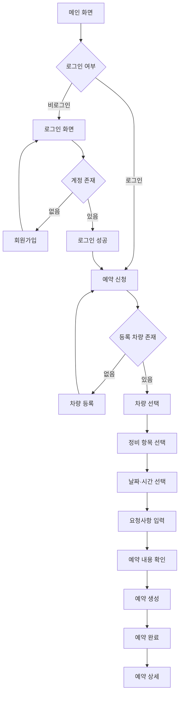
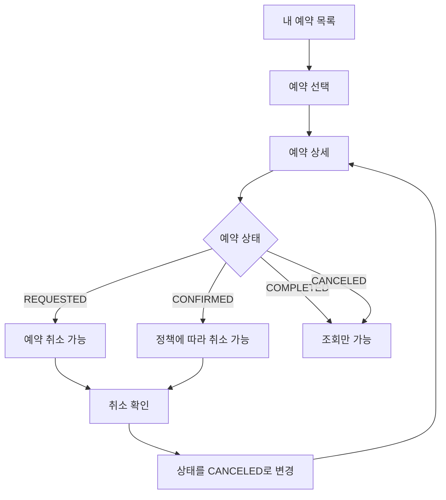
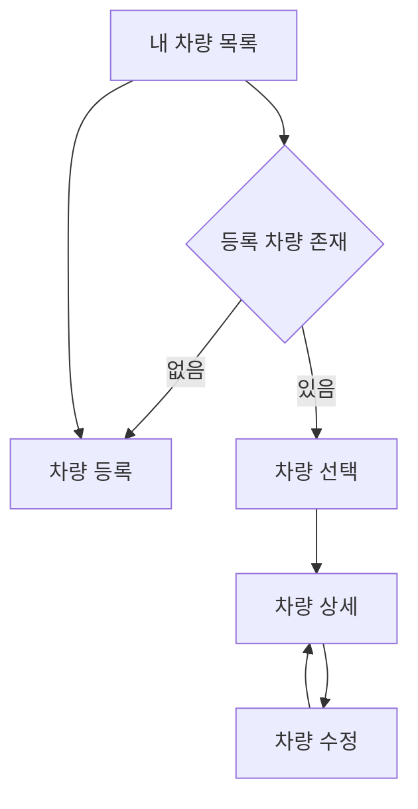
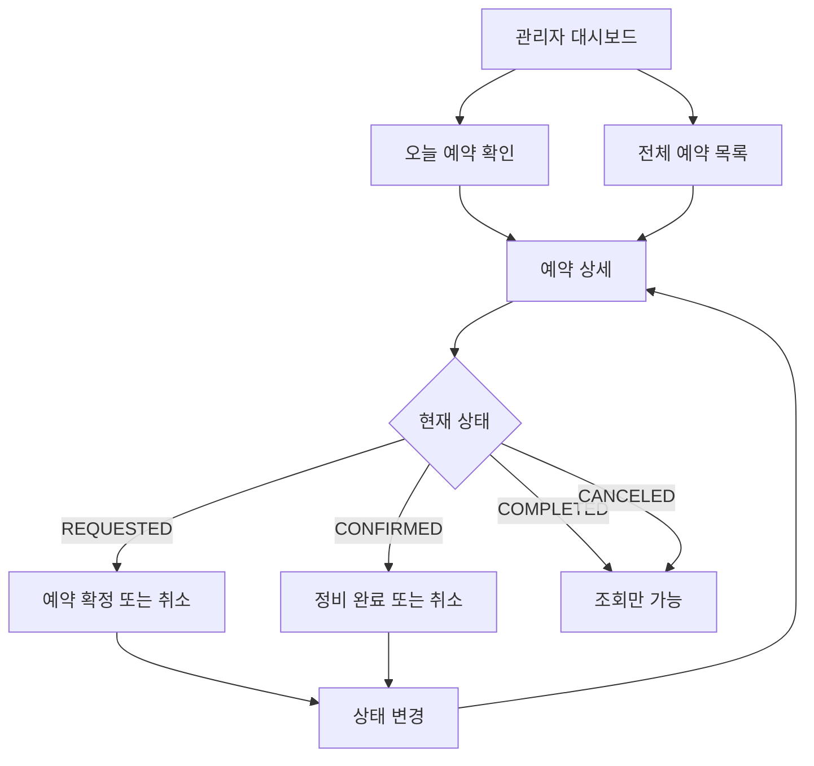
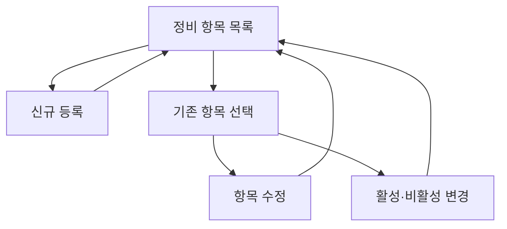
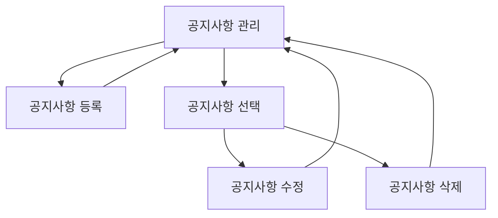

# GarageCare Wireframe

> Version: 1.0.0  
> Status: Draft  
> Last Updated: 2026-07-21

---

## 1. Overview

이 문서는 GarageCare MVP의 화면 구조와 사용자 흐름을 정의한다.

고객과 관리자가 서비스를 사용하는 과정을 화면 단위로 구체화하며, 이후 다음 작업의 기준으로 사용한다.

- Thymeleaf 화면 구현
- Controller 및 URL 설계
- API 요청·응답 명세 작성
- 사용자 권한 처리
- 입력값 검증
- 예외 화면 설계
- 통합 테스트 작성

본 문서의 Wireframe은 시각적 완성도보다 **정보 구조, 사용자 동선, 기능 배치**를 검증하는 데 목적이 있다.

---

## 2. Scope

현재 Wireframe은 GarageCare MVP에서 필요한 고객 및 관리자 화면을 대상으로 한다.

### 2.1 Included

#### Common

- 메인 화면
- 로그인
- 회원가입
- 공지사항 목록
- 공지사항 상세

#### Customer

- 내 차량 목록
- 차량 등록
- 차량 상세 및 수정
- 예약 신청
- 예약 완료
- 내 예약 목록
- 예약 상세
- 예약 취소

#### Administrator

- 관리자 대시보드
- 전체 예약 목록
- 예약 상세
- 예약 상태 변경
- 정비 항목 관리
- 공지사항 관리
- 공지사항 등록 및 수정

### 2.2 Out of Scope

다음 화면은 MVP 이후 설계한다.

- 비밀번호 찾기
- 소셜 로그인
- 회원 탈퇴
- 결제
- 정비 이력
- 매출 및 통계 대시보드
- 알림 수신 설정
- AI 정비 상담
- 다중 정비소 선택
- 정비기사 배정
- 부품 및 재고 관리

---

## 3. Design Goals

GarageCare의 화면은 다음 목표를 따른다.

### 3.1 Fast Reservation

고객은 복잡한 탐색 없이 등록된 차량을 선택하고 정비 항목과 시간을 지정하여 예약할 수 있어야 한다.

### 3.2 Clear Status

고객과 관리자는 예약 상태를 즉시 이해할 수 있어야 한다.

```text
REQUESTED  → 예약 요청
CONFIRMED  → 예약 확정
COMPLETED  → 정비 완료
CANCELED   → 예약 취소
```

### 3.3 Operational Efficiency

관리자는 날짜별 예약과 요청사항을 한 화면에서 빠르게 확인하고 상태를 변경할 수 있어야 한다.

### 3.4 Minimal Input

필수 입력값만 요구하고, 이미 저장된 회원·차량 정보는 다시 입력하지 않도록 한다.

### 3.5 Consistent Navigation

고객 화면과 관리자 화면에서 동일한 메뉴 위치와 버튼 표현을 사용한다.

---

## 4. User Roles

| Role | Description | Main Actions |
|---|---|---|
| `GUEST` | 로그인하지 않은 사용자 | 메인·공지사항 조회, 회원가입, 로그인 |
| `CUSTOMER` | GarageCare 고객 회원 | 차량 관리, 예약 신청, 본인 예약 조회·취소 |
| `ADMIN` | 정비소 관리자 | 전체 예약 관리, 상태 변경, 정비 항목·공지사항 관리 |

---

## 5. Access Policy

| Screen | Guest | Customer | Admin |
|---|:---:|:---:|:---:|
| 메인 | ✅ | ✅ | ✅ |
| 회원가입 | ✅ | ❌ | ❌ |
| 로그인 | ✅ | ❌ | ❌ |
| 공지사항 목록·상세 | ✅ | ✅ | ✅ |
| 내 차량 목록 | ❌ | ✅ | ❌ |
| 차량 등록·수정 | ❌ | ✅ | ❌ |
| 예약 신청 | ❌ | ✅ | ❌ |
| 내 예약 목록·상세 | ❌ | ✅ | ❌ |
| 예약 취소 | ❌ | ✅ | ❌ |
| 관리자 대시보드 | ❌ | ❌ | ✅ |
| 전체 예약 관리 | ❌ | ❌ | ✅ |
| 정비 항목 관리 | ❌ | ❌ | ✅ |
| 공지사항 관리 | ❌ | ❌ | ✅ |

인증되지 않은 사용자가 인증 필요 화면에 접근하면 로그인 화면으로 이동한다.

권한이 없는 사용자가 관리자 화면에 접근하면 `403 Forbidden` 화면을 표시한다.

---

## 6. Global Layout

### 6.1 Header

모든 화면 상단에 공통 Header를 표시한다.

#### Guest

```text
GarageCare | 예약하기 | 공지사항 | 로그인 | 회원가입
```

#### Customer

```text
GarageCare | 예약하기 | 내 예약 | 내 차량 | 공지사항 | 로그아웃
```

#### Admin

```text
GarageCare Admin | 대시보드 | 예약 관리 | 정비 항목 | 공지사항 | 로그아웃
```

### 6.2 Main Content

- 화면 제목
- 화면 설명 또는 현재 상태
- 핵심 콘텐츠
- 주요 행동 버튼
- 오류 및 안내 메시지

### 6.3 Footer

```text
GarageCare
빠른 예약, 효율적인 시스템, 만족스러운 서비스
```

사업장 정보가 확정되면 다음 내용을 추가할 수 있다.

- 정비소명
- 주소
- 연락처
- 영업시간
- 휴무일

---

## 7. Screen Overview

### 7.1 Common Screens

| ID | Screen | URL Candidate | Main User |
|---|---|---|---|
| `COM-01` | 메인 | `/` | 전체 |
| `COM-02` | 로그인 | `/login` | Guest |
| `COM-03` | 회원가입 | `/members/new` | Guest |
| `COM-04` | 공지사항 목록 | `/notices` | 전체 |
| `COM-05` | 공지사항 상세 | `/notices/{noticeId}` | 전체 |

### 7.2 Customer Screens

| ID | Screen | URL Candidate | Main User |
|---|---|---|---|
| `CUS-01` | 내 차량 목록 | `/vehicles` | Customer |
| `CUS-02` | 차량 등록 | `/vehicles/new` | Customer |
| `CUS-03` | 차량 상세 | `/vehicles/{vehicleId}` | Customer |
| `CUS-04` | 차량 수정 | `/vehicles/{vehicleId}/edit` | Customer |
| `CUS-05` | 예약 신청 | `/reservations/new` | Customer |
| `CUS-06` | 예약 완료 | `/reservations/{reservationId}/complete` | Customer |
| `CUS-07` | 내 예약 목록 | `/reservations` | Customer |
| `CUS-08` | 예약 상세 | `/reservations/{reservationId}` | Customer |

### 7.3 Administrator Screens

| ID | Screen | URL Candidate | Main User |
|---|---|---|---|
| `ADM-01` | 관리자 대시보드 | `/admin` | Admin |
| `ADM-02` | 전체 예약 목록 | `/admin/reservations` | Admin |
| `ADM-03` | 예약 상세 | `/admin/reservations/{reservationId}` | Admin |
| `ADM-04` | 정비 항목 목록 | `/admin/maintenance-items` | Admin |
| `ADM-05` | 정비 항목 등록 | `/admin/maintenance-items/new` | Admin |
| `ADM-06` | 정비 항목 수정 | `/admin/maintenance-items/{itemId}/edit` | Admin |
| `ADM-07` | 공지사항 관리 | `/admin/notices` | Admin |
| `ADM-08` | 공지사항 등록 | `/admin/notices/new` | Admin |
| `ADM-09` | 공지사항 수정 | `/admin/notices/{noticeId}/edit` | Admin |

URL은 화면 구조를 설명하기 위한 후보이며, 최종 경로는 API 및 Controller 설계에서 확정한다.

---

## 8. Customer User Flow

### 8.1 First Reservation Flow



### 8.2 Reservation Management Flow



### 8.3 Vehicle Management Flow



---

## 9. Administrator User Flow

### 9.1 Reservation Management Flow



### 9.2 Maintenance Item Management Flow



### 9.3 Notice Management Flow



---

# 10. Common Wireframes

## 10.1 COM-01 메인 화면

### Purpose

GarageCare의 핵심 기능과 정비소 정보를 안내하고 예약 신청으로 연결한다.

### Wireframe

```text
┌──────────────────────────────────────────────────────────┐
│ GarageCare      예약하기      공지사항      로그인      회원가입 │
├──────────────────────────────────────────────────────────┤
│                                                          │
│              예약은 더 빠르게, 정비는 더 효율적으로.              │
│                                                          │
│         원하는 정비 항목과 시간을 선택해 간편하게 예약하세요.         │
│                                                          │
│                      [ 정비 예약하기 ]                      │
│                                                          │
├──────────────────────────────────────────────────────────┤
│  빠른 예약          차량 관리            예약 상태 확인          │
│  원하는 일정 선택    내 차량 정보 저장      진행 상태 조회          │
├──────────────────────────────────────────────────────────┤
│ 최근 공지사항                                               │
│ ┌──────────────────────────────────────────────────────┐ │
│ │ 여름휴가 휴무 안내                     2026-07-20        │ │
│ │ 예약 운영시간 변경 안내                2026-07-18         │ │
│ └──────────────────────────────────────────────────────┘ │
│                                         [전체 공지 보기]    │
├──────────────────────────────────────────────────────────┤
│ GarageCare | 운영시간 | 연락처 | 주소                         │
└──────────────────────────────────────────────────────────┘
```

### Main Components

- Hero 문구
- 예약하기 버튼
- 서비스 핵심 기능 안내
- 최근 공지사항
- 정비소 기본 정보

### Actions

| Action | Result |
|---|---|
| 예약하기 | 로그인 상태면 예약 신청, 비로그인이면 로그인 화면 |
| 공지사항 선택 | 공지사항 상세 화면 |
| 전체 공지 보기 | 공지사항 목록 |

### Empty State

공지사항이 없으면 다음 문구를 표시한다.

```text
등록된 공지사항이 없습니다.
```

---

## 10.2 COM-02 로그인 화면

### Wireframe

```text
┌──────────────────────────────────────────┐
│                  로그인                    │
├──────────────────────────────────────────┤
│ 로그인 아이디                               │
│ [                                      ] │
│                                          │
│ 비밀번호                                   │
│ [                                      ] │
│                                          │
│ [              로그인                  ]   │
│                                          │
│ 계정이 없으신가요? [회원가입]                   │
└──────────────────────────────────────────┘
```

### Input Fields

| Field | Required | Validation |
|---|:---:|---|
| 로그인 아이디 | ✅ | 공백 불가 |
| 비밀번호 | ✅ | 공백 불가 |

### Error Messages

```text
아이디 또는 비밀번호를 확인해 주세요.
```

보안을 위해 아이디 존재 여부와 비밀번호 오류 여부를 구분하여 표시하지 않는다.

### Success Redirect

| Role | Redirect |
|---|---|
| `CUSTOMER` | 메인 또는 로그인 전 요청 화면 |
| `ADMIN` | 관리자 대시보드 |

---

## 10.3 COM-03 회원가입 화면

### Wireframe

```text
┌──────────────────────────────────────────┐
│                  회원가입                  │
├──────────────────────────────────────────┤
│ 로그인 아이디                               │
│ [                                      ] │
│                                          │
│ 비밀번호                                   │
│ [                                      ] │
│                                          │
│ 비밀번호 확인                               │
│ [                                      ] │
│                                          │
│ 이름                                      │
│ [                                      ] │
│                                          │
│ 연락처                                     │
│ [                                      ] │
│                                          │
│  [             회원가입                 ]  │
│  [               취소                  ]  │
└──────────────────────────────────────────┘
```

### Input Fields

| Field | Required | Validation |
|---|:---:|---|
| 로그인 아이디 | ✅ | 길이, 형식, 중복 검사 |
| 비밀번호 | ✅ | 최소 길이 및 정책 검사 |
| 비밀번호 확인 | ✅ | 비밀번호 일치 |
| 이름 | ✅ | 공백 불가, 최대 길이 |
| 연락처 | ✅ | 전화번호 형식 |

### Success Flow

```text
회원가입 성공
→ 로그인 화면
→ "회원가입이 완료되었습니다." 메시지
```

---

## 10.4 COM-04 공지사항 목록

### Wireframe

```text
┌──────────────────────────────────────────────────────┐
│ 공지사항                                               │
├──────┬───────────────────────────────┬───────────────┤
│ 번호  │ 제목                           │ 작성일          │
├──────┼───────────────────────────────┼───────────────┤
│  12  │ 여름휴가 휴무 안내                │ 2026-07-20    │
│  11  │ 예약 운영시간 변경 안내            │ 2026-07-18    │
│  10  │ GarageCare 예약 안내            │ 2026-07-15    │
└──────┴───────────────────────────────┴───────────────┘
│                    < 1 2 3 >                         │
└──────────────────────────────────────────────────────┘
```

### Display Information

- 번호
- 제목
- 작성일
- 페이지네이션

### Empty State

```text
등록된 공지사항이 없습니다.
```

---

## 10.5 COM-05 공지사항 상세

### Wireframe

```text
┌──────────────────────────────────────────────────────┐
│ 여름휴가 휴무 안내                                       │
│ 작성일 2026-07-20                                     │
├──────────────────────────────────────────────────────┤
│                                                      │
│ 8월 3일부터 8월 5일까지 휴무입니다.                         │
│ 예약 시 참고해 주세요.                                    │
│                                                      │
├──────────────────────────────────────────────────────┤
│ [목록으로]                                             │
└──────────────────────────────────────────────────────┘
```

---

# 11. Customer Wireframes

## 11.1 CUS-01 내 차량 목록

### Purpose

고객이 등록한 차량을 확인하고 등록·상세·수정 화면으로 이동한다.

### Wireframe

```text
┌──────────────────────────────────────────────────────┐
│ 내 차량                                  [차량 등록]     │
├──────────────────────────────────────────────────────┤
│ ┌──────────────────────────────────────────────────┐ │
│ │ 현대 그랜저                                         │ │
│ │ 차량번호 12가3456                                   │ │
│ │ 2023년식 · 35,000km                    [상세 보기]  │ │
│ └──────────────────────────────────────────────────┘ │
│                                                      │
│ ┌──────────────────────────────────────────────────┐ │
│ │ 기아 쏘렌토                                         │ │
│ │ 차량번호 34나5678                                   │ │
│ │ 2022년식 · 42,000km                     [상세 보기] │ │
│ └──────────────────────────────────────────────────┘ │
└──────────────────────────────────────────────────────┘
```

### Empty State

```text
등록된 차량이 없습니다.

예약을 신청하려면 먼저 차량을 등록해 주세요.

[차량 등록]
```

---

## 11.2 CUS-02 차량 등록

### Wireframe

```text
┌──────────────────────────────────────────┐
│                  차량 등록                 │
├──────────────────────────────────────────┤
│ 제조사                                     │
│ [                                      ] │
│                                          │
│ 모델명                                     │
│ [                                      ] │
│                                          │
│ 차량 번호                                  │
│ [                                      ] │
│                                          │
│ 연식                                      │
│ [                                      ] │
│                                          │
│ 현재 주행거리                               │
│ [                                  ] km  │
│                                          │
│ [                 등록                  ] │
│ [                 취소                  ] │
└──────────────────────────────────────────┘
```

### Input Fields

| Field | Required | Validation |
|---|:---:|---|
| 제조사 | ✅ | 공백 불가 |
| 모델명 | ✅ | 공백 불가 |
| 차량 번호 | ✅ | 형식 및 중복 검사 |
| 연식 | ❌ | 숫자 및 현실적인 범위 |
| 주행거리 | ❌ | 0 이상의 정수 |

### Success Flow

```text
차량 등록
→ 차량 상세 또는 내 차량 목록
→ "차량이 등록되었습니다."
```

---

## 11.3 CUS-03 차량 상세

### Wireframe

```text
┌──────────────────────────────────────────────────────┐
│ 차량 상세                                              │
├──────────────────────────────────────────────────────┤
│ 제조사        현대                                      │
│ 모델명        그랜저                                    │
│ 차량 번호     12가3456                                  │
│ 연식          2023                                    │
│ 주행거리      35,000km                                 │
├──────────────────────────────────────────────────────┤
│ [이 차량으로 예약]  [수정]  [목록으로]                      │
└──────────────────────────────────────────────────────┘
```

### Access Rule

본인이 소유한 차량만 조회할 수 있다.

다른 회원의 차량에 접근하면 `403 Forbidden` 또는 `404 Not Found`로 처리한다.

---

## 11.4 CUS-04 차량 수정

차량 등록 화면과 동일한 Form 구조를 사용한다.

### Editable Fields

- 제조사
- 모델명
- 차량 번호
- 연식
- 주행거리

### Actions

```text
[저장] [취소]
```

차량 번호 변경 시 중복 여부를 다시 검사한다.

---

## 11.5 CUS-05 예약 신청

### Purpose

등록 차량, 정비 항목, 예약 일정 및 추가 요청사항을 입력한다.

### Wireframe

```text
┌──────────────────────────────────────────────────────┐
│ 정비 예약 신청                                          │
├──────────────────────────────────────────────────────┤
│ 1. 차량 선택                                           │
│ (●) 현대 그랜저 · 12가3456                              │
│ ( ) 기아 쏘렌토 · 34나5678                              │
│                                      [차량 등록]       │
├──────────────────────────────────────────────────────┤
│ 2. 정비 항목 선택                                       │
│ [✓] 엔진오일 교환                                       │
│ [ ] 타이어 점검 및 교체                                  │
│ [ ] 브레이크 점검                                       │
│ [ ] 배터리 점검 및 교체                                  │
│ [ ] 일반 점검                                          │
├──────────────────────────────────────────────────────┤
│ 3. 예약 일정                                           │
│ 날짜 [ 2026-07-25 ▼ ]                                 │
│ 시간 [ 10:00 ▼ ]                                      │
├──────────────────────────────────────────────────────┤
│ 4. 추가 요청사항                                        │
│ ┌──────────────────────────────────────────────────┐ │
│ │ 주행 중 소음이 발생합니다.                             │ │
│ └──────────────────────────────────────────────────┘ │
├──────────────────────────────────────────────────────┤
│ [                   예약 내용 확인                    ] │
│ [                       취소                        ] │
└──────────────────────────────────────────────────────┘
```

### Input Fields

| Field | Required | Validation |
|---|:---:|---|
| 차량 | ✅ | 본인 소유 차량 |
| 정비 항목 | ✅ | 최소 한 개, 활성 항목 |
| 예약 날짜 | ✅ | 오늘 이후 예약 가능 날짜 |
| 예약 시간 | ✅ | 영업시간 및 수용량 확인 |
| 요청사항 | ❌ | 최대 길이 제한 |

### Confirmation Area

제출 직전 다음 내용을 확인할 수 있도록 한다.

```text
차량
정비 항목
예약 일시
추가 요청사항
```

초기 구현에서는 별도 확인 페이지 대신 동일 화면 하단의 확인 영역 또는 브라우저 확인 대화상자를 사용할 수 있다.

### Error States

```text
차량을 선택해 주세요.
하나 이상의 정비 항목을 선택해 주세요.
예약 날짜를 선택해 주세요.
예약 시간을 선택해 주세요.
선택한 시간에는 예약할 수 없습니다.
비활성화된 정비 항목이 포함되어 있습니다.
```

### No Vehicle State

등록 차량이 없으면 예약 Form 대신 다음 안내를 표시한다.

```text
예약을 신청하려면 차량 등록이 필요합니다.

[차량 등록]
```

---

## 11.6 CUS-06 예약 완료

### Wireframe

```text
┌──────────────────────────────────────────────────────┐
│                    예약이 접수되었습니다.                  │
├──────────────────────────────────────────────────────┤
│ 예약 번호      20260721-001                            │
│ 차량           현대 그랜저 · 12가3456                    │
│ 예약 일시      2026-07-25 10:00                        │
│ 정비 항목      엔진오일 교환, 브레이크 점검                   │
│ 상태           예약 요청                                │
├──────────────────────────────────────────────────────┤
│ 관리자가 예약을 확인한 후 상태가 변경될 수 있습니다.             │
├──────────────────────────────────────────────────────┤
│ [예약 상세 보기]  [메인으로]                               │
└──────────────────────────────────────────────────────┘
```

실제 DB 식별자인 `id`를 사용자용 예약 번호로 직접 노출할지는 구현 단계에서 결정한다.

---

## 11.7 CUS-07 내 예약 목록

### Wireframe

```text
┌──────────────────────────────────────────────────────────────┐
│ 내 예약                                          [새 예약]      │
├──────────────────────────────────────────────────────────────┤
│ 상태 [전체 ▼]     기간 [최근 3개월 ▼]                             │
├──────────────────────────────────────────────────────────────┤
│ 예약일시           차량           정비 항목           상태          │
├──────────────────────────────────────────────────────────────┤
│ 07-25 10:00       그랜저        엔진오일 외 1     예약 요청         │
│ 07-10 14:00       그랜저        일반 점검         정비 완료         │
│ 06-20 11:00       쏘렌토        타이어 점검       예약 취소         │
└──────────────────────────────────────────────────────────────┘
```

### Status Display

| Status | User Label |
|---|---|
| `REQUESTED` | 예약 요청 |
| `CONFIRMED` | 예약 확정 |
| `COMPLETED` | 정비 완료 |
| `CANCELED` | 예약 취소 |

상태는 색상뿐 아니라 텍스트로도 구분한다.

### Empty State

```text
예약 내역이 없습니다.

[첫 예약 신청하기]
```

---

## 11.8 CUS-08 예약 상세

### Wireframe

```text
┌──────────────────────────────────────────────────────┐
│ 예약 상세                                 [예약 요청]     │
├──────────────────────────────────────────────────────┤
│ 예약 번호      20260721-001                            │
│ 예약 일시      2026-07-25 10:00                        │
│ 차량           현대 그랜저 · 12가3456                    │
│ 정비 항목      엔진오일 교환                              │
│                브레이크 점검                            │
│ 요청사항       주행 중 소음이 발생합니다.                    │
│ 신청일         2026-07-21 15:30                       │
├──────────────────────────────────────────────────────┤
│ [예약 취소]    [목록으로]                                │
└──────────────────────────────────────────────────────┘
```

### Available Actions

| Status | Cancel Button |
|---|:---:|
| `REQUESTED` | 표시 |
| `CONFIRMED` | 운영 정책에 따라 표시 |
| `COMPLETED` | 숨김 |
| `CANCELED` | 숨김 |

### Cancellation Confirmation

```text
예약을 취소하시겠습니까?

취소된 예약은 복구할 수 없습니다.

[예약 취소] [돌아가기]
```

실제 데이터는 삭제하지 않고 상태를 `CANCELED`로 변경한다.

---

# 12. Administrator Wireframes

## 12.1 ADM-01 관리자 대시보드

### Purpose

오늘의 예약 현황과 관리가 필요한 예약을 빠르게 확인한다.

### Wireframe

```text
┌──────────────────────────────────────────────────────────────┐
│    관리자 대시보드                                               │
├──────────────────────────────────────────────────────────────┤
│   오늘 예약 5건   │   예약 요청 2건  │   예약 확정 2건  │   완료 1건   │
├──────────────────────────────────────────────────────────────┤
│ 오늘의 예약                                                     │
│ 시간     고객       차량          정비 항목       상태              │
│ 10:00    박현우     그랜저        엔진오일        예약 요청          │
│ 11:00    김민수     쏘렌토        브레이크        예약 확정          │
│ 14:00    이서준     아반떼        일반 점검       예약 확정          │
│                                               [전체 예약 보기]  │
├──────────────────────────────────────────────────────────────┤
│ 빠른 관리                                                      │
│ [새 예약 요청 확인] [정비 항목 관리] [공지사항 등록]                    │
└──────────────────────────────────────────────────────────────┘
```

### Dashboard Summary

- 오늘 전체 예약 수
- 예약 요청 수
- 예약 확정 수
- 정비 완료 수
- 오늘 시간순 예약

통계 기능은 복잡한 분석이 아니라 현재 운영 상태를 빠르게 확인하는 수준으로 제한한다.

---

## 12.2 ADM-02 전체 예약 목록

### Wireframe

```text
┌────────────────────────────────────────────────────────────────────┐
│   예약 관리                                                          │
├────────────────────────────────────────────────────────────────────┤
│ 날짜 [2026-07-21]    상태 [전체 ▼]    차량/고객 [            ] [검색]     │
├────────────────────────────────────────────────────────────────────┤
│ 시간    고객    연락처       차량       정비 항목      상태                │
├────────────────────────────────────────────────────────────────────┤
│ 10:00 박현우  010-****     그랜저     엔진오일       예약 요청             │
│ 11:00 김민수  010-****     쏘렌토     브레이크       예약 확정             │
│ 14:00 이서준  010-****     아반떼     일반 점검      정비 완료             │
└────────────────────────────────────────────────────────────────────┘
│                            < 1 2 3 >                               │
└────────────────────────────────────────────────────────────────────┘
```

### Search and Filter

- 예약 날짜
- 예약 상태
- 고객 이름
- 연락처
- 차량 번호
- 정비 항목

MVP에서는 날짜와 상태 필터를 우선 구현하고, 나머지 검색은 개발 범위에 따라 추가한다.

### Default Sorting

```text
reservation_date ASC
reservation_time ASC
```

과거 예약 목록에서는 최신 날짜 우선 정렬을 사용할 수 있다.

### Empty State

```text
조건에 해당하는 예약이 없습니다.
```

---

## 12.3 ADM-03 관리자 예약 상세

### Wireframe

```text
┌──────────────────────────────────────────────────────────┐
│ 예약 상세                                        [예약 요청]  │
├──────────────────────────────────────────────────────────┤
│ 고객 정보                                                  │
│ 이름          박현우                                        │
│ 연락처        010-1234-5678                                │
├──────────────────────────────────────────────────────────┤
│ 차량 정보                                                  │
│ 차량          현대 그랜저                                    │
│ 차량 번호     12가3456                                      │
│ 연식          2023                                        │
│ 주행거리      35,000km                                     │
├──────────────────────────────────────────────────────────┤
│ 예약 정보                                                  │
│ 일시          2026-07-25 10:00                            │
│ 정비 항목     엔진오일 교환                                   │
│               브레이크 점검                                 │
│ 요청사항      주행 중 소음이 발생합니다.                         │
├──────────────────────────────────────────────────────────┤
│ 상태 변경                                                  │
│ [예약 확정]   [예약 취소]                                    │
├──────────────────────────────────────────────────────────┤
│ [목록으로]                                                 │
└──────────────────────────────────────────────────────────┘
```

### Status Actions

| Current Status | Available Actions |
|---|---|
| `REQUESTED` | `CONFIRMED`, `CANCELED` |
| `CONFIRMED` | `COMPLETED`, `CANCELED` |
| `COMPLETED` | 없음 |
| `CANCELED` | 없음 |

### Confirmation Dialog

```text
예약 상태를 '예약 확정'으로 변경하시겠습니까?

[변경] [취소]
```

상태 변경 후 상세 화면에서 성공 메시지를 표시한다.

```text
예약 상태가 변경되었습니다.
```

---

## 12.4 ADM-04 정비 항목 목록

### Wireframe

```text
┌──────────────────────────────────────────────────────────┐
│ 정비 항목 관리                                [정비 항목 등록]  │
├──────────────────────────────────────────────────────────┤
│ 항목명                상태             등록일        관리      │
├──────────────────────────────────────────────────────────┤
│ 엔진오일 교환           활성          2026-07-01    [수정]     │
│ 타이어 점검 및 교체      활성          2026-07-01    [수정]     │
│ 브레이크 점검           활성          2026-07-01    [수정]     │
│ 구형 서비스 항목        비활성         2026-06-01    [수정]     │
└──────────────────────────────────────────────────────────┘
```

### Actions

- 신규 정비 항목 등록
- 항목명 및 설명 수정
- 활성·비활성 상태 변경

정비 항목은 과거 예약에서 참조할 수 있으므로 삭제 버튼을 제공하지 않는다.

---

## 12.5 ADM-05 정비 항목 등록

### Wireframe

```text
┌──────────────────────────────────────────┐
│                정비 항목 등록               │
├──────────────────────────────────────────┤
│ 항목명                                     │
│ [                                      ] │
│                                          │
│ 설명                                      │
│ ┌──────────────────────────────────────┐ │
│ │                                      │ │
│ └──────────────────────────────────────┘ │
│                                          │
│ 활성 상태  [✓] 예약 화면에 표시                │
│                                          │
│ [                등록                   ] │
│ [                취소                   ] │
└──────────────────────────────────────────┘
```

### Validation

- 항목명 필수
- 항목명 중복 불가
- 항목명 최대 길이
- 설명 최대 길이

---

## 12.6 ADM-06 정비 항목 수정

등록 화면과 동일한 Form을 사용한다.

### Additional Notice

비활성화 시 다음 안내를 표시한다.

```text
비활성화된 정비 항목은 새로운 예약에서 선택할 수 없습니다.
기존 예약 내역에는 계속 표시됩니다.
```

---

## 12.7 ADM-07 공지사항 관리

### Wireframe

```text
┌──────────────────────────────────────────────────────────┐
│ 공지사항 관리                                [공지사항 등록]    │
├──────┬──────────────────────────────┬────────────┬───────┤
│ 번호  │ 제목                          │ 작성일       │  관리  │
├──────┼──────────────────────────────┼────────────┼───────┤
│  12  │ 여름휴가 휴무 안내               │ 07-20       │ 수정   │
│  11  │ 예약 운영시간 변경 안내           │ 07-18       │ 수정   │
└──────┴──────────────────────────────┴────────────┴───────┘
```

공지사항 선택 시 관리자용 상세 또는 수정 화면으로 이동한다.

---

## 12.8 ADM-08 공지사항 등록

### Wireframe

```text
┌──────────────────────────────────────────────────────┐
│ 공지사항 등록                                           │
├──────────────────────────────────────────────────────┤
│ 제목                                                  │
│ [                                                  ] │
│                                                      │
│ 내용                                                  │
│ ┌──────────────────────────────────────────────────┐ │
│ │                                                  │ │
│ │                                                  │ │
│ └──────────────────────────────────────────────────┘ │
│                                                      │
│ [등록] [취소]                                          │
└──────────────────────────────────────────────────────┘
```

### Validation

| Field | Required | Validation |
|---|:---:|---|
| 제목 | ✅ | 공백 불가, 최대 길이 |
| 내용 | ✅ | 공백 불가, 최대 길이 |

---

## 12.9 ADM-09 공지사항 수정

등록 화면과 동일한 Form을 사용한다.

### Actions

```text
[저장] [삭제] [취소]
```

삭제 전 확인 대화상자를 표시한다.

```text
공지사항을 삭제하시겠습니까?

삭제된 공지사항은 복구할 수 없습니다.

[삭제] [돌아가기]
```

---

# 13. Form Validation Policy

## 13.1 Validation Display

입력 오류는 해당 입력 필드 바로 아래에 표시한다.

```text
차량 번호
[12가]
올바른 차량 번호를 입력해 주세요.
```

전체 오류가 있는 경우 Form 상단에 요약 메시지를 추가할 수 있다.

```text
입력한 내용을 다시 확인해 주세요.
```

## 13.2 Validation Timing

기본적으로 서버 검증을 기준으로 한다.

사용자 경험 개선을 위해 다음 항목은 클라이언트 검증을 함께 적용할 수 있다.

- 필수 입력
- 최대 길이
- 숫자 형식
- 비밀번호 확인
- 전화번호 형식

중복 검사, 권한 검사, 예약 가능 여부는 반드시 서버에서 다시 검증한다.

## 13.3 Input Preservation

검증 오류가 발생해도 사용자가 입력한 값은 가능한 한 유지한다.

단, 보안을 위해 비밀번호는 다시 입력하도록 할 수 있다.

---

# 14. Feedback Messages

## 14.1 Success Messages

```text
회원가입이 완료되었습니다.
차량이 등록되었습니다.
차량 정보가 수정되었습니다.
예약이 접수되었습니다.
예약이 취소되었습니다.
예약 상태가 변경되었습니다.
정비 항목이 등록되었습니다.
정비 항목이 수정되었습니다.
공지사항이 등록되었습니다.
공지사항이 수정되었습니다.
공지사항이 삭제되었습니다.
```

## 14.2 Error Messages

```text
요청을 처리하지 못했습니다. 잠시 후 다시 시도해 주세요.
입력한 내용을 확인해 주세요.
해당 정보를 찾을 수 없습니다.
접근 권한이 없습니다.
이미 사용 중인 로그인 아이디입니다.
이미 등록된 차량 번호입니다.
이미 등록된 정비 항목입니다.
선택한 시간에는 예약할 수 없습니다.
현재 상태에서는 예약을 취소할 수 없습니다.
현재 상태에서는 예약 상태를 변경할 수 없습니다.
```

---

# 15. Empty, Loading and Error States

## 15.1 Empty State

데이터가 없는 화면에는 단순히 빈 표를 표시하지 않고 다음 행동을 안내한다.

| Screen | Message | Action |
|---|---|---|
| 차량 목록 | 등록된 차량이 없습니다. | 차량 등록 |
| 예약 목록 | 예약 내역이 없습니다. | 예약 신청 |
| 공지사항 | 등록된 공지사항이 없습니다. | 없음 |
| 관리자 예약 목록 | 조건에 해당하는 예약이 없습니다. | 검색 초기화 |
| 정비 항목 | 등록된 정비 항목이 없습니다. | 정비 항목 등록 |

## 15.2 Loading State

서버 렌더링 기반 MVP에서는 별도의 Loading 화면을 필수로 구현하지 않는다.

비동기 요청을 도입하는 경우 버튼 중복 제출 방지를 위해 다음 상태를 제공한다.

```text
예약 중...
저장 중...
상태 변경 중...
```

## 15.3 Error Pages

| HTTP Status | Screen |
|---|---|
| `400` | 잘못된 요청 |
| `403` | 접근 권한 없음 |
| `404` | 요청한 정보 없음 |
| `500` | 서버 오류 |

### Example

```text
요청한 페이지를 찾을 수 없습니다.

주소가 올바른지 확인해 주세요.

[메인으로]
```

---

# 16. Reservation State Presentation

상태는 코드값을 직접 노출하지 않고 사용자 친화적인 한글로 표시한다.

| Code | Customer Label | Admin Label | Description |
|---|---|---|---|
| `REQUESTED` | 예약 요청 | 확인 필요 | 관리자가 아직 확인하지 않은 상태 |
| `CONFIRMED` | 예약 확정 | 예약 확정 | 관리자가 예약을 수락한 상태 |
| `COMPLETED` | 정비 완료 | 정비 완료 | 정비가 완료된 상태 |
| `CANCELED` | 예약 취소 | 예약 취소 | 고객 또는 관리자가 취소한 상태 |

색상은 상태를 보조하는 수단으로만 사용하고 텍스트를 항상 함께 표시한다.

---

# 17. Responsive Design

GarageCare는 고객의 모바일 사용 가능성이 높으므로 고객 화면은 모바일 우선으로 설계한다.

## 17.1 Breakpoint Candidates

```text
Mobile:  0px ~ 767px
Tablet:  768px ~ 1023px
Desktop: 1024px 이상
```

최종 Breakpoint는 CSS Framework 선택 후 확정한다.

## 17.2 Mobile Policy

### Navigation

Desktop Header 메뉴는 모바일에서 축소 메뉴로 변경한다.

```text
☰ GarageCare
```

### Tables

예약 목록과 공지사항 목록은 모바일에서 카드 형태로 전환한다.

```text
┌──────────────────────────────┐
│ 2026-07-25 10:00             │
│ 현대 그랜저 · 12가3456          │
│ 엔진오일 외 1개                 │
│ 예약 요청                      │
└──────────────────────────────┘
```

### Forms

- 입력 필드는 한 열로 배치한다.
- 주요 버튼은 충분한 터치 영역을 확보한다.
- 예약 신청 버튼은 화면 하단에서 쉽게 접근할 수 있도록 한다.

## 17.3 Admin Policy

관리자 화면은 예약 목록과 여러 정보를 동시에 확인해야 하므로 데스크톱 사용을 우선한다.

모바일에서도 조회와 상태 변경은 가능하도록 하되, 테이블은 카드 또는 가로 스크롤 방식으로 표시한다.

---

# 18. Accessibility

다음 접근성 원칙을 기본으로 적용한다.

- 모든 입력 필드에 `label`을 연결한다.
- 버튼은 동작을 알 수 있는 구체적인 문구를 사용한다.
- 상태를 색상만으로 구분하지 않는다.
- 키보드만으로 주요 기능을 사용할 수 있도록 한다.
- 오류 메시지는 해당 입력값과 연결한다.
- 이미지가 추가되면 대체 텍스트를 제공한다.
- 충분한 글자 크기와 명도 대비를 확보한다.

피해야 할 버튼 문구:

```text
확인
처리
클릭
```

권장 버튼 문구:

```text
예약 신청
예약 취소
차량 등록
예약 확정
정비 완료
```

---

# 19. Security and Privacy Considerations

## 19.1 Ownership Verification

화면에서 버튼을 숨기는 것만으로 권한을 보장할 수 없다.

서버에서 반드시 다음 소유권을 검증한다.

- 차량 소유자
- 예약 신청자
- 예약 대상 차량
- 공지사항 관리자 권한

## 19.2 Personal Information

관리자 예약 목록에서 연락처 전체를 표시할지는 운영 환경을 고려해 결정한다.

목록에서는 일부 마스킹하고 상세 화면에서 전체 연락처를 보여주는 방식을 고려한다.

```text
010-****-5678
```

## 19.3 Sensitive Values

다음 값은 화면에 노출하지 않는다.

- 암호화된 비밀번호
- 내부 인증 정보
- 세션 식별자
- 상세 서버 오류
- 데이터베이스 PK가 불필요한 경우의 내부 식별자

---

# 20. Screen-to-Domain Mapping

| Screen | Main Domain | Related Domain |
|---|---|---|
| 회원가입 | `Member` | `MemberRole` |
| 내 차량 목록·등록 | `Vehicle` | `Member` |
| 예약 신청 | `Reservation` | `Vehicle`, `ReservationItem`, `MaintenanceItem` |
| 내 예약 목록·상세 | `Reservation` | `Vehicle`, `ReservationItem` |
| 관리자 예약 관리 | `Reservation` | `Member`, `Vehicle`, `ReservationItem` |
| 정비 항목 관리 | `MaintenanceItem` | `ReservationItem` |
| 공지사항 | `Notice` | `Member` |

---

# 21. Screen-to-API Requirements

화면 설계를 기준으로 이후 API 명세에서 다음 기능이 필요하다.

## 21.1 Authentication and Member

```text
회원가입
로그인
로그아웃
현재 사용자 정보 조회
```

## 21.2 Vehicle

```text
내 차량 목록 조회
차량 등록
차량 상세 조회
차량 수정
```

## 21.3 Reservation

```text
예약 가능 정비 항목 조회
예약 가능 날짜·시간 확인
예약 생성
내 예약 목록 조회
내 예약 상세 조회
예약 취소
관리자 전체 예약 조회
관리자 예약 상태 변경
```

## 21.4 MaintenanceItem

```text
활성 정비 항목 조회
관리자 정비 항목 목록 조회
정비 항목 등록
정비 항목 수정
정비 항목 활성·비활성 변경
```

## 21.5 Notice

```text
공지사항 목록 조회
공지사항 상세 조회
공지사항 등록
공지사항 수정
공지사항 삭제
```

Spring MVC와 Thymeleaf 기반으로 구현할 경우 반드시 REST API로 분리할 필요는 없으며, Controller의 요청 경로와 Form 요청 명세로 구체화할 수 있다.

---

# 22. Key Design Decisions

## 22.1 예약 신청을 한 화면에 구성하는 이유

차량, 정비 항목, 일정 선택을 여러 페이지로 분리하면 단계별 화면은 단순해지지만 사용자가 이전 선택을 확인하거나 수정하기 어렵다.

MVP에서는 예약 정보를 한 화면에 배치하여 전체 내용을 빠르게 확인하고 수정할 수 있도록 한다.

모바일에서 화면이 지나치게 길어지면 단계형 UI 도입을 검토한다.

## 22.2 차량 등록을 예약 흐름과 연결하는 이유

예약에는 반드시 차량이 필요하다.

등록 차량이 없는 사용자를 단순히 오류 화면으로 보내지 않고 예약 신청 화면에서 차량 등록으로 자연스럽게 연결한다.

## 22.3 관리자의 예약 상태 변경을 상세 화면에서 수행하는 이유

목록에서 즉시 상태를 변경하면 빠르지만 잘못된 예약을 처리할 위험이 있다.

관리자가 고객, 차량, 정비 항목 및 요청사항을 확인한 후 상태를 변경할 수 있도록 예약 상세 화면에 상태 변경 버튼을 배치한다.

향후 운영 중 반복 작업이 많아지면 목록의 빠른 상태 변경 기능을 추가할 수 있다.

## 22.4 정비 항목 삭제 버튼을 제공하지 않는 이유

정비 항목은 과거 예약에서 참조될 수 있다.

삭제 대신 활성 상태를 변경하여 과거 기록은 유지하면서 새로운 예약에서만 선택되지 않도록 한다.

## 22.5 취소된 예약을 목록에 유지하는 이유

예약 취소도 정비소 운영 기록에 해당한다.

따라서 목록에서 삭제하지 않고 `예약 취소` 상태로 표시한다.

---

# 23. Open Decisions

| Decision | Current Direction |
|---|---|
| CSS Framework | Bootstrap 또는 직접 CSS 검토 |
| 예약 Form 방식 | 한 화면 구성 |
| 별도 예약 확인 화면 | MVP에서는 생략 가능 |
| 예약 시간 단위 | 초기 1시간 |
| 예약 가능 시간 조회 방식 | 날짜 선택 후 서버 검증 우선 |
| `CONFIRMED` 상태 고객 취소 | 정비소 운영 정책 확인 필요 |
| 차량 삭제 화면 | MVP 제외 또는 예약 이력 없는 차량만 허용 |
| 관리자 연락처 표시 | 목록 마스킹, 상세 전체 표시 후보 |
| 관리자 대시보드 통계 | 오늘 예약 수와 상태별 건수만 제공 |
| 목록 페이지네이션 | 데이터 증가 가능 화면에 적용 |
| 사용자용 예약 번호 | 내부 ID와 별도 생성 여부 검토 |
| 모바일 예약 UI | 단일 Form 우선, 필요 시 단계형 UI |
| 공지사항 검색 | MVP 제외 |
| 다크 모드 | MVP 제외 |

확정된 사항은 본 문서와 관련 Issue에 결정 근거를 기록한다.

---

# 24. Implementation Priority

모든 화면을 동시에 구현하지 않고 핵심 사용자 흐름을 기준으로 순차 구현한다.

## Priority 1 — Core Reservation

1. 로그인
2. 차량 목록 및 등록
3. 예약 신청
4. 예약 완료
5. 내 예약 목록 및 상세
6. 관리자 예약 목록 및 상세
7. 예약 상태 변경

## Priority 2 — Supporting Features

1. 메인 화면
2. 회원가입
3. 정비 항목 관리
4. 공지사항 목록 및 상세
5. 공지사항 관리

## Priority 3 — Quality

1. 반응형 화면
2. 빈 상태
3. 검증 메시지
4. 오류 페이지
5. 접근성 보완
6. 목록 검색 및 페이지네이션

---

# 25. Related Documents

| Document | Description |
|---|---|
| [`planning.md`](./planning.md) | 프로젝트 비전과 사용자 요구사항 |
| [`feature-list.md`](./feature-list.md) | MVP 기능 목록과 우선순위 |
| [`domain-model.md`](./domain-model.md) | 핵심 도메인과 비즈니스 규칙 |
| [`erd.md`](./erd.md) | 테이블, 관계 및 데이터 제약조건 |
| `api-spec.md` | 요청 경로, 입력값 및 응답 명세 |
| `architecture.md` | 계층 및 패키지 구조 |

---

# 26. Summary

GarageCare의 화면은 고객의 빠른 예약과 관리자의 효율적인 예약 처리를 중심으로 설계한다.

```text
Customer

회원가입·로그인
    ↓
차량 등록
    ↓
정비 예약 신청
    ↓
예약 상태 확인
    ↓
예약 취소 또는 정비 완료 확인
```

```text
Administrator

관리자 대시보드
    ↓
예약 요청 확인
    ↓
고객·차량·요청사항 확인
    ↓
예약 확정
    ↓
정비 완료
```

핵심 설계 원칙은 다음과 같다.

- 고객의 예약 과정에서 불필요한 입력과 화면 이동을 줄인다.
- 예약 상태를 고객과 관리자 모두 명확하게 이해할 수 있도록 표현한다.
- 관리자는 상세 정보를 확인한 후 예약 상태를 변경한다.
- 차량과 예약의 소유권 및 관리자 권한은 서버에서 검증한다.
- 데이터가 없거나 오류가 발생한 경우 다음 행동을 명확하게 안내한다.
- 고객 화면은 모바일 우선, 관리자 화면은 데스크톱 우선으로 설계한다.
- 화면 설계 결과를 이후 Controller와 API 명세의 기준으로 사용한다.